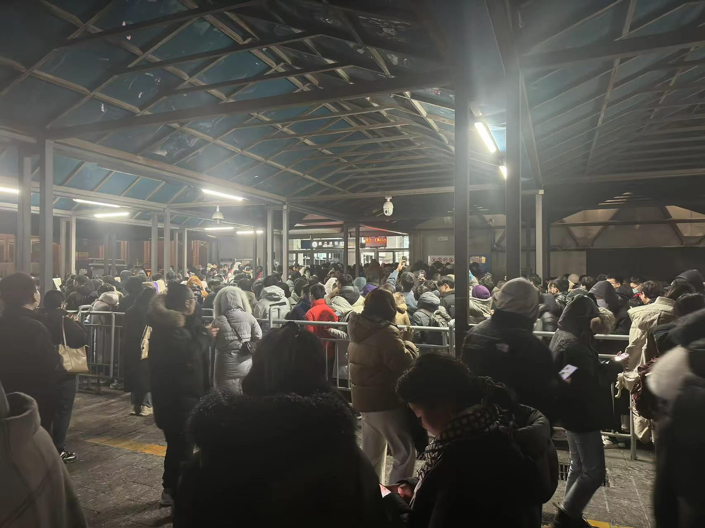
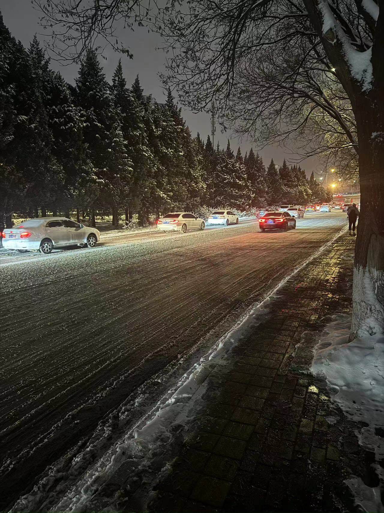

> 记录暴雪下普通打工人的生活。

#### 12月14日 周四

北京的雪已经连着下了两天了。

12月11日，也是因为下雪，晚上打车打到10点半才叫到车。

所以这次下雪后，晚上就早走了。

7:15坐上公司摆渡车，7:40左右到西二旗。

下车前刷微博看到有说昌平线故障，还没细看就到站下车了，还没想到事情的严重性。

路口已经有交警在指挥交通，看见两辆消防车在等红灯，事后想可能是去救援的。

走到进站口，就听到有人喊，“昌平线故障不停车，请更换其他交通工具”。

我坐13号线，继续往前走，就看到了下面的情景。

栏杆里全是人，后面的人还在不断的往里进。

看了下门口的人不动，人太多，不敢进去，先看看情况。

过了一会，有人喊13号线也停了，扭头赶紧走。

第一反应打车，看了下，排队900人，直接放弃，换公交。

最近的公交站在西二旗大街，走吧。

到公交站一看，人更多，本来路就窄，全是人，走都没法走。

公交也没戏了，继续走吧，走过这段到前面看看再。

事后看说有的车被挤爆了，吓的别的车都不敢开门了。

走的有点冷，闻见一股香味，一看手机快8点半了，找个地吃点东西先。

一碗馄饨下肚，暖和多了，继续上路。

走的小腿有点酸了，终于到公交站了。

等了一小会，总算上车了。

车也不敢开的快，10迈左右。

晚上10点，终于到家了。

路上花费**2小时45分钟**。

#### 12月15日 周五

早上坐公交到地铁站。



霍营地铁站盛况，人挤满了整个通道。

立马出站，换乘公交。

路上花费**2小时**。