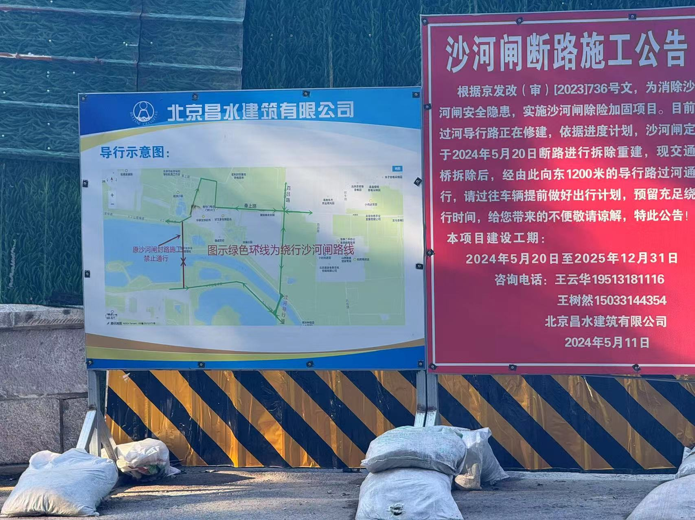
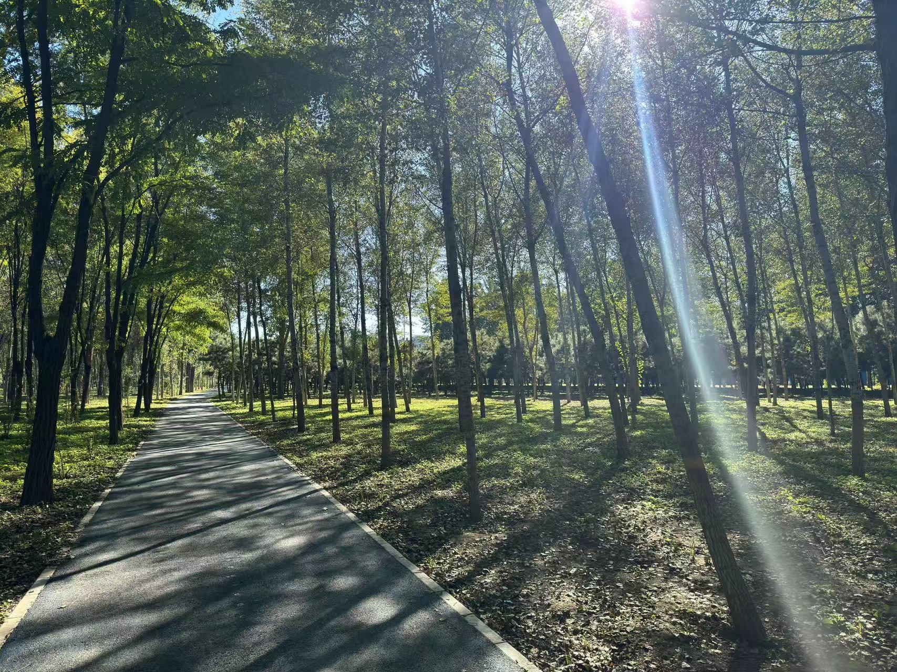

五一的时候带娃骑过南边这段，网上查了说北边这段不好骑，难得2号下午有空，决定先自己走一遍看看。

从家附近的奥北森林公园开始，骑行到沙河水库，整个行程近30公里，耗时3个小时左右。

奥北森林公园不大，出来后要走一段太平庄中街和建材城东路的社会路段，目前还在施工，道路坑洼不好骑，不过还好并不长。

路过霍家营小区，查了一下原来是个霍家营村。

进入霍营公园，里面很大，有专门的骑行道。

出公园后，穿过马路，过桥右拐，注意别走错，是直接过桥。

路过第一个路标，还是继续树林间骑行，道路一般，没有公园的专用道好骑。

树叶已经开始变黄了，没想到，在北京还能看见一片玉米地。

平西府的介绍，出来后上北清路转上承路，这段是社会道路，也正在施工，不好骑。

路边有个小口子，从这进入一片绿地，地图上看在白庙村附近。

穿过社会道路，注意安全。

看定位在温都水城附近了，还要再穿一次社会道路。

林间绿道结束了，出来就是定泗路，非常难走的一段，路窄，而且各种大车。

记住这个小口子，回来的时候一不小心错过，白骑了好一段路。

定泗路转苍龙街，然后就开始沿着温榆河一直走，路也很窄，还是有点危险的。

沙河水库正在改造施工，我按地图路线走的，结果到跟前没法继续了。

正确的路线应该是在来的路上有一个过河的导行路，从那里过去。

休息了20分钟，打道回府。

总结来说，北边这段路线要穿越占用社会道路，定泗路开始尤其危险，并不适合带娃骑行。

路上的一些杂拍，穿林而过，感觉挺好。

