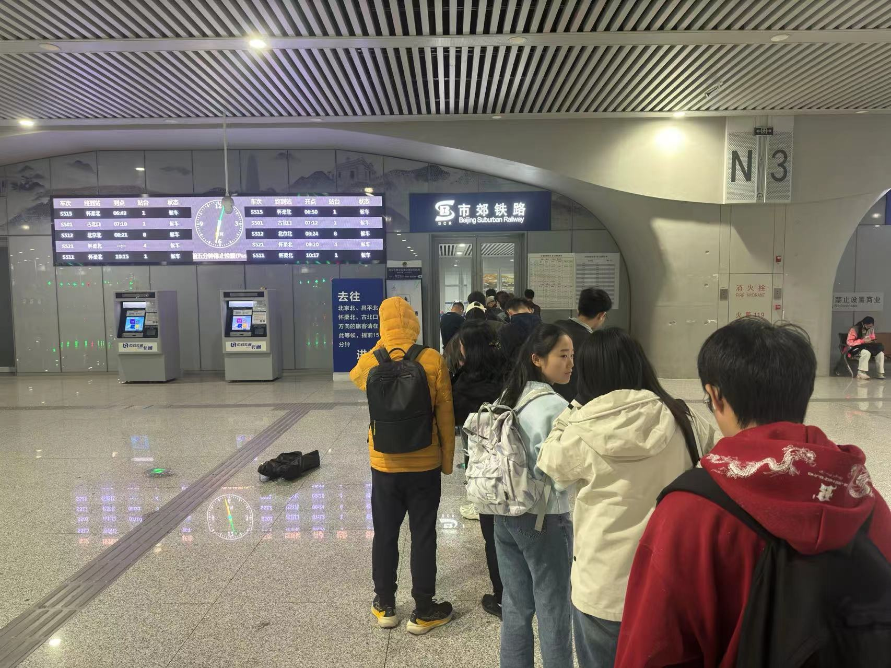
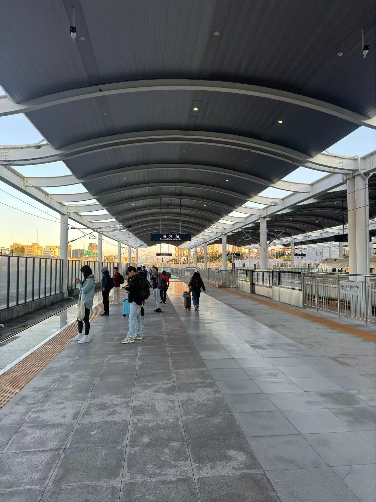
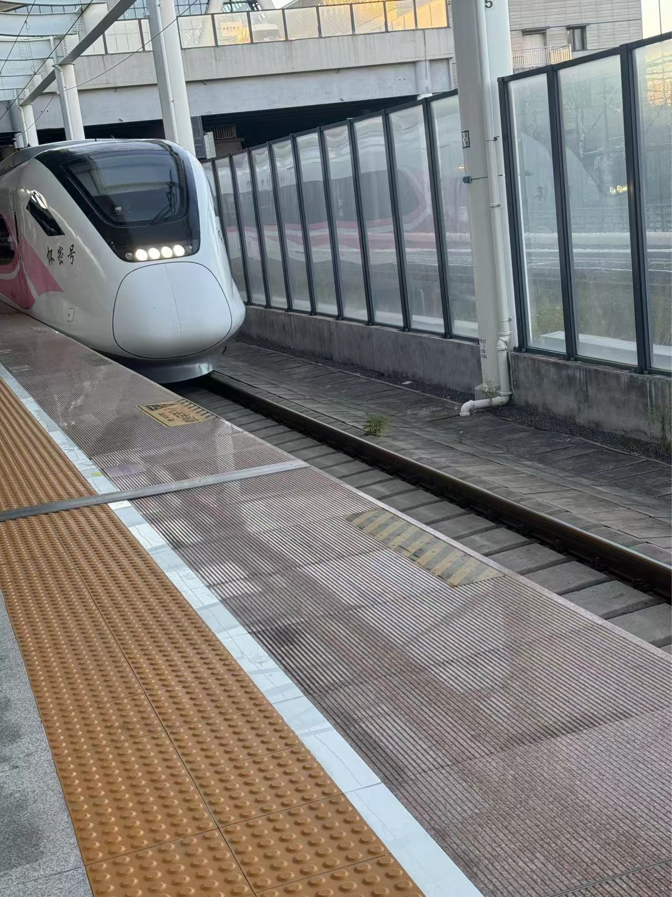
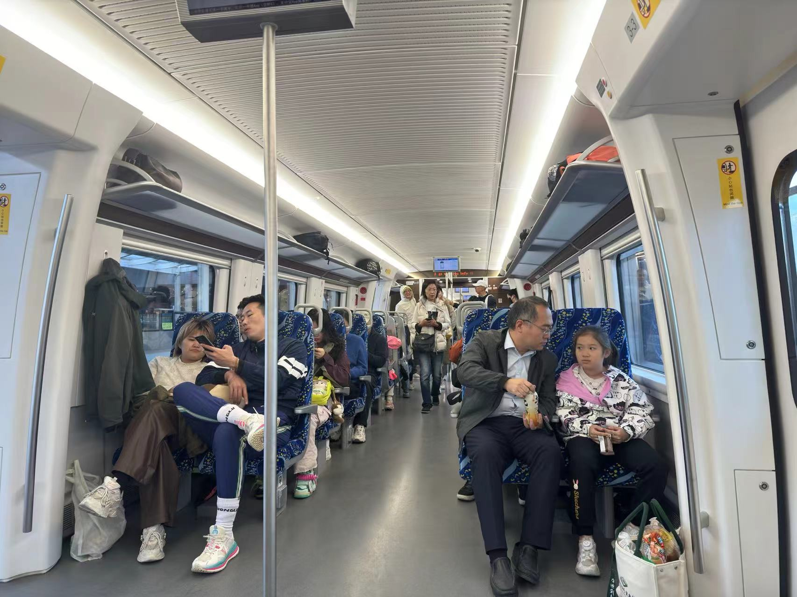
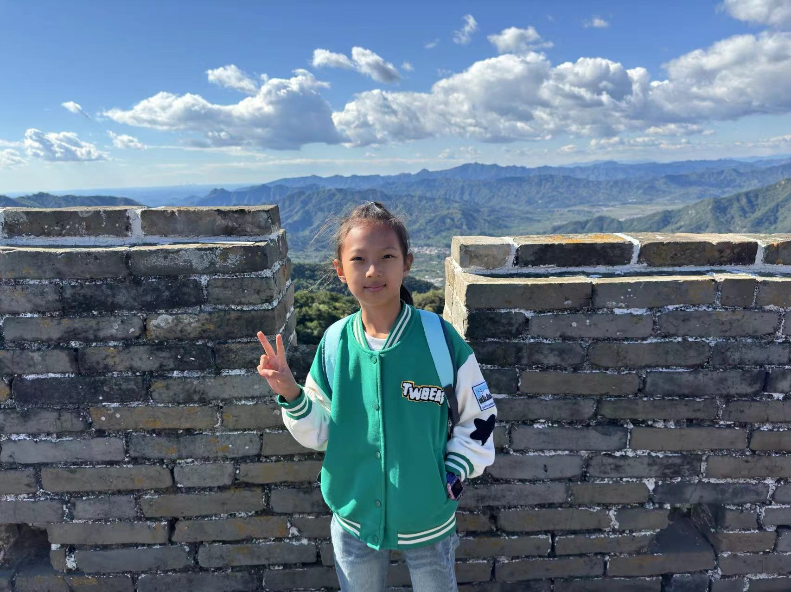
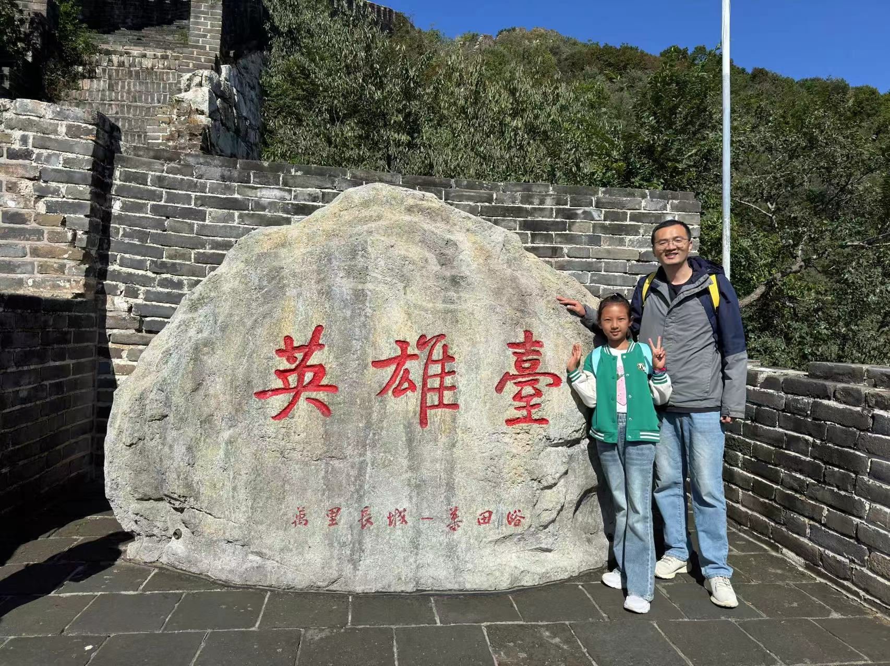
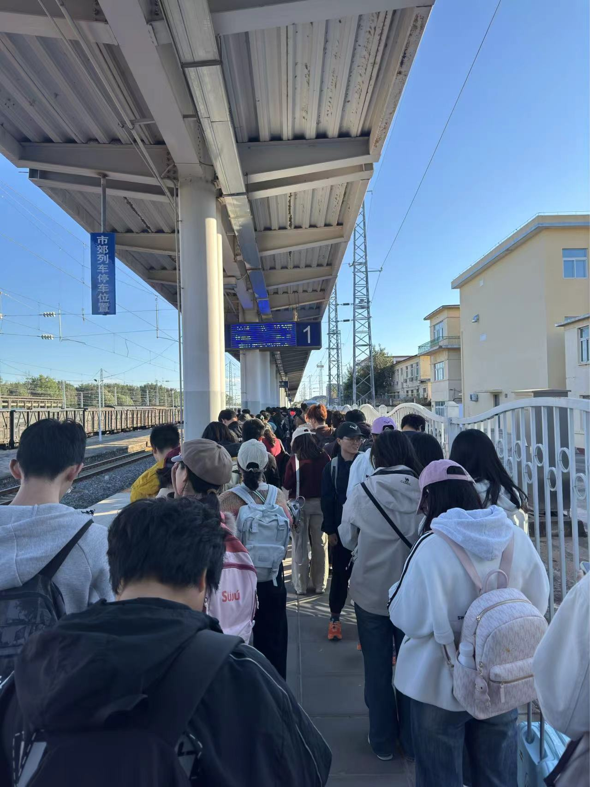

早上5点半起床洗漱，6点出门打车直奔清河站，6点50的火车S515清河-雁栖湖。

虽然坐地铁经常路过清河站，但还是第一次来清河站坐车。

我们提前20分钟到的车站，已经开始排队了。

等了一小会就开始进站了，提前进站台等车。

终于见到了传说中粉色的怀密线列车了。

这趟车跟普通火车不一样，不是固定座位。

清河是第二站，上车还是有座的。

1个小时到雁栖湖站，出站打了个滴滴，半个小时左右到慕田峪长城。

进门往前走，直奔摆渡车，景区里人还不多。

摆渡车下来，继续往前，会先路过索道滑道的入口，我们是缆车继续往前走。

上缆车，几分钟就到山顶了，直奔西线开爬。









因为在电视上看过八达岭长城十一的阵势，特意选了人少一些的慕田峪长城。

整个行程下来，人都不算太多。

当天风特别大，还好穿了抗风的外套。

另外爬好汉坡的时候，短短几分钟，经历了大晴天->下雨->下雪->大晴天的变化。

西线除了最后的好汉坡，大部分地方都是平路，台阶都很少。

我们走走停停，3个小时左右就下山了，感觉并没有太累。

回程没买到雁栖湖站的票，只好买的怀柔北站。

幸好买的怀柔北站，赶上十一学生回家，怀柔北站上车就没座了。

