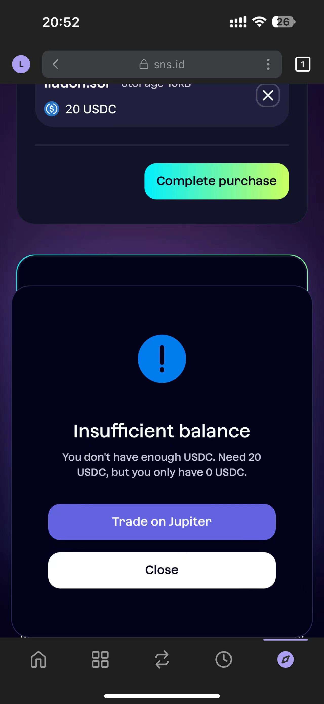
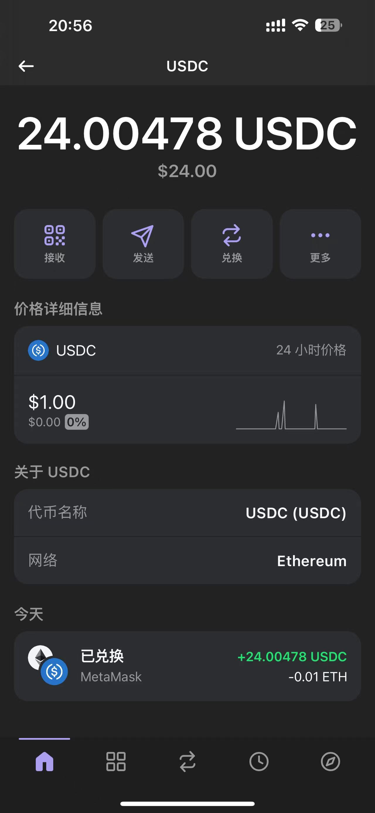
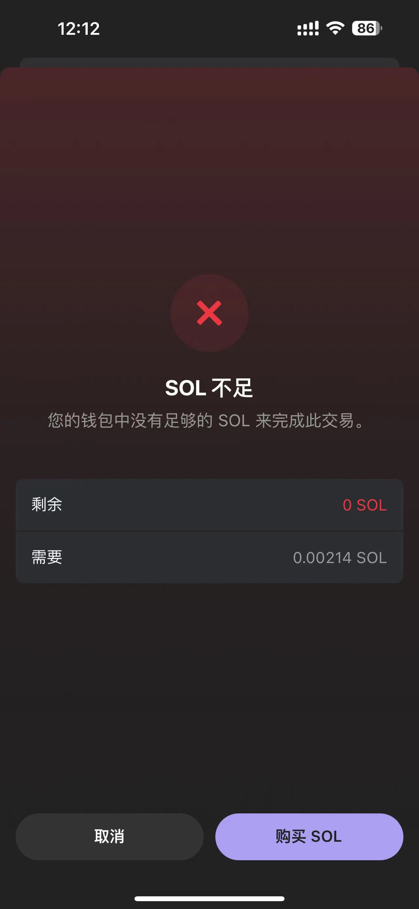
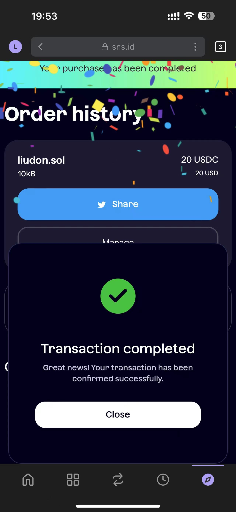

Livid大佬新搞了个[支持Solana的IPFS/IPNS网关](https://www.v2ex.com/t/1078126)，了解到还有一个`.sol`的web3域名。

> Solana域名服务（SNS）的目标是提供一种去中心化且可负担的方式，将域名（.sol）和链上数据连接起来。这些链上数据可以是SOL地址、 IPFS CID、图片、文本、或者任何其它的东西。
>
> The mechanics of purchasing a .sol domain are a bit different than ENS — they don’t expire and most domain sales are run via auction. 
>
> https://brandsec.com.au/sol-domains/

哇塞，这域名没有过期一说，不需要续费。

正好`liudon.sol`还未注册，决定入手。

用MetaMask试了下，连接钱包的时候没有反应，问了下Livid，说是得用Phantom。

下载好Phantom，在[sns.id](https://sns.id)注册域名，提交订单的时候发现不支持ETH支付。

又回到MetaMask，用ETH兑换USDC。

但是提交订单支付的时候，提示还是没有USDC。




奇了怪了，请教了一下Livid，原来这俩是不同的网络：

```
MetaMask使用的是Ethereum；
Phantom使用的是Solana；
```

按Livid的提示，用交易所把USDC转到了Phantom钱包。

重新付款，又提示没有SOL，查了一下，原来Solana网络手续费都是用的SOL。



又回到MetaMask兑换了些SOL，然后通过交易所转换时，发现必须得有SOL支付手续费才能进行转换。

呃，这下彻底死胡同了。

再次请教Livid，通过交易所兑换了些SOL，转到了Phantom钱包，这下总算搞定了。



现在，你可以通过[https://liudon.sol.build](https://liudon.sol.build)访问了。