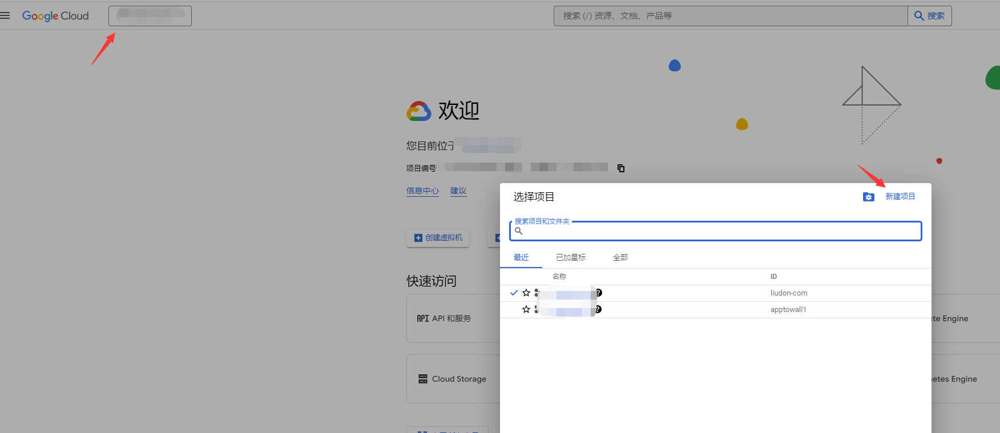
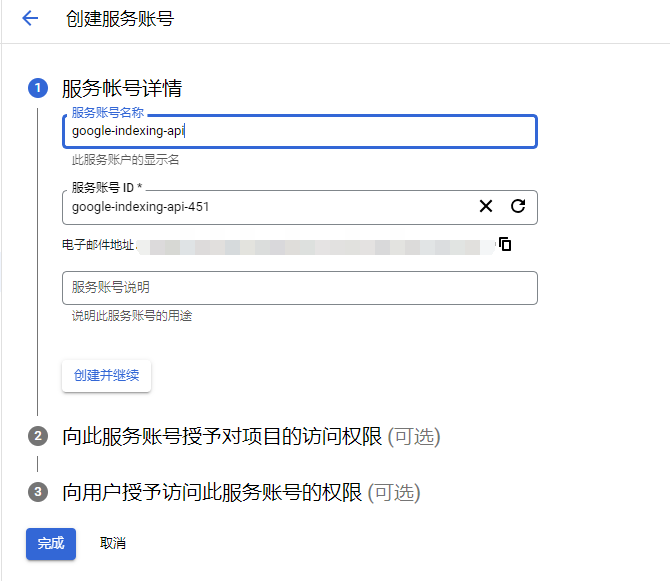
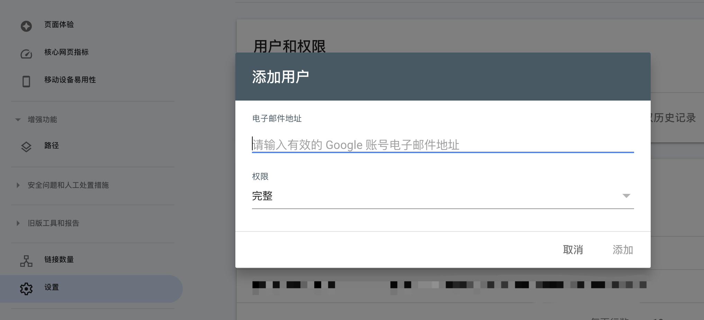
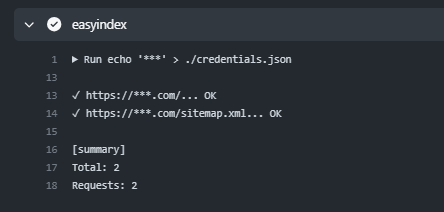

对于一个新站点来说，总是想着能让搜索引擎快点收录网站内容。

今天，我们就来介绍一种利用`Google Indexing API`接口，通过`Github Actions`实现部署时通知`Google`抓取页面内容。

操作步骤：

1. 申请`Google API`凭证

    访问[Google Cloud控制台](https://console.cloud.google.com/)，如果没有项目，点击选择项目，然后新建项目。

    

    选择对应项目，点击`IAM和管理`标签，点击`服务帐号`，选择新建服务帐号。

    

    ```
    服务帐号名称：自己起个名字即可
    服务帐号id：不需要修改，自动生成
    服务角色：Owner
    ```

    填写相关信息后，点击完成创建好服务帐号。

    

    创建完，默认是没有密钥的，记住账号的邮箱地址，后面要用到。
    
    点击后面的三个点按钮，选择管理密钥。

    点击添加密钥->新建密钥，选择`JSON`格式，点击创建会下载一个文件，这里后面会用到。

    回到首页，点击`API和服务`，点击`启用API和服务`，搜索框输入`Indexing`，选择`Web Search Indexing API`，点击启用即可。

2. 将服务账号关联到`Google Search Console`

    进入[Google Search Console控制台](https://search.google.com/)，选择你的网站。

    找到设置里的用户和权限，点击添加用户。

    

    ```
    邮箱地址：填写第一步分配的邮箱地址
    权限：选择拥有者
    ```

3. 配置`Github Action`

    - 添加`Secret`变量，变量key为`GOOGLE_INDEXING_API_TOKEN`，值为前面下载文件的内容。

    - 编辑`workflow`编排任务，新增步骤

    ```
    - name: easyindex
        run: |
          echo '${{ secrets.GOOGLE_INDEXING_API_TOKEN }}' > ./credentials.json

          touch ./url.csv
          echo "\"notification_type\",\"url\"" >> ./url.csv # Headers line
          echo "\"URL_UPDATED\",\"https://liudon.com/\"" >> ./url.csv # ADD URL 这里改为你的博客首页
          echo "\"URL_UPDATED\",\"https://liudon.com/sitemap.xml\"" >> ./url.csv # ADD URL 这里改为你的sitemap地址

          curl -s -L https://github.com/usk81/easyindex-cli/releases/download/v1.0.6/easyindex-cli_1.0.6_linux_amd64.tar.gz | tar xz
          chmod +x ./easyindex-cli
          ./easyindex-cli google -d -c ./url.csv
    ```

    
