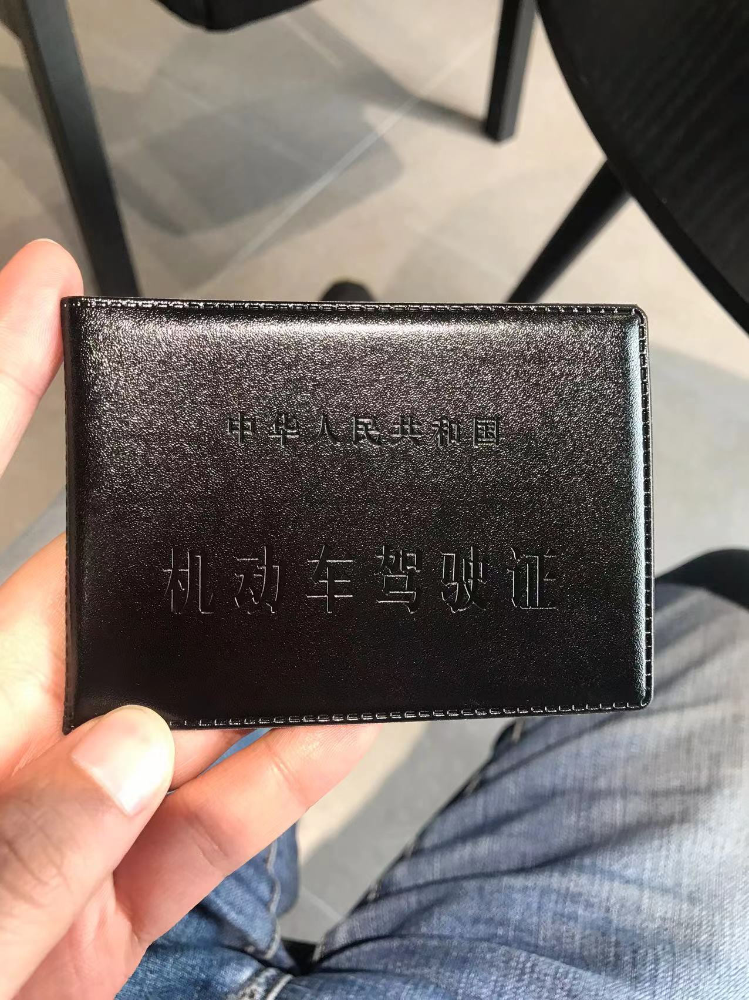

之前在[2022年终总结](https://liudon.com/posts/review-2022/)提到过，我在练车考驾照。

就在昨天，终于拿证了。👏👏👏

咱也是可以上路开车的人了，虽然比别人晚了快10年才拿证。🐶

```
2022年6月11日，在海淀驾校报名，周末连续班，报名费5380元。

2022年10月12日，科目一考试通过。

2022年10月22日，科目二模拟驾驶。

2022年11月13日，科目二第一次上车练习。

2022年11月24日，疫情严重，驾校发通知，自11月25日暂停培训。

2023年2月4日，年后驾校恢复培训，继续科目二练车。

2023年2月13日，科目二考试通过。

2023年3月11日，科目三上路练习。

2023年3月23日，上午科目三考试通过，下午科目四考试通过。
考试的时候，早上遇到临时交通管制，一直到9点40才开考。
考完回来，班车上的人说又管制不能考了。
班车拉回驾校，剩下的人中午加班考试。
```

终于不用再5点半起床赶班车了。🥱

