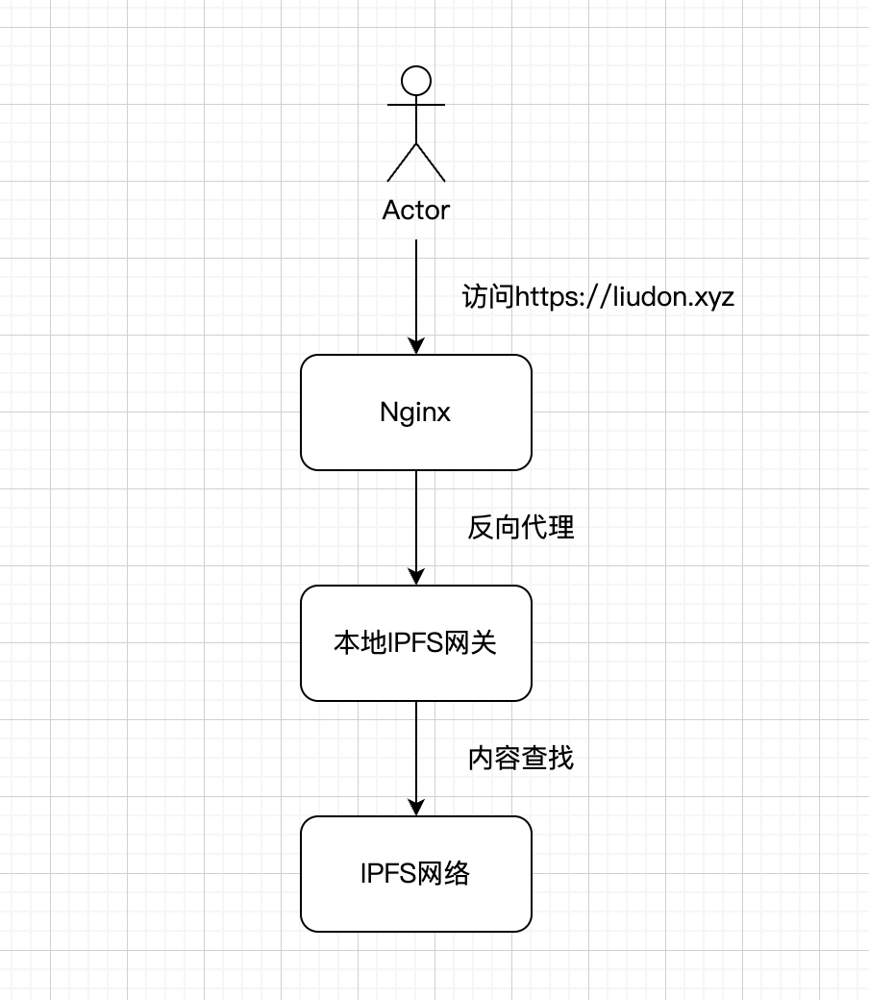

#### 背景

4月底的时候，Livid大佬提醒，`Cloudflare`应该是调整了`IPFS Gateway`网关策略，我的[IPFS镜像博客](https://liudon.xyz)无法访问了。

没查到`Cloudflare`的调整说明，不过还好`IPFS`官方也提供了公共网关`gateway.ipfs.io`，将域名解析改到官网网关。

但还是无法访问，被`Cloudflare`拦截了。

```
Error 1014 Ray ID: 887cc7fcfa2804bb • 2024-05-22 12:24:05 UTC
CNAME Cross-User Banned
What happened?
You've requested a page on a website that is part of the Cloudflare network. The host is configured as a CNAME across accounts on Cloudflare, which is not allowed by Cloudflare's security policy.

What can I do?
If this is an R2 custom domain, it may still be initializing. If you have attempted to manually point a CNAME DNS record to your R2 bucket, you must do it using a custom domain. Refer to R2's documentation for details.


Visit our website to learn more about Cloudflare.
```

这周在Discord群里，看到有人发消息，说是`Cloudflare`将下线`IPFS Gateway`网关服务。

https://blog.cloudflare.com/cloudflares-public-ipfs-gateways-and-supporting-interplanetary-shipyard

> All traffic using the cloudflare-ipfs.com or cf-ipfs.com hostname(s) will continue to work without interruption and be redirected to ipfs.io or dweb.link until August 14th, 2024, at which time the Cloudflare hostnames will no longer connect to IPFS and all users must switch the hostname they use to ipfs.io or dweb.link to ensure no service interruption takes place. If you are using either of the Cloudflare hostnames, please be sure to switch to one of the new ones as soon as possible ahead of the transition date to avoid any service interruptions!

#### 方案调研

经过一番搜索，找到了一篇[自建IPFS Gateway`关的资料](https://railway.app/template/PhPjgz)，里面用到了[bifrost-gateway](https://github.com/ipfs/bifrost-gateway)组件。

```
To run against a compatible, local trustless gateway provided by Kubo or IPFS Desktop:

$ PROXY_GATEWAY_URL="http://127.0.0.1:8080" ./bifrost-gateway
```

看文档，可以通过这个命令搭建一个自己的网关服务，同时支持`DNSLink`方式访问。

太棒了，感觉可以自己搭一套网关，然后用`Nginx`反代对外提供服务。

在之前[将博客部署到星际文件系统(IPFS)](https://liudon.com/posts/deploy-blog-to-ipfs/)文章中，已经通过`Kubo`搭建了一套本地`IPFS`服务。

上机器验证一下可行性：


1. 启动Bifrost Gateway，网关默认地址为`https://127.0.0.1:8081`

    ```
    $ PROXY_GATEWAY_URL="http://127.0.0.1:8080" ./bifrost-gateway
    2024/05/22 20:54:00 Starting bifrost-gateway dev-build
    2024/05/22 20:54:00 Proxy backend (PROXY_GATEWAY_URL) at http://127.0.0.1:8080
    2024/05/22 20:54:00 BLOCK_CACHE_SIZE: 1024
    2024/05/22 20:54:00 GRAPH_BACKEND: false
    2024/05/22 20:54:00 Legacy RPC at /api/v0 (KUBO_RPC_URL) provided by http://127.0.0.1:5001
    2024/05/22 20:54:00 Path gateway listening on http://127.0.0.1:8081
    2024/05/22 20:54:00   Smoke test (JPG): http://127.0.0.1:8081/ipfs/bafybeigdyrzt5sfp7udm7hu76uh7y26nf3efuylqabf3oclgtqy55fbzdi
    2024/05/22 20:54:00 Subdomain gateway configured on dweb.link and http://localhost:8081
    2024/05/22 20:54:00   Smoke test (Subdomain+DNSLink+UnixFS+HAMT): http://localhost:8081/ipns/en.wikipedia-on-ipfs.org/wiki/
    2024/05/22 20:54:00 Metrics exposed at http://127.0.0.1:8041/debug/metrics/prometheus
    ```

2. 在另外一个终端下，执行命令

    ```
    $ curl 'http://127.0.0.1:8081/' -H"Host:liudon.xyz" -I
    HTTP/1.1 200 OK
    Accept-Ranges: bytes
    Access-Control-Allow-Headers: Content-Type
    Access-Control-Allow-Headers: Range
    Access-Control-Allow-Headers: User-Agent
    Access-Control-Allow-Headers: X-Requested-With
    Access-Control-Allow-Methods: GET
    Access-Control-Allow-Methods: HEAD
    Access-Control-Allow-Methods: OPTIONS
    Access-Control-Allow-Origin: *
    Access-Control-Expose-Headers: Content-Length
    Access-Control-Expose-Headers: Content-Range
    Access-Control-Expose-Headers: X-Chunked-Output
    Access-Control-Expose-Headers: X-Ipfs-Path
    Access-Control-Expose-Headers: X-Ipfs-Roots
    Access-Control-Expose-Headers: X-Stream-Output
    Content-Length: 26283
    Content-Type: text/html
    Etag: "QmebCXeD6XDB9xsVvX5Te91EeF5t7sk65A3adsLQ9bostj"
    Last-Modified: Wed, 22 May 2024 12:57:29 GMT
    X-Ipfs-Path: /ipns/liudon.xyz/
    X-Ipfs-Roots: QmebCXeD6XDB9xsVvX5Te91EeF5t7sk65A3adsLQ9bostj
    Date: Wed, 22 May 2024 12:57:29 GMT
    ```

验证可行，不过我记得`Kubo`默认就有网关服务的，试一下直接通过`Kubo`默认网关的情况。

*Kubo默认网关地址为http://127.0.0.1:8080*

```
$ curl 'http://127.0.0.1:8080/' -H"Host:liudon.xyz" -I
HTTP/1.1 200 OK
Accept-Ranges: bytes
Access-Control-Allow-Headers: Content-Type
Access-Control-Allow-Headers: Range
Access-Control-Allow-Headers: User-Agent
Access-Control-Allow-Headers: X-Requested-With
Access-Control-Allow-Methods: GET
Access-Control-Allow-Origin: *
Access-Control-Expose-Headers: Content-Length
Access-Control-Expose-Headers: Content-Range
Access-Control-Expose-Headers: X-Chunked-Output
Access-Control-Expose-Headers: X-Ipfs-Path
Access-Control-Expose-Headers: X-Ipfs-Roots
Access-Control-Expose-Headers: X-Stream-Output
Content-Length: 26283
Content-Type: text/html
Etag: "QmebCXeD6XDB9xsVvX5Te91EeF5t7sk65A3adsLQ9bostj"
Last-Modified: Wed, 22 May 2024 12:59:25 GMT
X-Ipfs-Path: /ipns/liudon.xyz/
X-Ipfs-Roots: QmebCXeD6XDB9xsVvX5Te91EeF5t7sk65A3adsLQ9bostj
Date: Wed, 22 May 2024 12:59:25 GMT
```

也是可以的，那就没必要多搞一套bifrost网关了。

#### 具体实现

通过`Nginx`反向代理转发到本地`IPFS`网关，只需要改一下解析就可以继续使用`IPFS`服务了。



1. `Nginx`反向代理

```
server {
    listen 443 ssl http2;
    server_name liudon.xyz;

    ssl_certificate /etc/nginx/ssl/liudon.xyz/fullchain.cer;
    ssl_certificate_key /etc/nginx/ssl/liudon.xyz/liudon.xyz.key;

    ssl_protocols TLSv1.2 TLSv1.3;
    ssl_ciphers 'TLS_AES_128_GCM_SHA256:TLS_AES_256_GCM_SHA384:TLS_CHACHA20_POLY1305_SHA256:ECDHE-RSA-AES128-GCM-SHA256:ECDHE-RSA-AES256-GCM-SHA384';
    ssl_prefer_server_ciphers on;
    ssl_session_cache shared:SSL:10m;
    ssl_session_timeout 10m;

    location / {
            proxy_pass http://127.0.0.1:8080;
            proxy_set_header Host $host;
    }

    access_log /var/log/nginx/liudon.xyz.access.log;
    error_log /var/log/nginx/liudon.xyz.error.log;
}
```

申请`Let's Encrypt`证书，证书相关的就不多做介绍了，网上资料很多。

2. 更改DNS解析

```
原有的解析

类型：CNAME
名称：liudon.xyz
内容：cloudflare-ipfs.com

新的解析

类型：A
名称：liudon.xyz
内容：你的服务器公网IP
```

搞定，又可以继续白嫖`IPFS`服务了。