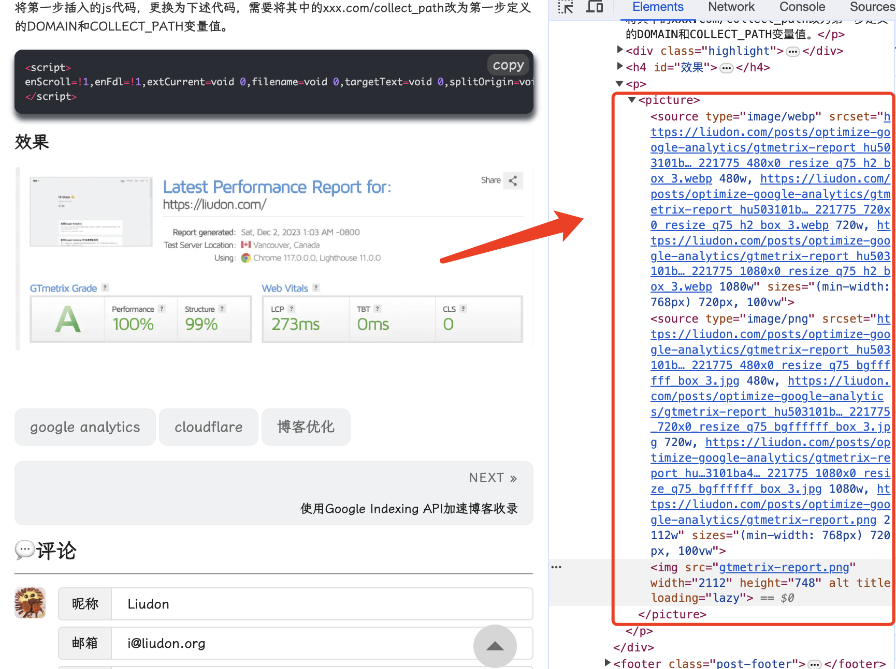
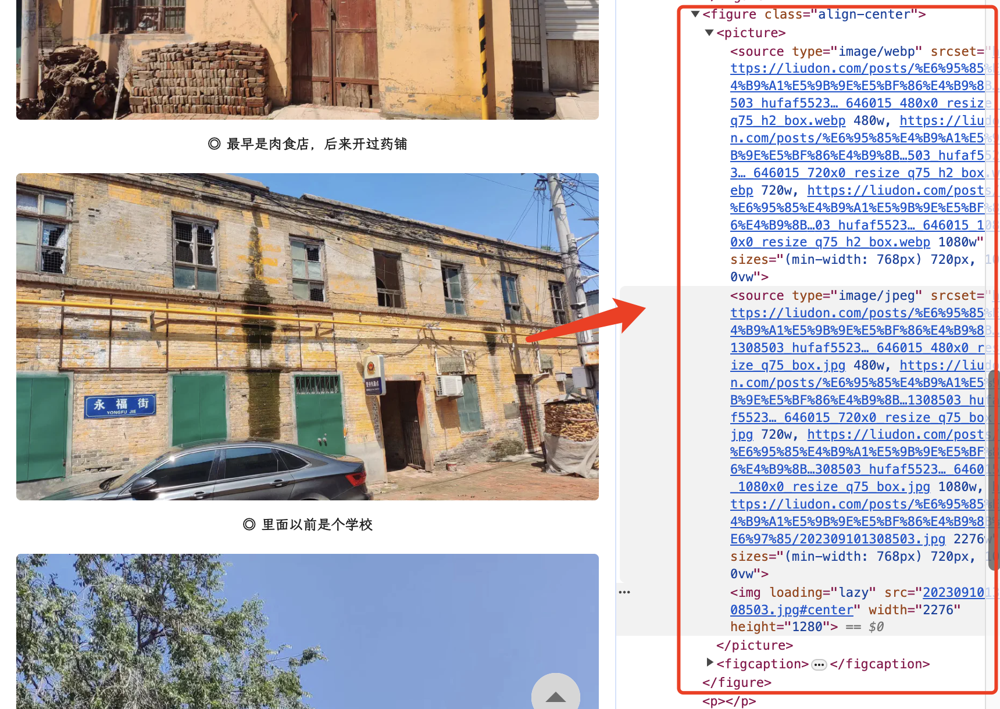
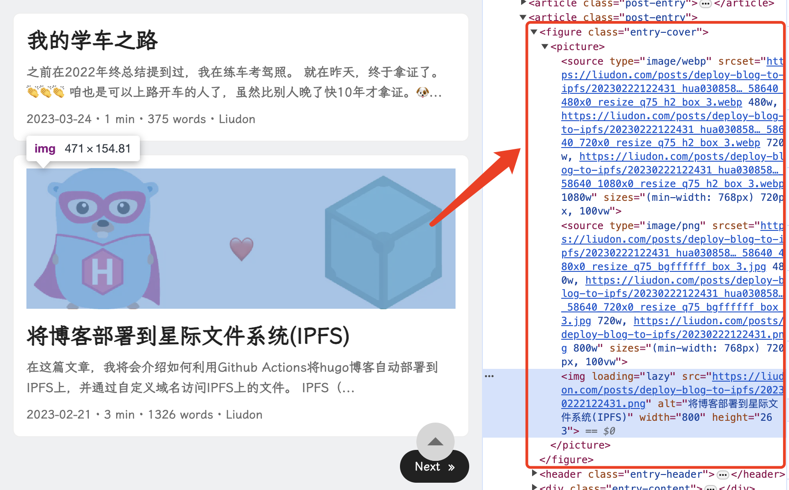

继续我们的[博客优化之旅](/tags/博客优化/)，本篇内容我们将介绍如何使用`Hugo`实现响应式和优化的图片。

#### 问题

在之前文章里，通过腾讯云数据万象实现了图片优化能力，具体的可参考文章[累计布局偏移修复方案改进 —— 自动生成图片宽高](https://liudon.com/posts/hugo-auto-generate-image-width-and-height/)。

经过一段运行后，发现这里有一个弊端。

```
Run hugo --gc --minify --cleanDestinationDir
Start building sites … 
hugo v0.119.0-b84644c008e0dc2c4b67bd69cccf87a41a03937e linux/amd64 BuildDate=2023-09-24T15:20:17Z VendorInfo=gohugoio

ERROR Failed to get JSON resource "https://static.***.com/64412246-9050f100-d0c1-11e9-893a-f9b0766533ad.png?imageInfo&t=1698674110": Get "https://static.***.com/64412246-9050f100-d0c1-11e9-893a-f9b0766533ad.png?imageInfo&t=1698674110": stream error: stream ID 1; STREAM_CLOSED; received from peer
ERROR Failed to get JSON resource "https://static.***.com/SkRx5uFwQ8Cliyq.jpg?imageInfo&t=1698674110": Get "https://static.***.com/SkRx5uFwQ8Cliyq.jpg?imageInfo&t=1698674110": stream error: stream ID 3; STREAM_CLOSED; received from peer
```

随着图片数量增多，因为需要调接口查询图片信息，这里构建耗时变长，同时也特别容易出现超时导致构建失败。

失败的时候，需要手动重跑构建，自动化发布卡壳了。

#### 优化

经过一番搜索，发现其实`Hugo`本身是支持图片处理能力的。

> **Image processing**
> 
> Resize, crop, rotate, filter, and convert images.
>
> https://gohugo.io/content-management/image-processing/

下面以我使用的[PaperMod主题](https://github.com/adityatelange/hugo-PaperMod/)为例，讲下如何通过`image processing`实现图片响应式优化。

`image processing`需要用到`Page bundles`，所以**文章目录结构需要调整**，
将一篇文章的资源（md文件，图片等）放在一个目录下。

```
content/
├── posts
│   ├── my-post
│   │   ├── content1.md
│   │   ├── content2.md
│   │   ├── image1.jpg
│   │   ├── image2.png
│   │   └── index.md
│   └── my-other-post
│       └── index.md
```

目录结构调整完毕后，接下来修改图片显示文件代码。

这里需要生成`webp`格式图片，所以**需要使用`hugo`的extended版本**。

`PagerMod`主题涉及到图片显示的一共三个文件：

- _default/_markup/render-image.html，对应markdown图片语法解析。

    ```
    {{- $respSizes := slice 480 720 1080 -}} /*生成的图片规格*/
    {{- $dataSzes := "(min-width: 768px) 720px, 100vw" -}}

    {{- $holder := "GIP" -}}
    {{- $hint := "photo" -}}
    {{- $filter := "box" -}}

    {{- $Destination := .Destination -}}
    {{- $Text := .Text -}}
    {{- $Title := .Title -}}

    /*内容图片响应式开关配置，默认为true*/
    {{- $responsiveImages := (.Page.Params.responsiveImages | default site.Params.responsiveImages) | default true }}

    {{ with $src := .Page.Resources.GetMatch .Destination }}
        {{- if $responsiveImages -}}
            <picture>
                /*只有使用了hugo扩展版本的，才生成webp格式图片*/
                {{- if and hugo.IsExtended (ne $src.MediaType.Type "image/webp") -}}
                <source type="image/webp" srcset="
                {{- with $respSizes -}}
                    {{- range $i, $e := . -}}
                        {{- if $i }}, {{ end -}}{{- ($src.Resize (print . "x webp " $hint " " $filter) ).RelPermalink | absURL }} {{ . }}w
                    {{- end -}}
                {{- end -}}" sizes="{{ $dataSzes }}" />
                {{- end -}}
                <source type="{{ $src.MediaType.Type }}" srcset="
                {{- with $respSizes -}}
                    {{- range $i, $e := . -}}
                        {{- if ge $src.Width . -}}
                            {{- if $i }}, {{ end -}}{{- ($src.Resize (print . "x jpg " $filter) ).RelPermalink | absURL}} {{ . }}w
                        {{- end -}}
                    {{- end -}}
                {{- end -}}, {{$src.Permalink }} {{printf "%dw" ($src.Width)}}" sizes="{{ $dataSzes }}" />
                
            </picture>
        {{- else }}
            
        {{- end }}
    {{ end }}
    ```

- partials/cover.html，对应文章封面解析。

    ```
    {{- $respSizes := slice 480 720 1080 -}}
    {{- $dataSzes := "(min-width: 768px) 720px, 100vw" -}}

    {{- $holder := "GIP" -}}
    {{- $hint := "photo" -}}
    {{- $filter := "box" -}}

    {{- with .cxt}} {{/* Apply proper context from dict */}}
    {{- if (and .Params.cover.image (not $.isHidden)) }}
    {{- $alt := (.Params.cover.alt | default .Params.cover.caption | plainify) }}
    <figure class="entry-cover">
        /*封面响应式图片配置开关，默认为true*/
        {{- $responsiveImages := (.Params.cover.responsiveImages | default site.Params.cover.responsiveImages) | default true }}
        {{- $addLink := (and site.Params.cover.linkFullImages (not $.IsHome)) }}
        {{- $cover := (.Resources.ByType "image").GetMatch (printf "*%s*" (.Params.cover.image)) }}
        {{- if $cover -}}{{/* i.e it is present in page bundle */}}
            {{- if $addLink }}<a href="{{ (path.Join .RelPermalink .Params.cover.image) | absURL }}" target="_blank"
                rel="noopener noreferrer">{{ end -}}
            {{- if $responsiveImages -}}
            <picture>
            {{- if and hugo.IsExtended (ne $cover.MediaType.Type "image/webp") -}}
            <source type="image/webp" srcset="
            {{- with $respSizes -}}
                {{- range $i, $e := . -}}
                    {{- if $i }}, {{ end -}}{{- ($cover.Resize (print . "x webp " $hint " " $filter) ).RelPermalink | absURL }} {{ . }}w
                {{- end -}}
            {{- end -}}" sizes="{{ $dataSzes }}" />
            {{- end -}}
            <source type="{{ $cover.MediaType.Type }}" srcset="
            {{- with $respSizes -}}
                {{- range $i, $e := . -}}
                    {{- if ge $cover.Width . -}}
                        {{- if $i }}, {{ end -}}{{- ($cover.Resize (print . "x jpg " $filter) ).RelPermalink | absURL}} {{ . }}w
                    {{- end -}}
                {{- end -}}
            {{- end -}}, {{$cover.Permalink }} {{printf "%dw" ($cover.Width)}}" sizes="{{ $dataSzes }}" />

            
            </picture>
            {{- else }}{{/* Unprocessable image or responsive images disabled */}}
            
            {{- end }}
        {{- else }}{{/* For absolute urls and external links, no img processing here */}}
            {{- if $addLink }}<a href="{{ (.Params.cover.image) | absURL }}" target="_blank"
                rel="noopener noreferrer">{{ end -}}
                
        {{- end }}
        {{- if $addLink }}</a>{{ end -}}
        {{/*  Display Caption  */}}
        {{- if not $.IsHome }}
            {{ with .Params.cover.caption }}<p>{{ . | markdownify }}</p>{{- end }}
        {{- end }}
    </figure>
    {{- end }}{{/* End image */}}
    {{- end -}}{{/* End context */ -}}
    ```

- shortcodes/figure.html，对应文章内`figure`语法解析。

    ```
    {{- $respSizes := slice 480 720 1080 -}}
    {{- $dataSzes := "(min-width: 768px) 720px, 100vw" -}}

    {{- $holder := "GIP" -}}
    {{- $hint := "photo" -}}
    {{- $filter := "box" -}}

    {{ $src := .Get "src" }}
    {{ $align := .Get "align" }}
    {{ $alt := .Get "alt" }}
    {{ $caption := .Get "caption" }}

    {{- $responsiveImages := (.Page.Params.responsiveImages | default site.Params.responsiveImages) | default true }}

    <figure{{ if or (.Get "class") (eq (.Get "align") "center") }} class="
            {{- if eq (.Get "align") "center" }}align-center {{ end }}
            {{- with .Get "class" }}{{ . }}{{- end }}"
    {{- end -}}>
        {{- if .Get "link" -}}
            <a href="{{ .Get "link" }}"{{ with .Get "target" }} target="{{ . }}"{{ end }}{{ with .Get "rel" }} rel="{{ . }}"{{ end }}>
        {{- end }}
        {{ with $src := $.Page.Resources.GetMatch (.Get "src") }}
        <picture>
            {{- if $responsiveImages -}}
                {{- if and hugo.IsExtended (ne $src.MediaType.Type "image/webp") -}}
                <source type="image/webp" srcset="
                {{- with $respSizes -}}
                    {{- range $i, $e := . -}}
                        {{- if $i }}, {{ end -}}{{- ($src.Resize (print . "x webp " $hint " " $filter) ).RelPermalink | absURL }} {{ . }}w
                    {{- end -}}
                {{- end -}}" sizes="{{ $dataSzes }}" />
                {{- end -}}
                <source type="{{ $src.MediaType.Type }}" srcset="
                {{- with $respSizes -}}
                    {{- range $i, $e := . -}}
                        {{- if ge $src.Width . -}}
                            {{- if $i }}, {{ end -}}{{- ($src.Resize (print . "x jpg " $filter) ).RelPermalink | absURL}} {{ . }}w
                        {{- end -}}
                    {{- end -}}
                {{- end -}}, {{$src.Permalink }} {{printf "%dw" ($src.Width)}}" sizes="{{ $dataSzes }}" />
            {{- end }}
             <!-- Closing img tag -->
        </picture>
        {{ end }}
        {{- if .Get "link" }}</a>{{ end -}}
        {{- if or (or (.Get "title") (.Get "caption")) (.Get "attr") -}}
            <figcaption>
                {{ with (.Get "title") -}}
                    {{ . }}
                {{- end -}}
                {{- if or (.Get "caption") (.Get "attr") -}}<p>
                    {{- .Get "caption" | markdownify -}}
                    {{- with .Get "attrlink" }}
                        <a href="{{ . }}">
                    {{- end -}}
                    {{- .Get "attr" | markdownify -}}
                    {{- if .Get "attrlink" }}</a>{{ end }}</p>
                {{- end }}
            </figcaption>
        {{- end }}
    </figure>
    ```

#### 使用效果

正常插入`jpg/png`图片，构建后会自动生成webp/原始格式下不同规格的图片。

- markdown图片显示



- figure短代码显示



- 封面显示



**提示：**

随着图片数量增多，可能会遇到构建超时的错误，类似下述信息：

```
Start building sites … 
hugo v0.96.0+extended darwin/arm64 BuildDate=unknown
Error: Error building site: "/Users/dondonliu/Code/liudon.github.io/content/posts/xxxx/index.md:1:1": timed out initializing value. You may have a circular loop in a shortcode, or your site may have resources that take longer to build than the `timeout` limit in your Hugo config file.
Built in 22356 ms
```

可以通过修改配置文件`config.yml`，新增`timeout`配置，调大超时时间解决。

```
buildDrafts: false
buildFuture: false
buildExpired: false

timeout: 60s // 调大此处的时间即可
```

终于知道为啥`PagerMod`主题默认只有封面下才有生成不同规格的逻辑了。