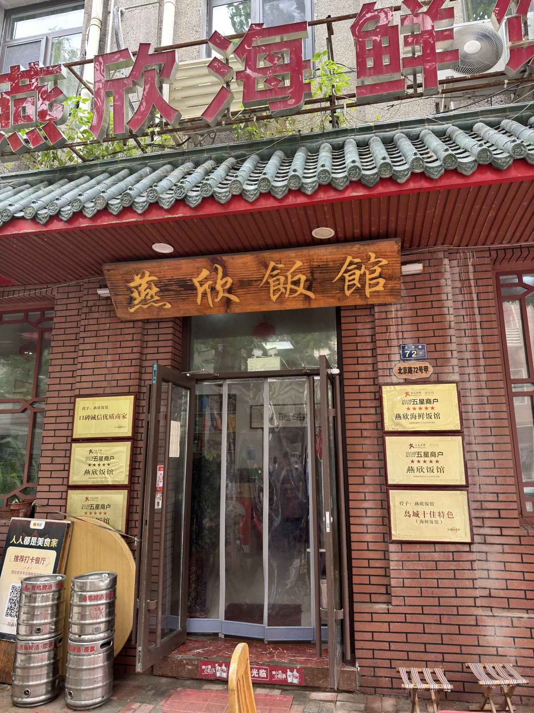
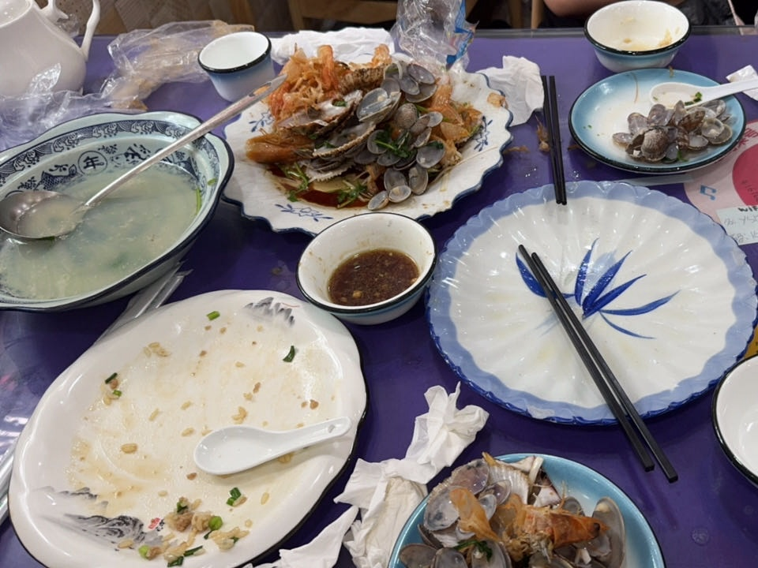
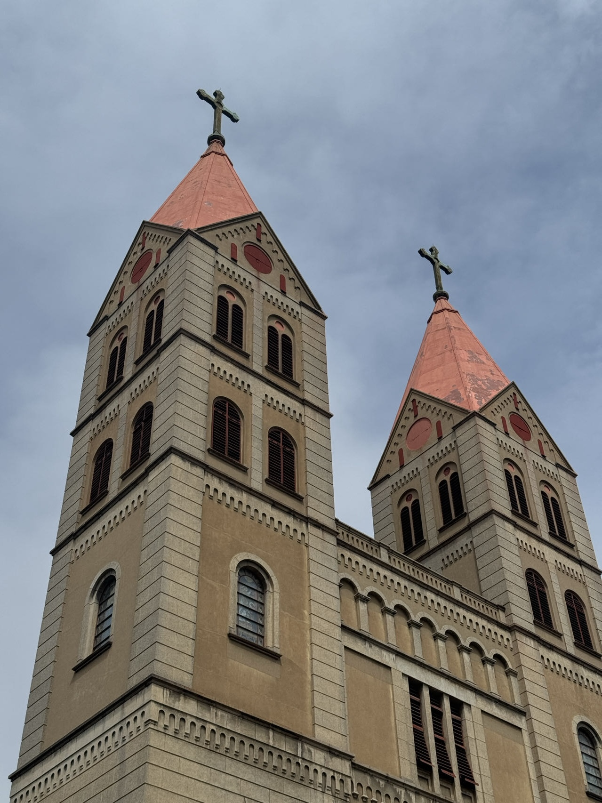
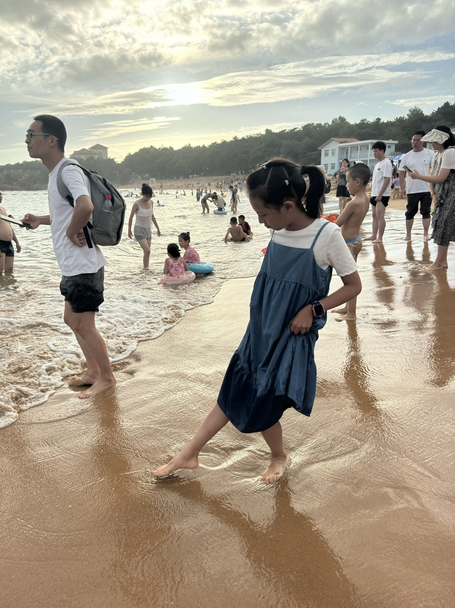

刚放暑假的时候，就答应了娃带她去一趟青岛。

8月份要回老家，所以定在了7月中下旬出发。

车票/酒店都订好了，结果来了个台风格美。

出发前一周一直在查天气，就怕去了一直下雨。

看了台风的预测路径，感觉可能能赶在台风来之前的空档，硬着头皮出发吧。

7月26日乘坐高铁G203，中午12点左右到达青岛。

老天很给面子，是个晴天，还有点晒。


本来的计划路线：

```
第一天：

中午到达青岛 -> 天主教堂 -> 栈桥 -> 八大关 -> 第二海水浴场

第二天：

海底世界/极地海洋馆 -> 石老人海水浴场 -> 五四广场/奥帆中心夜景

第三天：

酒店休息返京
```

按这个路线，定了两个酒店，一个在栈桥附近，一个在海洋馆附近。

到了青岛后，先去酒店放行李，然后打车去吃饭。

青岛的第一顿饭，我们选了吃海鲜，事前查了些攻略，选择了栈桥附近的燕欣饭馆。



中午很饿，上来就吃，忘记拍照了，只有吃完后的照片了。



油焖大虾相当不错，海肠捞饭非常好吃，韭菜很鲜。

3个人，一共花了240元，非常推荐的一家店。

吃完饭，溜达到天主教堂打卡。



然后是栈桥，人非常多，中午非常晒。


于是回酒店稍作休息，决定打车直奔第二海水浴场玩水。

踩水的感觉太好玩了，娃从一开始的有点害怕，到后面追着水玩。



玩完打车去的美团推荐的双合园，地方很小，需要等位。

吃下来，感觉不如第一顿好吃，菜品一般，不太推荐。

吃完已经9点了，错过了夜景时间，直接回酒店休息了。

第二天起床，发现外面下雨了，风很大，最终没逃过台风的影响。

昨天路过海洋馆，看了外面排队的人巨多，决定不去室内这种海洋馆了。

先去了银鱼巷溜达一圈，没啥看的，中午在1907青岛老味道吃的午饭，非常不推荐的一家店。

吃完饭打车到奥帆中心，想着坐船玩一圈，到了发现因为风大停运了。


打卡完，直奔第三海水浴场玩水。

到了发现因为风大不让下水了，只能在沙滩上玩沙子了。


和娃一起抓了几只小螃蟹，虽然天气不好，娃玩的还是很开心。


实在不想吃海鲜了，晚饭在酒店附近吃了个米村拌饭，发现旁边有家类似北京的老年厨房，非常便宜，菜品也不错，第二天早晨在这里解决了。

天气不好，晚上在酒店看电视了，点了个麦当劳夜宵，结果娃没吃多少，全我吃了，给我撑的。

第三天天晴了，但是风还是大。

决定到第二海水浴场看看运气，到了之后还是不让下水，在沙滩上玩了会沙子。

时间差不多，回酒店办退房。

然后步行到火车站，上车回京。

青岛之行就此结束了，尽管行程很短，天气不太好，但一家人在一起就很开心，唯一的教训就是晚上夜宵不要吃的太多。 😂