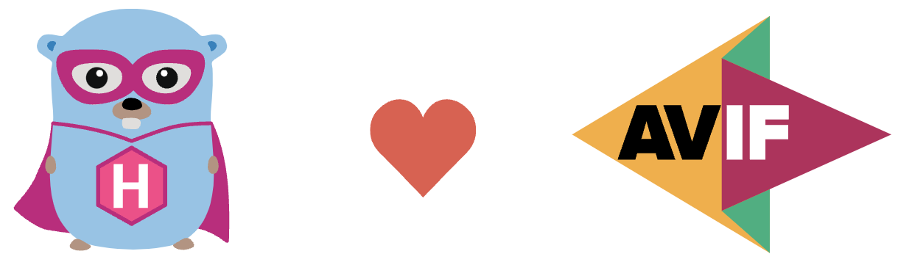
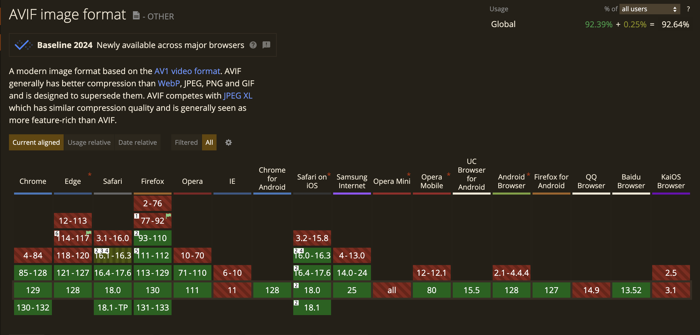
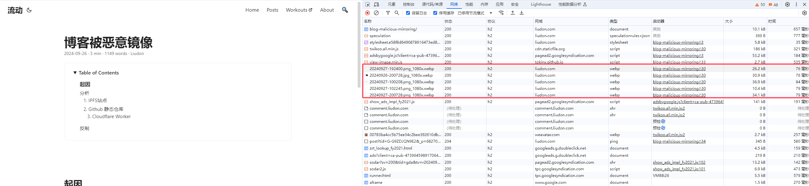
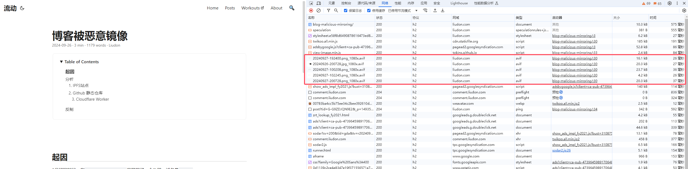

这篇文章会介绍基于Github Workflow使用ImageMagick生成AVIF图片，来优化Hugo站点的加载速度。

## 背景

AVIF是什么？

> AVIF（AV1 Image File Format）是一种基于AV1视频编码标准的图像文件格式。
> 
> A modern image format based on the AV1 video format. 
> 
> AVIF generally has better compression than WebP, JPEG, PNG and GIF and is designed to supersede them.



在2024年，绝大部分浏览器都已经支持了AVIF格式。

ImageMagick是什么？

> ImageMagick® is a free, open-source software suite, used for editing and manipulating digital images. 
> 
> It can be used to create, edit, compose, or convert bitmap images, and supports a wide range of file formats, including JPEG, PNG, GIF, TIFF, and Ultra HDR.

ImageMagick是一款用于图像处理的一个工具。

## 对比

AVIF说的这么好，我们来验证对比一下。

对于一张PNG的图片，使用ImageMagick分别生成WEBP和AVIF格式的图片，文件大小如下：

```
-rw-r--r--@  1 liudon  staff   1.1M  9 29 23:02 20240922-170856.png
-rw-r--r--@  1 liudon  staff    15K  9 29 23:08 20240922-170856.png.avif
-rw-r--r--@  1 liudon  staff    25K  9 29 23:07 20240922-170856.png.webp
```

WEBP比PNG要节省90%左右，AVIF要比WEBP再小40%左右。

效果出奇的好，开搞吧。

## 使用

### 1. 生成AVIF文件

博客使用了Github Workflow来进行部署，所以生成ImageMagick的工作也就放在了Github Workflow上。

```
- name: Compress Image
run: |
    sudo apt-get update
    sudo apt-get install -y imagemagick libheif-dev
    find ./content/posts/ -type f \( -name "*.jpg" -o -name "*.png" -o -name "*.jpeg" \) -exec convert {} -resize 1080x\> -quality 75 -define webp:image-hint=photo {}_1080x.webp \;
    find ./content/posts/ -type f \( -name "*.jpg" -o -name "*.png" -o -name "*.jpeg" \) -exec convert {} -resize 1080x\> {}_1080x.avif \;
```

新增压缩图片步骤，同时生成WEBP和AVIF格式文件。

含义说明，可以自行调整：

```
-resize 1080x> 表示缩放到1080宽，>表示只有在原图宽大于1080时才进行缩放，小于不做处理。
-quality 75 表示处理后图片质量，值越小图越小，图片也越不清晰。
-define webp:image-hint=photo 这里是为了对齐Hugo自身的图片处理参数。
```

### 2. 使用AVIF文件

修改`layouts/_default/_markup/render-image.html`文件：

```
{{- $respSizes := slice 1080 -}}
{{- $dataSizes := "(min-width: 768px) 1080px, 100vw" -}}

{{- $holder := "GIP" -}}
{{- $hint := "photo" -}}
{{- $filter := "box" -}}

{{- $Destination := .Destination -}}
{{- $Page := .Page -}}
{{- $Text := .Text -}}
{{- $Title := .Title -}}

{{- $responsiveImages := (.Page.Params.responsiveImages | default site.Params.responsiveImages) | default true }}

{{ with $src := .Page.Resources.GetMatch .Destination }}
	{{- if $responsiveImages -}}
		{{- $imageTypes := slice -}}
		{{- if and hugo.IsExtended (ne $src.MediaType.Type "image/webp") -}}
			{{- $imageTypes = $imageTypes | append "avif" -}} <!-- avif need the first -->
			{{- $imageTypes = $imageTypes | append "webp" -}}
		{{- end -}}
		{{- if gt (index $respSizes 0) $src.Width -}}
			{{- $respSizes = slice $src.Width -}}
		{{- end -}}
		<picture>
			{{- range $imageType := $imageTypes -}}
			<source type="image/{{ $imageType }}" srcset="
			{{- $compressedImage := printf "%s_1080x.%s" $Destination $imageType -}}
			{{- $cmSrc := $Page.Resources.GetMatch $compressedImage -}}
			{{- if $cmSrc -}}
                <!--avif/webp file exist-->
				{{ $cmSrc.RelPermalink | absURL}} 1080w
			{{- else -}}
				<!-- hugo not support avif format -->
				{{ if ne $imageType "avif" }}
					{{- with $respSizes -}}
						{{- range $i, $e := . -}}
							{{- if ge $src.Width . -}}
								{{- if $i }}, {{ end -}}{{- ($src.Resize (print . "x " $imageType " " $filter) ).RelPermalink | absURL}} {{ . }}w
							{{- end -}}
						{{- end -}}
					{{- end -}}
				{{ end }}
			{{- end -}}" sizes="{{ $dataSizes }}" />
			{{- end -}}
			
		</picture>
	{{- else }}
		
	{{- end }}
{{ end }}
```

这里如果AVIF/WEBP文件已经存在，那么直接使用对应文件（注意：我这里都是生成的1080宽，如果你有调整记得一起调整）；

否则会使用Hugo自身的Image Processing生成对应格式文件。

## 效果

优化前：



优化后：



从WEBP切换到AVIF，文件大小减少了30%左右。

哈哈，太棒了，效果杠杠滴。

唯一的缺点就是每次都是全量生成图片，Workflow执行略久些（我的要5分钟左右），这里后面再优化。

从23年11月开始有的想法，在24年9月最后一天终于实现了。🎉🎉🎉

