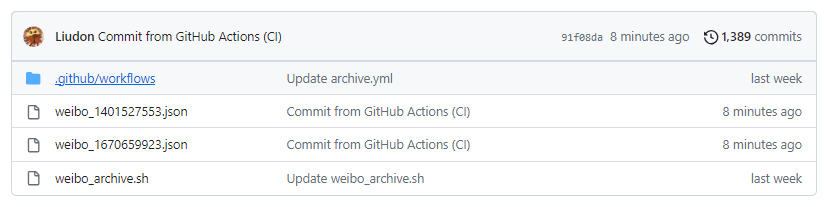

#### 背景

在微博上关注了一些用户，比如[tk教主](https://weibo.com/u/1401527553)，[月风](https://weibo.com/u/1670659923)。

但是有些内容过段时间不可见了，所以希望可以定时抓取微博归档备份下来。

#### 实现方案

__整体思路：利用`Github Actions`的`Scheduled`任务，定时执行抓取shell脚本，将内容保存到文件，提交到Github仓库。__


1. 新建仓库，比如`weibo_archive`。

2. 添加抓取脚本，[完整代码](https://github.com/Liudon/weibo_archive/blob/main/weibo_archive.sh)。

    这里用到微博两个接口：

    ```
    // 抓取某个用户最新的10条微博数据，返回里有每条微博的id，这里如果内容过长的话会被截断
    https://m.weibo.cn/api/container/getIndex?jumpfrom=weibocom&type=uid&value=$uid&containerid=107603$uid

    // 根据微博id，抓取微博完整的内容
    https://m.weibo.cn/statuses/extend?id=$id
    ```

3. 添加环境变量。

    - 进入`个人设置`->`Developer Settings`->`Personal access tokens`->`Tokens (classic)`，创建新的Token，记下对应的值。

    - 进入第一步创建仓库的配置页，点击`Secrets and variables`下的`Actions`：

        切到`Secret`目录，创建新的`Secret`变量，名称为`TOKEN`，值为前一步记录的值；切到`Variables`目录，创建新的`Variables`变量，名称为`WEIBO_UIDS`，值为你需要抓取的微博用户id，多个用户的话以`|`分割。

4. 添加定时任务，完整yaml文件如下。

    ```
    # This is a basic workflow to help you get started with Actions

    name: CI

    # Controls when the workflow will run
    on:
    # Triggers the workflow on push or pull request events but only for the "main" branch
    push:
        branches: [ "main" ]
    pull_request:
        branches: [ "main" ]

    # Allows you to run this workflow manually from the Actions tab
    workflow_dispatch:
    schedule:
        - cron: '*/5 * * * *'

    # A workflow run is made up of one or more jobs that can run sequentially or in parallel
    jobs:
    # This workflow contains a single job called "build"
    build:
        # The type of runner that the job will run on
        runs-on: ubuntu-latest
    
        permissions:      
        contents: write

        # Steps represent a sequence of tasks that will be executed as part of the job
        steps:
        # Checks-out your repository under $GITHUB_WORKSPACE, so your job can access it
        - uses: actions/checkout@v3

        # Runs a single command using the runners shell
        - name: archive weibo
            run: |
            chmod +x ./weibo_archive.sh
            ./weibo_archive.sh
            shell: bash
            env:
            weibo_uids: ${{ vars.weibo_uids }}

        # Runs a set of commands using the runners shell
        - name: Commit changes
            uses: EndBug/add-and-commit@v9
            env:
            github_token: ${{ secrets.TOKEN }}
            add: .
    ```

#### 效果

抓取后的内容，会按用户id分别保存到不同文件。



不过这个方案有一个唯一的缺点，`Github Actions`定时任务时间粒度最小是5分钟，而且不能保证执行时间完全符合这个粒度，所以可能还是会有漏掉的内容。

> Note: The schedule event can be delayed during periods of high loads of GitHub Actions workflow runs. High load times include the start of every hour. If the load is sufficiently high enough, some queued jobs may be dropped. To decrease the chance of delay, schedule your workflow to run at a different time of the hour.