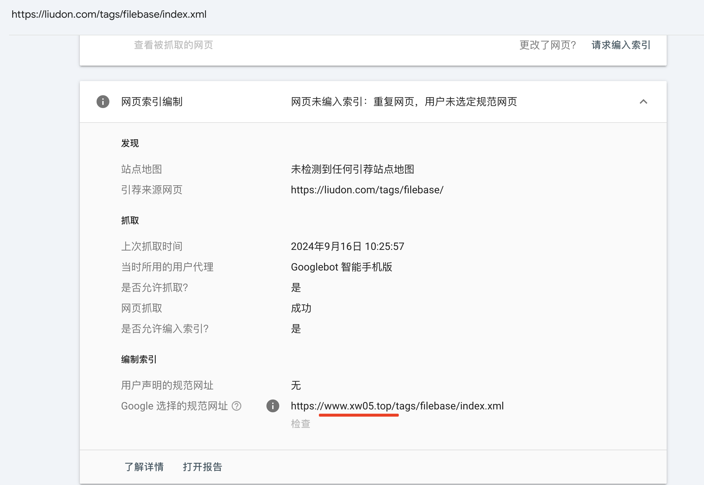
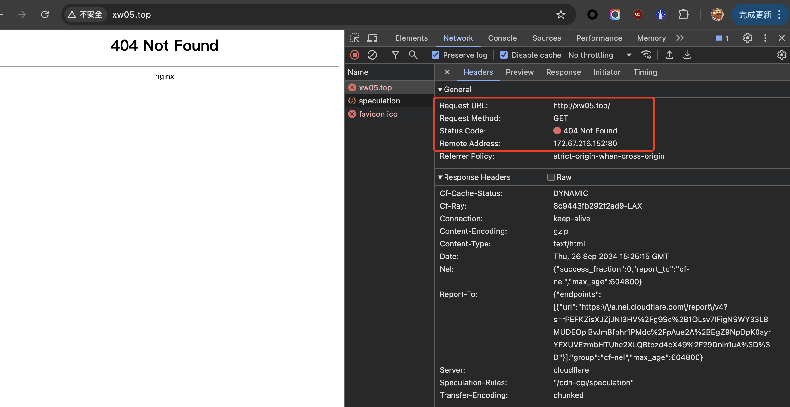
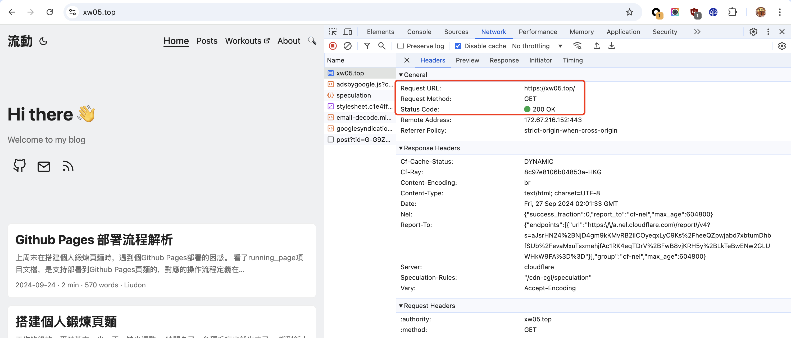
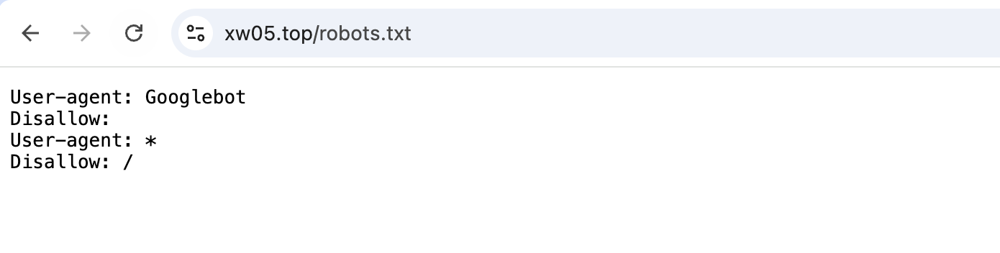
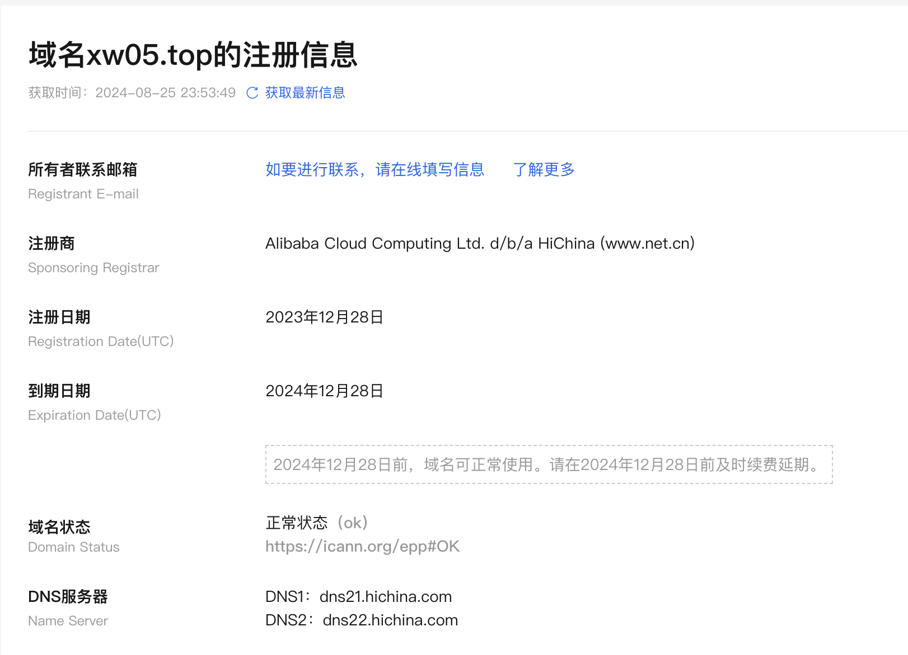
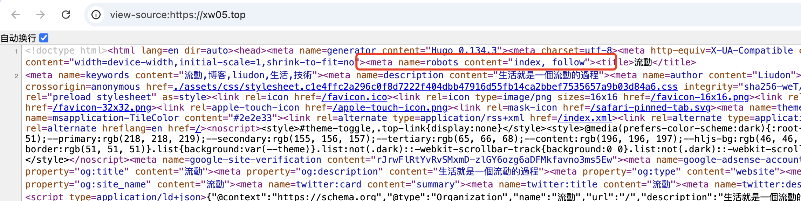

## 起因

9月初的时候，在`Google Search Console`里发现了一个外链，域名是`**.top`。

随手点过去看了下，发现居然跟我的博客内容一模一样，就是内容变成了繁体。

知道这肯定是被拿来镜像了，不过当时也没在意，就没管。

后来在[v2ex](https://v2ex.com/t/1070859)上也发现类似的问题，还有其他博主也反馈有被镜像，感觉像是个黑产批量的操作。

这周`Google Search Console`反馈我的站点有个新问题，点进去一看，嚯。



在谷歌里搜了一下，发现已经有很多这个站点的收录了。

开始影响到我的博客收录了，这怎么能忍呢，必须处理掉它。

## 分析

测试了一下这个站点，不得不说，这个人是相当的聪明。





使用了`Cloudflare`服务，隐藏了真实的服务ip。

同时判断了访问ip，如果是国内用户直接返回了404，海外才会正常返回，这样一般国内用户就发现不了。



还重写了`robots.txt`，只让谷歌收录。

查了一下域名`Whois`信息，注册在阿里云。



页面上挂的备案号都是我的，搞事情的话后面再扯上我，这就麻烦了。

这就像块牛皮癣，越想越恶心。

我的博客搞了两套部署，一套部署在[Cloudflare Pages](https://liudon.com)，一套部署在[IPFS](https://liudon.xyz)。

接下来就是搞清楚，他是镜像的哪个站点：

### 1. IPFS站点

看他的`robots.txt`内容，我一开始怀疑是镜像的IPFS站点[liudon.xyz](https://liudon.xyz)，感觉像是在我的`robots.txt`前面加了一段内容。

```
curl 'https://liudon.xyz/robots.txt'
User-agent: *
Disallow: /
```

幸好还有一个`Robots meta 标记`，于是把IPFS部署的站点加上了这个属性。

部署后发现这个镜像站并没有更新，排除了这个可能。



### 2. Github 静态仓库

我在`Github`上单独搞了个分支存放生成的静态文件，`Cloudflare Pages`直接读取这个分支进行部署。

怀疑他是不是监控了这个仓库的提交记录，直接拿这个来部署的镜像站。

我把`Cloudflare Pages`的自动部署关掉，然后直接修改静态文件。

更新后发现，这个静态站并没有预期的更新。

#### 3. Cloudflare Worker

在分析过程中，发现我的博客更新后，他的站点也会很快就更新。

因为他的网站部署在`Cloudflare`上，考虑是走的`Cloudflare Worker`反代，直接请求目标站点，然后进行繁体翻译返回。

这样就完全不需要关心更新的问题，完全自动化处理，太完美了。

## 反制

其实这里并没有太好的办法反制，`robots`文件被他重写了，无法控制，使用`Robots meta 标记`的话会影响到我们自己的收录。

只能是通过加一段JS代码，参考自[竹林里有冰](https://zhul.in/2024/07/18/my-blog-is-completely-proxied-and-translated-into-traditional-chinese/)，判断访问的域名非法的话，直接跳转到正确地址。

```
const host = window.location.host
if (host !== 'liudon.com' && ! host.startsWith('localhost') && ! host.startsWith('127.0.0.1')) {
    document.body.innerHTML = [
        '<div style="margin: auto;">',
        '<h1>当前页面并非本文作者的主页，将在五秒后跳转。</h1>',
        '</div>',
    ].join('')
    document.body.style = [
        'background-color: white;',
        'color: black;',
        'text-align: center;',
        'font-size: 50px;',
        'width: 100vw;',
        'height: 100vh;',
        'display: flex;',
    ].join('')
    setTimeout(() => {
        window.location.href = 'https://liudon.com'
    }, 5000)
}
```

查了一下，搜索Bot爬取的时候会执行js，希望能更新掉已收录的网页信息。
