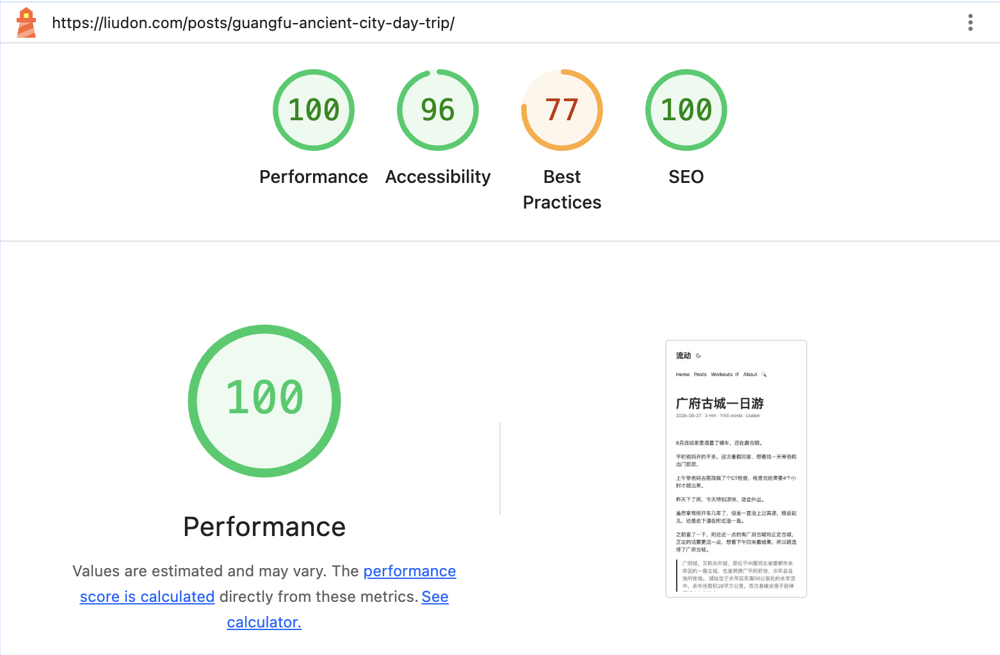

目前博客部署在 Cloudflare Pages 服务上，通过 DnsPod 服务做了国内和海外分线路解析。

```
Cloudflare Pages
       ↑
blog.liudon.xyz
   ↑         ↑
 回源       直接访问
   │         │
腾讯云 CDN    │
   ↑         ↑
   国内     海外
     \       /
      DNSPod
        ↑
    liudon.com
```

因为 Cloudflare 在国内属于反向加速，所以加了一层国内CDN做加速。

但总感觉博客访问不快，随便打开一个页面，页面完全处理完都要在秒级，实在是慢。

通过 Lighthouse 测试，借助 AI 的能力，又做了一轮新的优化。

*以下内容全部基于 PaperMod 主题进行修改。*

### 1. 增加国内 CDN 节点缓存时间

腾讯 CDN 首页的响应：

```
cf-cache-status: DYNAMIC
cf-ray: ...-AMS
x-cache-lookup: Cache Miss
cache-control: public, must-revalidate, max-age=0
age: 0
x-nws-log-uuid: ...
```

请求确实经过腾讯云 CDN（x-nws-log-uuid），但腾讯边缘节点没有命中首页缓存，随后回源 Cloudflare，并落到 AMS（阿姆斯特丹）。

Cloudflare Pages 默认返回 max-age=0, must-revalidate，这是 Pages 的正常默认行为；但腾讯 CDN 如果“遵循源站”，就会频繁回源。

通过调整腾讯云 CDN 的缓存规则，增加强制缓存规则解决。

```
首页 缓存30分钟
/posts 缓存30分钟
/tags 缓存30分钟
/page 缓存30分钟
```

### 2. 延长指纹资源缓存时间

```
cache-control: public, must-revalidate, max-age=14400
age: 223
x-cache-lookup: Cache Hit
```

当前 CSS / JS 文件名已经包含 hash，可以设置更长的过期时间。

通过 _headers 文件配置缓存时间解决。

```
/assets/*
  Cache-Control: public, max-age=31536000, immutable
```

### 3. 响应式图片

终于来到这次优化的重头戏了。

这里之前其实做过一次优化，见[当Hugo遇上AVIF，优化图片加载](https://liudon.com/posts/use-avif-to-optimize-images-on-hugo/)。

当时引入了 AVIF 格式文件，增加了响应式图片效果。

但通过 Lighthouse 测试，仍有图片大小的问题。

比如[广府古城一日游](https://liudon.com/posts/guangfu-ancient-city-day-trip/)文章里，整个页面 Lighthouse 给出的图片优化空间是3,914 KiB，接近 4 MB。

当前页面的响应式代码如下：

```
<source
  type="image/avif"
  srcset="IMG_7537.PNG_1080x.avif 1080w"
  sizes="(min-width: 768px) 1080px, 100vw"
>
```

这里只有 1080x 这一个规格，并不能发挥响应式图片的作用。

这里是我理解有误，我理解成浏览器是按页面屏幕大小来做选择了，实际上是按这个元素的占位大小来选择不同规格。

页面里多图并排的情况，也会下载 1080x 这个规格的文件，导致大量的流量浪费。

另外还有一个问题是，现在的 AVIF / WEBP 格式文件都是提前预处理的。

因为每次都是全量生成，虽然现在只生成一个规格，但每次执行耗时都要在 10 分钟以上。

如果生成多个规格文件，会导致 Github Actions 执行非常慢。

怎么优化这个耗时，一直想优化来着，苦于找不到好的方案。

将这些问题反馈给 AI，给出了如下的方案：

通过预生成多个规格的 AVIF / WEBP 文件做响应式图片；

通过增加流水线缓存，避免每次都全量生成，只做增量更新。

#### 3.1 流水线增加媒体处理逻辑

新增.github/scripts/media/package.json文件，内容如下：

```
{
  "name": "liudon-media-pipeline",
  "private": true,
  "type": "module",
  "engines": {
    "node": ">=24"
  },
  "dependencies": {
    "sharp": "0.35.0"
  }
}
```

新增.github/scripts/media/process-media.mjs文件，这里还加了视频处理/视频封面生成等逻辑，内容如下：

```
import sharp from "sharp";

import {
    access,
    copyFile,
    mkdir,
    readdir,
    rm,
    stat,
} from "node:fs/promises";

import { createReadStream } from "node:fs";
import { createHash } from "node:crypto";
import { spawn } from "node:child_process";
import { fileURLToPath } from "node:url";

import path from "node:path";


// ============================================================
// Paths
// ============================================================

const ROOT = process.cwd();

const CONTENT_DIR =
    path.join(ROOT, "content/posts");

const CACHE_DIR =
    path.join(ROOT, ".cache/media");

const IMAGE_CACHE_DIR =
    path.join(CACHE_DIR, "images");

const VIDEO_CACHE_DIR =
    path.join(CACHE_DIR, "videos");

const FONT =
    path.join(
        ROOT,
        "static/ArchitectsDaughter-Regular.ttf"
    );

const SCRIPT_FILE =
    fileURLToPath(import.meta.url);


// ============================================================
// Image configuration
// ============================================================

const IMAGE_MAX_WIDTH = 1080;

const RESPONSIVE_WIDTHS = [
    320,
    480,
    720,
    1080,
];


// fallback JPG

const JPEG_QUALITY = 82;


// WebP

const WEBP_PHOTO_QUALITY = 75;
const WEBP_PICTURE_QUALITY = 80;


// AVIF

const AVIF_PHOTO_QUALITY = 50;
const AVIF_PICTURE_QUALITY = 55;


// ============================================================
// Watermark
// ============================================================

const WATERMARK_TEXT =
    "@liudon\nhttps://liudon.com";

const WATERMARK_COLOR =
    "#909090";

const WATERMARK_POINTSIZE = 48;

const WATERMARK_BOTTOM = 20;


// ============================================================
// Video configuration
// ============================================================

// 最大边 1280
//
// 横屏：
// 3840x2160 -> 1280x720
//
// 竖屏：
// 2160x3840 -> 720x1280

const VIDEO_MAX_EDGE = 1280;


// 平均码率高于 3500kbps 时压缩

const VIDEO_MAX_BITRATE_KBPS = 3500;


// H.264 CRF
//
// 23：质量和体积比较均衡

const VIDEO_CRF = 23;

const VIDEO_PRESET = "medium";


// 非 AAC 音频转换参数

const VIDEO_AUDIO_BITRATE = "128k";


// Poster

const POSTER_MAX_WIDTH = 1080;

const POSTER_QUALITY = 82;


// ============================================================
// Statistics
// ============================================================

let imageProcessed = 0;
let imageCached = 0;

let videoProcessed = 0;
let videoCached = 0;


// ============================================================
// Cache tracking
// ============================================================

const usedImageCaches = new Set();
const usedVideoCaches = new Set();


// ============================================================
// Basic utilities
// ============================================================

async function exists(file) {

    try {

        await access(file);

        return true;

    } catch {

        return false;
    }
}


async function sha256File(file) {

    return new Promise(
        (resolve, reject) => {

            const hash =
                createHash("sha256");

            const stream =
                createReadStream(file);

            stream.on(
                "data",
                chunk => hash.update(chunk)
            );

            stream.on(
                "error",
                reject
            );

            stream.on(
                "end",
                () => resolve(
                    hash.digest("hex")
                )
            );
        }
    );
}


function sha256String(value) {

    return createHash("sha256")
        .update(value)
        .digest("hex");
}


async function walk(dir) {

    const output = [];

    const entries =
        await readdir(
            dir,
            {
                withFileTypes: true,
            }
        );

    for (const entry of entries) {

        const full =
            path.join(
                dir,
                entry.name
            );

        if (entry.isDirectory()) {

            output.push(
                ...(await walk(full))
            );

        } else {

            output.push(full);
        }
    }

    return output;
}


// ============================================================
// Execute external command
// ============================================================

function run(
    command,
    args,
    {
        quiet = false,
    } = {}
) {

    return new Promise(
        (resolve, reject) => {

            const child =
                spawn(
                    command,
                    args,
                    {
                        stdio: [
                            "ignore",
                            "pipe",
                            "pipe",
                        ],
                    }
                );

            let stdout = "";
            let stderr = "";

            child.stdout.on(
                "data",
                data => {

                    stdout +=
                        data.toString();
                }
            );

            child.stderr.on(
                "data",
                data => {

                    stderr +=
                        data.toString();

                    if (!quiet) {

                        process.stderr.write(
                            data
                        );
                    }
                }
            );

            child.on(
                "error",
                reject
            );

            child.on(
                "close",
                code => {

                    if (code === 0) {

                        resolve({
                            stdout,
                            stderr,
                        });

                        return;
                    }

                    reject(
                        new Error(
                            `${command} failed with code ${code}\n${stderr}`
                        )
                    );
                }
            );
        }
    );
}


// ============================================================
// Image validation
// ============================================================

async function validateImage(
    file,
    expectedMediaType = null
) {

    if (!(await exists(file))) {

        return false;
    }

    try {

        const metadata =
            await sharp(file).metadata();

        if (
            !metadata.width ||
            !metadata.height
        ) {

            return false;
        }

        if (
            expectedMediaType &&
            metadata.mediaType !==
                expectedMediaType
        ) {

            return false;
        }

        return true;

    } catch {

        return false;
    }
}


// ============================================================
// Image orientation
// ============================================================

function getOrientedDimensions(metadata) {

    let width =
        metadata.width;

    let height =
        metadata.height;

    if (
        [
            5,
            6,
            7,
            8,
        ].includes(metadata.orientation)
    ) {

        [
            width,
            height,
        ] = [
            height,
            width,
        ];
    }

    return {
        width,
        height,
    };
}


// ============================================================
// Watermark
// ============================================================

async function createWatermark(
    targetWidth
) {

    // 防止小图中文字宽度超过图片。

    const maxWidth =
        Math.max(
            1,
            targetWidth - 20
        );

    const markup =
        `<span foreground="${WATERMARK_COLOR}">` +
        WATERMARK_TEXT +
        "</span>";

    return await sharp({
        text: {
            text:
                markup,

            font:
                `Architects Daughter ${WATERMARK_POINTSIZE}`,

            fontfile:
                FONT,

            width:
                maxWidth,

            align:
                "center",

            rgba:
                true,

            dpi:
                72,
        },
    })
        .png()
        .toBuffer({
            resolveWithObject: true,
        });
}


// ============================================================
// Restore image outputs
// ============================================================

async function restoreImageOutputs(
    src,
    base,
    cacheDir,
    widths
) {

    // fallback 原图

    await copyFile(
        base,
        src
    );


    // responsive variants

    for (const width of widths) {

        await copyFile(
            path.join(
                cacheDir,
                `${width}.webp`
            ),
            `${src}_${width}x.webp`
        );

        await copyFile(
            path.join(
                cacheDir,
                `${width}.avif`
            ),
            `${src}_${width}x.avif`
        );
    }
}


// ============================================================
// Process image
// ============================================================

async function processImage(
    src,
    scriptHash,
    fontHash
) {

    const ext =
        path.extname(src)
            .toLowerCase();

    const imageType =
        ext === ".png"
            ? "picture"
            : "photo";

    const webpQuality =
        imageType === "photo"
            ? WEBP_PHOTO_QUALITY
            : WEBP_PICTURE_QUALITY;

    const avifQuality =
        imageType === "photo"
            ? AVIF_PHOTO_QUALITY
            : AVIF_PICTURE_QUALITY;


    // --------------------------------------------------------
    // Source metadata
    // --------------------------------------------------------

    const metadata =
        await sharp(src).metadata();

    const oriented =
        getOrientedDimensions(
            metadata
        );

    const targetWidth =
        Math.min(
            IMAGE_MAX_WIDTH,
            oriented.width
        );


    // --------------------------------------------------------
    // Cache hash
    // --------------------------------------------------------

    const sourceHash =
        await sha256File(src);

    const config =
        JSON.stringify({
            type:
                "image",

            sourceHash,

            scriptHash,

            fontHash,

            IMAGE_MAX_WIDTH,

            RESPONSIVE_WIDTHS,

            JPEG_QUALITY,

            webpQuality,

            avifQuality,

            WATERMARK_TEXT,

            WATERMARK_COLOR,

            WATERMARK_POINTSIZE,

            WATERMARK_BOTTOM,
        });

    const hash =
        sha256String(config);

    usedImageCaches.add(hash);

    const cacheDir =
        path.join(
            IMAGE_CACHE_DIR,
            hash
        );

    await mkdir(
        cacheDir,
        {
            recursive: true,
        }
    );


    // --------------------------------------------------------
    // Widths
    //
    // 1080 -> 320 / 480 / 720 / 1080
    // 900  -> 320 / 480 / 720 / 900
    // 600  -> 320 / 480 / 600
    // --------------------------------------------------------

    const widths = [
        ...RESPONSIVE_WIDTHS.filter(
            width =>
                width <= targetWidth
        ),
        targetWidth,
    ];

    const finalWidths =
        [...new Set(widths)]
            .sort(
                (a, b) =>
                    a - b
            );


    const base =
        path.join(
            cacheDir,
            `source${ext}`
        );


    // --------------------------------------------------------
    // Cache validation
    // --------------------------------------------------------

    let cacheOK =
        await validateImage(base);

    if (cacheOK) {

        for (const width of finalWidths) {

            const webp =
                path.join(
                    cacheDir,
                    `${width}.webp`
                );

            const avif =
                path.join(
                    cacheDir,
                    `${width}.avif`
                );

            if (
                !(await validateImage(
                    webp,
                    "image/webp"
                )) ||
                !(await validateImage(
                    avif,
                    "image/avif"
                ))
            ) {

                cacheOK = false;

                break;
            }
        }
    }


    // --------------------------------------------------------
    // Cache hit
    // --------------------------------------------------------

    if (cacheOK) {

        console.log(
            `CACHE IMAGE   ${path.relative(ROOT, src)}`
        );

        await restoreImageOutputs(
            src,
            base,
            cacheDir,
            finalWidths
        );

        imageCached++;

        return;
    }


    // --------------------------------------------------------
    // Cache miss
    // --------------------------------------------------------

    console.log();
    console.log(
        `PROCESS IMAGE ${path.relative(ROOT, src)}`
    );

    await rm(
        cacheDir,
        {
            recursive: true,
            force: true,
        }
    );

    await mkdir(
        cacheDir,
        {
            recursive: true,
        }
    );


    // --------------------------------------------------------
    // Calculate final base dimensions
    // --------------------------------------------------------

    const scale =
        targetWidth /
        oriented.width;

    const targetHeight =
        Math.max(
            1,
            Math.round(
                oriented.height * scale
            )
        );


    // --------------------------------------------------------
    // Watermark
    // --------------------------------------------------------

    let watermark =
        await createWatermark(
            targetWidth
        );

    // 极端小图情况下避免 watermark 高于图片。

    const maxWatermarkHeight =
        Math.max(
            1,
            targetHeight -
            WATERMARK_BOTTOM
        );

    if (
        watermark.info.height >
        maxWatermarkHeight
    ) {

        const resized =
            await sharp(watermark.data)
                .resize({
                    height:
                        maxWatermarkHeight,

                    withoutEnlargement:
                        true,
                })
                .png()
                .toBuffer({
                    resolveWithObject:
                        true,
                });

        watermark = resized;
    }


    const left =
        Math.max(
            0,
            Math.round(
                (
                    targetWidth -
                    watermark.info.width
                ) / 2
            )
        );

    const top =
        Math.max(
            0,
            targetHeight -
            watermark.info.height -
            WATERMARK_BOTTOM
        );


    // --------------------------------------------------------
    // Generate fallback/base
    // --------------------------------------------------------

    let pipeline =
        sharp(src)
            .rotate()
            .resize({
                width:
                    IMAGE_MAX_WIDTH,

                withoutEnlargement:
                    true,

                fit:
                    "inside",
            })
            .toColourspace(
                "srgb"
            )
            .composite([
                {
                    input:
                        watermark.data,

                    left,

                    top,
                },
            ]);


    if (ext === ".png") {

        pipeline =
            pipeline.png({
                compressionLevel:
                    9,

                adaptiveFiltering:
                    true,
            });

    } else {

        pipeline =
            pipeline.jpeg({
                quality:
                    JPEG_QUALITY,

                progressive:
                    true,

                optimiseCoding:
                    true,
            });
    }


    await pipeline.toFile(base);


    if (!(await validateImage(base))) {

        throw new Error(
            `Invalid processed image: ${src}`
        );
    }


    // --------------------------------------------------------
    // Get actual width
    // --------------------------------------------------------

    const baseMetadata =
        await sharp(base).metadata();

    const actualWidth =
        baseMetadata.width;


    const actualWidths = [
        ...RESPONSIVE_WIDTHS.filter(
            width =>
                width <= actualWidth
        ),
        actualWidth,
    ];

    const outputWidths =
        [...new Set(actualWidths)]
            .sort(
                (a, b) =>
                    a - b
            );


    // --------------------------------------------------------
    // WebP + AVIF
    // --------------------------------------------------------

    for (const width of outputWidths) {

        console.log(
            `        generate ${width}w`
        );

        const webp =
            path.join(
                cacheDir,
                `${width}.webp`
            );

        const avif =
            path.join(
                cacheDir,
                `${width}.avif`
            );


        await sharp(base)
            .resize({
                width,

                withoutEnlargement:
                    true,
            })
            .webp({
                quality:
                    webpQuality,

                effort:
                    6,

                preset:
                    imageType,
            })
            .toFile(webp);


        await sharp(base)
            .resize({
                width,

                withoutEnlargement:
                    true,
            })
            .avif({
                quality:
                    avifQuality,

                effort:
                    5,

                chromaSubsampling:
                    imageType === "photo"
                        ? "4:2:0"
                        : "4:4:4",
            })
            .toFile(avif);


        if (
            !(await validateImage(
                webp,
                "image/webp"
            ))
        ) {

            throw new Error(
                `Invalid WebP: ${webp}`
            );
        }


        if (
            !(await validateImage(
                avif,
                "image/avif"
            ))
        ) {

            throw new Error(
                `Invalid AVIF: ${avif}`
            );
        }
    }


    await restoreImageOutputs(
        src,
        base,
        cacheDir,
        outputWidths
    );


    // --------------------------------------------------------
    // Stats
    // --------------------------------------------------------

    const largestWidth =
        outputWidths.at(-1);

    const baseStat =
        await stat(base);

    const webpStat =
        await stat(
            path.join(
                cacheDir,
                `${largestWidth}.webp`
            )
        );

    const avifStat =
        await stat(
            path.join(
                cacheDir,
                `${largestWidth}.avif`
            )
        );


    console.log(
        `        size     : ${baseMetadata.width}x${baseMetadata.height}`
    );

    console.log(
        `        variants : ${outputWidths.join(",")}`
    );

    console.log(
        `        base     : ${(baseStat.size / 1024).toFixed(1)} KB`
    );

    console.log(
        `        webp max : ${(webpStat.size / 1024).toFixed(1)} KB`
    );

    console.log(
        `        avif max : ${(avifStat.size / 1024).toFixed(1)} KB`
    );


    imageProcessed++;
}


// ============================================================
// FFprobe
// ============================================================

async function probeVideo(file) {

    const result =
        await run(
            "ffprobe",
            [
                "-v",
                "error",

                "-show_entries",
                "format=duration,bit_rate:stream=codec_type,codec_name,width,height,pix_fmt",

                "-of",
                "json",

                file,
            ],
            {
                quiet: true,
            }
        );

    return JSON.parse(
        result.stdout
    );
}


// ============================================================
// Validate processed video
// ============================================================

async function validateVideo(file) {

    if (!(await exists(file))) {

        return false;
    }

    try {

        const probe =
            await probeVideo(file);

        const video =
            probe.streams.find(
                stream =>
                    stream.codec_type ===
                    "video"
            );

        if (!video) {

            return false;
        }

        if (
            video.codec_name !== "h264"
        ) {

            return false;
        }

        if (
            video.pix_fmt !== "yuv420p"
        ) {

            return false;
        }

        if (
            Math.max(
                Number(video.width || 0),
                Number(video.height || 0)
            ) >
            VIDEO_MAX_EDGE
        ) {

            return false;
        }

        return true;

    } catch {

        return false;
    }
}


// ============================================================
// Process MP4
// ============================================================

async function processVideo(
    src,
    scriptHash
) {

    const sourceStat =
        await stat(src);

    const sourceHash =
        await sha256File(src);

    const probe =
        await probeVideo(src);


    const video =
        probe.streams.find(
            stream =>
                stream.codec_type ===
                "video"
        );

    const audio =
        probe.streams.find(
            stream =>
                stream.codec_type ===
                "audio"
        );


    if (!video) {

        throw new Error(
            `Video stream not found: ${src}`
        );
    }


    const width =
        Number(video.width || 0);

    const height =
        Number(video.height || 0);

    const duration =
        Number(
            probe.format.duration || 0
        );


    // --------------------------------------------------------
    // Calculate bitrate
    // --------------------------------------------------------

    let bitrateKbps =
        Number(
            probe.format.bit_rate || 0
        ) / 1000;


    // 某些 MP4 没有 bit_rate，
    // 用文件大小 / 时长估算。

    if (
        bitrateKbps <= 0 &&
        duration > 0
    ) {

        bitrateKbps =
            (
                sourceStat.size *
                8 /
                duration /
                1000
            );
    }


    // --------------------------------------------------------
    // Decide transcode
    // --------------------------------------------------------

    const transcodeVideo =
        video.codec_name !== "h264" ||

        video.pix_fmt !== "yuv420p" ||

        Math.max(
            width,
            height
        ) > VIDEO_MAX_EDGE ||

        (
            bitrateKbps > 0 &&
            bitrateKbps >
                VIDEO_MAX_BITRATE_KBPS
        );


    const transcodeAudio =
        Boolean(
            audio &&
            audio.codec_name !== "aac"
        );


    // --------------------------------------------------------
    // Cache hash
    // --------------------------------------------------------

    const config =
        JSON.stringify({
            type:
                "video",

            sourceHash,

            scriptHash,

            VIDEO_MAX_EDGE,

            VIDEO_MAX_BITRATE_KBPS,

            VIDEO_CRF,

            VIDEO_PRESET,

            VIDEO_AUDIO_BITRATE,

            POSTER_MAX_WIDTH,

            POSTER_QUALITY,

            transcodeVideo,

            transcodeAudio,
        });


    const hash =
        sha256String(config);

    usedVideoCaches.add(hash);

    const cacheDir =
        path.join(
            VIDEO_CACHE_DIR,
            hash
        );

    const outputVideo =
        path.join(
            cacheDir,
            "video.mp4"
        );

    const poster =
        path.join(
            cacheDir,
            "poster.webp"
        );


    await mkdir(
        cacheDir,
        {
            recursive: true,
        }
    );


    // --------------------------------------------------------
    // Cache hit
    // --------------------------------------------------------

    if (
        await validateVideo(outputVideo) &&
        await validateImage(
            poster,
            "image/webp"
        )
    ) {

        console.log(
            `CACHE VIDEO   ${path.relative(ROOT, src)}`
        );

        await copyFile(
            outputVideo,
            src
        );

        await copyFile(
            poster,
            `${src}.poster.webp`
        );

        videoCached++;

        return;
    }


    // --------------------------------------------------------
    // Cache miss
    // --------------------------------------------------------

    console.log();
    console.log(
        `PROCESS VIDEO ${path.relative(ROOT, src)}`
    );

    console.log(
        `        video    : ${video.codec_name}`
    );

    console.log(
        `        pix_fmt  : ${video.pix_fmt}`
    );

    console.log(
        `        audio    : ${audio?.codec_name || "none"}`
    );

    console.log(
        `        size     : ${width}x${height}`
    );

    console.log(
        `        bitrate  : ${bitrateKbps.toFixed(0)} kbps`
    );

    console.log(
        `        duration : ${duration.toFixed(1)} sec`
    );


    await rm(
        cacheDir,
        {
            recursive: true,
            force: true,
        }
    );

    await mkdir(
        cacheDir,
        {
            recursive: true,
        }
    );


    // --------------------------------------------------------
    // FFmpeg
    // --------------------------------------------------------

    const args = [
        "-hide_banner",
        "-loglevel",
        "warning",

        "-y",

        "-i",
        src,

        "-map",
        "0:v:0",

        "-map",
        "0:a?",

        "-map_metadata",
        "0",
    ];


    // --------------------------------------------------------
    // Video codec
    // --------------------------------------------------------

    if (transcodeVideo) {

        args.push(
            "-vf",
            `scale=w='min(iw,${VIDEO_MAX_EDGE})':h='min(ih,${VIDEO_MAX_EDGE})':force_original_aspect_ratio=decrease:force_divisible_by=2`,

            "-c:v",
            "libx264",

            "-preset",
            VIDEO_PRESET,

            "-crf",
            String(VIDEO_CRF),

            "-pix_fmt",
            "yuv420p"
        );

    } else {

        args.push(
            "-c:v",
            "copy"
        );
    }


    // --------------------------------------------------------
    // Audio codec
    // --------------------------------------------------------

    if (audio) {

        if (transcodeAudio) {

            args.push(
                "-c:a",
                "aac",

                "-b:a",
                VIDEO_AUDIO_BITRATE
            );

        } else {

            args.push(
                "-c:a",
                "copy"
            );
        }
    }


    // --------------------------------------------------------
    // MP4 fast start
    //
    // 把 moov atom 放文件前部，
    // 浏览器不用等下载完整视频才能开始播放。
    // --------------------------------------------------------

    args.push(
        "-movflags",
        "+faststart",

        outputVideo
    );


    if (transcodeVideo) {

        console.log(
            "        mode     : transcode"
        );

    } else if (transcodeAudio) {

        console.log(
            "        mode     : audio transcode"
        );

    } else {

        console.log(
            "        mode     : remux"
        );
    }


    await run(
        "ffmpeg",
        args
    );


    // --------------------------------------------------------
    // Validate video
    // --------------------------------------------------------

    if (!(await validateVideo(outputVideo))) {

        throw new Error(
            `Invalid generated video: ${src}`
        );
    }


    // --------------------------------------------------------
    // Poster frame
    //
    // 取视频 10% 位置，
    // 最大不超过第 3 秒。
    // --------------------------------------------------------

    const posterTime =
        duration > 0
            ? Math.min(
                3,
                duration * 0.1
            )
            : 0;


    const frame =
        path.join(
            cacheDir,
            "poster-frame.png"
        );


    await run(
        "ffmpeg",
        [
            "-hide_banner",
            "-loglevel",
            "error",

            "-y",

            "-i",
            outputVideo,

            "-ss",
            posterTime.toFixed(3),

            "-frames:v",
            "1",

            "-an",

            frame,
        ]
    );


    if (!(await validateImage(frame))) {

        throw new Error(
            `Failed to generate video poster: ${src}`
        );
    }


    // --------------------------------------------------------
    // Poster -> WebP
    // --------------------------------------------------------

    await sharp(frame)
        .resize({
            width:
                POSTER_MAX_WIDTH,

            withoutEnlargement:
                true,
        })
        .webp({
            quality:
                POSTER_QUALITY,

            effort:
                6,
        })
        .toFile(poster);


    await rm(
        frame,
        {
            force: true,
        }
    );


    if (
        !(await validateImage(
            poster,
            "image/webp"
        ))
    ) {

        throw new Error(
            `Invalid poster: ${poster}`
        );
    }


    // --------------------------------------------------------
    // Copy back into Hugo page bundle
    // --------------------------------------------------------

    await copyFile(
        outputVideo,
        src
    );

    await copyFile(
        poster,
        `${src}.poster.webp`
    );


    // --------------------------------------------------------
    // Stats
    // --------------------------------------------------------

    const outputStat =
        await stat(outputVideo);

    const posterStat =
        await stat(poster);


    console.log(
        `        input    : ${(sourceStat.size / 1024 / 1024).toFixed(2)} MB`
    );

    console.log(
        `        output   : ${(outputStat.size / 1024 / 1024).toFixed(2)} MB`
    );

    console.log(
        `        poster   : ${(posterStat.size / 1024).toFixed(1)} KB`
    );


    videoProcessed++;
}


// ============================================================
// Prune obsolete per-file cache
// ============================================================

async function pruneCache(
    dir,
    used
) {

    if (!(await exists(dir))) {

        return;
    }

    const entries =
        await readdir(
            dir,
            {
                withFileTypes: true,
            }
        );


    for (const entry of entries) {

        if (!entry.isDirectory()) {

            continue;
        }


        if (!used.has(entry.name)) {

            console.log(
                `PRUNE CACHE   ${path.relative(ROOT, path.join(dir, entry.name))}`
            );

            await rm(
                path.join(
                    dir,
                    entry.name
                ),
                {
                    recursive: true,
                    force: true,
                }
            );
        }
    }
}


// ============================================================
// Main
// ============================================================

async function main() {

    await mkdir(
        IMAGE_CACHE_DIR,
        {
            recursive: true,
        }
    );

    await mkdir(
        VIDEO_CACHE_DIR,
        {
            recursive: true,
        }
    );


    if (!(await exists(FONT))) {

        throw new Error(
            `Watermark font not found: ${FONT}`
        );
    }


    const scriptHash =
        await sha256File(
            SCRIPT_FILE
        );

    const fontHash =
        await sha256File(
            FONT
        );


    // --------------------------------------------------------
    // Runtime info
    // --------------------------------------------------------

    const ffmpegVersion =
        await run(
            "ffmpeg",
            [
                "-version",
            ],
            {
                quiet: true,
            }
        );


    console.log(
        "========================================"
    );

    console.log(
        "Media environment"
    );

    console.log(
        "========================================"
    );

    console.log(
        `Sharp   : ${sharp.versions.sharp}`
    );

    console.log(
        `libvips : ${sharp.versions.vips}`
    );

    console.log(
        `FFmpeg  : ${ffmpegVersion.stdout.split("\n")[0]}`
    );

    console.log();


    // --------------------------------------------------------
    // Find sources
    // --------------------------------------------------------

    const files =
        await walk(
            CONTENT_DIR
        );


    const images =
        files.filter(file => {

            const ext =
                path.extname(file)
                    .toLowerCase();

            return [
                ".jpg",
                ".jpeg",
                ".png",
            ].includes(ext);
        });


    const videos =
        files.filter(file => {

            return (
                path.extname(file)
                    .toLowerCase() ===
                ".mp4"
            );
        });


    console.log(
        `Images : ${images.length}`
    );

    console.log(
        `Videos : ${videos.length}`
    );

    console.log();


    // --------------------------------------------------------
    // Images
    // --------------------------------------------------------

    for (const image of images) {

        await processImage(
            image,
            scriptHash,
            fontHash
        );
    }


    // --------------------------------------------------------
    // Videos
    // --------------------------------------------------------

    for (const video of videos) {

        await processVideo(
            video,
            scriptHash
        );
    }


    // --------------------------------------------------------
    // Prune
    // --------------------------------------------------------

    await pruneCache(
        IMAGE_CACHE_DIR,
        usedImageCaches
    );

    await pruneCache(
        VIDEO_CACHE_DIR,
        usedVideoCaches
    );


    // --------------------------------------------------------
    // Result
    // --------------------------------------------------------

    console.log();

    console.log(
        "========================================"
    );

    console.log(
        "Media processing finished"
    );

    console.log(
        "========================================"
    );

    console.log(
        `Images processed : ${imageProcessed}`
    );

    console.log(
        `Images cached    : ${imageCached}`
    );

    console.log(
        `Videos processed : ${videoProcessed}`
    );

    console.log(
        `Videos cached    : ${videoCached}`
    );

    console.log(
        "========================================"
    );
}


main().catch(error => {

    console.error();

    console.error(
        "MEDIA PIPELINE FAILED"
    );

    console.error(
        error
    );

    process.exit(1);
});
```

调整 .github/workflows/main.yml 文件，修改预处理逻辑为下面内容：

```
      # ------------------------------------------------------
      # Media cache
      #
      # 第一次：
      #
      # media-v1 不存在
      # -> 全量图片 + 视频处理
      #
      # 后续：
      #
      # source 未变化
      # -> exact cache hit
      #
      # 修改一张图片/视频
      # -> restore 最近的 media-v1
      # -> 只处理变化文件
      # ------------------------------------------------------

      - name: Restore media cache
        uses: actions/cache@v5
        with:
          path: .cache/media
          key: media-v1-${{ hashFiles('content/posts/**/*.jpg', 'content/posts/**/*.jpeg', 'content/posts/**/*.png', 'content/posts/**/*.JPG', 'content/posts/**/*.JPEG', 'content/posts/**/*.PNG', 'content/posts/**/*.mp4', 'content/posts/**/*.MP4', 'static/ArchitectsDaughter-Regular.ttf', '.github/scripts/media/package.json', '.github/scripts/media/process-media.mjs') }}
          restore-keys: |
            media-v1-

      # ------------------------------------------------------
      # Node.js
      # ------------------------------------------------------

      - name: Setup Node.js
        uses: actions/setup-node@v7
        with:
          node-version: "24"
          package-manager-cache: false

      # ------------------------------------------------------
      # Sharp
      #
      # 使用 Sharp 官方预编译 Linux 二进制。
      #
      # 不再需要：
      #
      # build-essential
      # libheif-dev
      # libaom-dev
      # libwebp-dev
      # ImageMagick configure/make
      # ------------------------------------------------------

      - name: Install Sharp
        run: |
          npm install \
            --prefix .github/scripts/media \
            --omit=dev \
            --no-audit \
            --no-fund

      # ------------------------------------------------------
      # FFmpeg
      # ------------------------------------------------------

      - name: Setup FFmpeg
        shell: bash
        run: |
          set -euo pipefail

          NEED_APT=0

          if ! command -v ffmpeg >/dev/null 2>&1; then
            NEED_APT=1
          fi

          if ! command -v ffprobe >/dev/null 2>&1; then
            NEED_APT=1
          fi

          if ! command -v fc-match >/dev/null 2>&1; then
            NEED_APT=1
          fi

          if [[ "$NEED_APT" == "1" ]]; then
            sudo apt-get update

            sudo apt-get install -y \
              ffmpeg \
              fontconfig
          fi

          echo
          echo "FFmpeg:"
          ffmpeg -version | head -n 1

          echo
          echo "FFprobe:"
          ffprobe -version | head -n 1

          echo
          echo "Checking H.264 encoder..."

          if ! ffmpeg -hide_banner -encoders 2>/dev/null | grep -q libx264; then
            echo "ERROR: FFmpeg does not contain libx264 encoder"
            exit 1
          fi

          echo "libx264: OK"

      # ------------------------------------------------------
      # Process images + videos
      # ------------------------------------------------------

      - name: Process media
        run: |
          node .github/scripts/media/process-media.mjs
```

把 ImageMagic 换成了 Sharp，压缩后的文件更小一些。

#### 3.2 Hugo 图片解析响应式调整

新增 layouts/_default/_markup/render-image.html文件，内容如下：

```
{{- /*
响应式图片尺寸：

普通大图：
320 / 480 / 720 / 1080

如果源图片小于 1080：
还会自动加入图片实际宽度。

例如：
源图 900px
→ 320 / 480 / 720 / 900

源图 600px
→ 320 / 480 / 600
*/ -}}

{{- $respSizes := slice 320 480 720 1080 -}}

{{- /*
auto:
现代浏览器根据 CSS 布局后的实际尺寸选择图片。

fallback:
如果浏览器不支持 auto，则最大按照 1080px 处理。
*/ -}}

{{- $dataSizes := site.Params.responsiveImageSizes | default "auto, (min-width: 1080px) 1080px, calc(100vw - 32px)" -}}

{{- $filter := "box" -}}

{{- $Destination := .Destination -}}
{{- $Page := .Page -}}
{{- $Text := .Text -}}
{{- $Title := .Title -}}

{{- $responsiveImages := (.Page.Params.responsiveImages | default site.Params.responsiveImages) | default true -}}

{{- with $src := .Page.Resources.GetMatch .Destination -}}

    {{- if $responsiveImages -}}

        {{- /*
        根据源图片宽度生成实际候选尺寸。

        最大不会超过源图。
        */ -}}

        {{- $candidateSizes := slice -}}

        {{- range $size := $respSizes -}}
            {{- if ge $src.Width $size -}}
                {{- $candidateSizes = $candidateSizes | append $size -}}
            {{- end -}}
        {{- end -}}

        {{- /*
        如果源图片实际宽度不是标准档位，
        把实际宽度作为最后一档。

        例如 900px：
        320 / 480 / 720 / 900
        */ -}}

        {{- if not (in $candidateSizes $src.Width) -}}
            {{- $candidateSizes = $candidateSizes | append $src.Width -}}
        {{- end -}}

        {{- /*
        优先 AVIF，再 WebP。
        */ -}}

        {{- $imageTypes := slice "avif" "webp" -}}

        <picture>

            {{- range $imageType := $imageTypes -}}

                {{- $srcset := slice -}}

                {{- range $size := $candidateSizes -}}

                    {{- $compressedImage := printf "%s_%dx.%s" $Destination $size $imageType -}}

                    {{- $cmSrc := $Page.Resources.GetMatch $compressedImage -}}

                    {{- if $cmSrc -}}

                        {{- $url := $cmSrc.RelPermalink | absURL -}}

                        {{- /*
                        用实际图片宽度作为 descriptor，
                        不依赖文件名里的数字。
                        */ -}}

                        {{- $candidate := printf "%s %dw" $url $cmSrc.Width -}}

                        {{- $srcset = $srcset | append $candidate -}}

                    {{- else if and (eq $imageType "webp") hugo.IsExtended -}}

                        {{- /*
                        本地 hugo server 没有预处理文件时，
                        WebP 仍然可以让 Hugo 自己生成。

                        AVIF 则依赖 GitHub Action 预处理。
                        */ -}}

                        {{- $resized := $src.Resize (printf "%dx %s %s" $size $imageType $filter) -}}

                        {{- $url := $resized.RelPermalink | absURL -}}

                        {{- $candidate := printf "%s %dw" $url $resized.Width -}}

                        {{- $srcset = $srcset | append $candidate -}}

                    {{- end -}}

                {{- end -}}

                {{- if gt (len $srcset) 0 -}}

                    <source
                        type="image/{{ $imageType }}"
                        srcset="{{ delimit $srcset ", " }}"
                        sizes="{{ $dataSizes }}"
                    />

                {{- end -}}

            {{- end -}}

            

        </picture>

    {{- else -}}

        

    {{- end -}}

{{- end -}}
```

第一次执行需要处理全量文件，输出类似如下：

```text
Images processed : N
Images cached    : 0
```

再次执行，输出类似如下：

```text
CACHE IMAGE ...
CACHE IMAGE ...

Images processed : 0
Images cached    : N
```

至此，图片响应式问题搞定了，流水线的耗时问题也解决了，目前控制在3分钟左右。

### 4. JS 文件按需加载

图片从数 MB 降下来以后，Lighthouse 中最明显的问题开始变成：

```text
Reduce unused JavaScript
```

目前文章页共引入了两个 JS 文件：

```
view-image.min.js 用于点击图片浮窗展示；

twikoo.min.js 用于展示twikoo评论；
```

在页面打开后就立即加载这两个文件，而评论部分在页面最下面，这个资源的加载时机不合理。

通过 article.js 文件引入 ViewImage 和 Twikoo loader，待用户接近评论区时才真正加载Twikoo评论。

```text
ViewImage
+
Twikoo loader
 ↓
article.js

Twikoo 本体
 ↓
用户接近评论区才加载
```

同时通过 Hugo 判断页面是否有插入图片，有的话才加载 ViewImage 代码，改为按需加载。

1. 下载 view-image.min.js 到 assets/js/vendor目录下，不再依赖 tokinx.github.io 服务访问。
2. 通过 Hugo Pipeline 构建文章页 JS文件引入。

文件目录：

```text
assets/js/
├── article.js
└── vendor/
    └── view-image.min.js
```

article.js 文件代码如下：

```
"use strict";


// ============================================================
// Hugo build-time configuration
// ============================================================

const TWIKOO_VERSION =
    {{ .Params.twikoo.version | jsonify }};

const TWIKOO_ENV_ID =
    {{ (.Params.twikoo.envId | default "") | jsonify }};

const TWIKOO_URL =
    `https://cdnjs.cloudflare.com/ajax/libs/twikoo/${TWIKOO_VERSION}/twikoo.min.js`;


// ============================================================
// ViewImage
// ============================================================

function initViewImage() {

    if (!window.ViewImage) {
        return;
    }

    const images =
        document.querySelectorAll(
            ".post-content img"
        );

    if (images.length === 0) {
        return;
    }

    window.ViewImage.init(
        ".post-content img"
    );
}


// ============================================================
// Twikoo state
// ============================================================

let twikooLoading = null;

let twikooInitialized = false;


// ============================================================
// Twikoo initialization
// ============================================================

function initTwikoo() {

    if (twikooInitialized) {
        return;
    }

    if (!window.twikoo) {
        return;
    }

    const container =
        document.querySelector(
            "#tcomment"
        );

    if (!container) {
        return;
    }

    twikooInitialized = true;

    try {

        const result =
            window.twikoo.init({
                envId:
                    TWIKOO_ENV_ID,
                el:
                "#tcomment",
                lang: 'zh-CN',
                region: 'ap-shanghai',
                path: window.TWIKOO_MAGIC_PATH||window.location.pathname,
            });

        if (
            result &&
            typeof result.catch ===
                "function"
        ) {

            result.catch(error => {

                twikooInitialized = false;

                console.error(
                    "Twikoo initialization failed:",
                    error
                );
            });
        }

    } catch (error) {

        twikooInitialized = false;

        console.error(
            "Twikoo initialization failed:",
            error
        );
    }
}


// ============================================================
// Dynamically load Twikoo
// ============================================================

function loadTwikoo() {

    if (window.twikoo) {

        initTwikoo();

        return Promise.resolve();
    }


    if (twikooLoading) {

        return twikooLoading;
    }


    twikooLoading =
        new Promise(
            (resolve, reject) => {

                const script =
                    document.createElement(
                        "script"
                    );

                script.src =
                    TWIKOO_URL;

                script.async =
                    true;

                script.crossOrigin =
                    "anonymous";


                script.onload =
                    () => {

                        initTwikoo();

                        resolve();
                    };


                script.onerror =
                    () => {

                        twikooLoading =
                            null;

                        reject(
                            new Error(
                                `Failed to load Twikoo: ${TWIKOO_URL}`
                            )
                        );
                    };


                document.head.appendChild(
                    script
                );
            }
        );


    return twikooLoading;
}


// ============================================================
// Lazy load Twikoo
// ============================================================

function initLazyTwikoo() {

    const container =
        document.querySelector(
            "#tcomment"
        );


    // 当前文章没有评论区域：
    // 完全不下载 Twikoo。

    if (!container) {
        return;
    }


    // 老浏览器 fallback

    if (
        !(
            "IntersectionObserver"
            in window
        )
    ) {

        loadTwikoo()
            .catch(console.error);

        return;
    }


    const observer =
        new IntersectionObserver(
            entries => {

                const shouldLoad =
                    entries.some(
                        entry =>
                            entry.isIntersecting
                    );


                if (!shouldLoad) {
                    return;
                }


                observer.disconnect();


                loadTwikoo()
                    .catch(error => {

                        console.error(
                            error
                        );
                    });
            },
            {
                // 用户距离评论区约 1000px
                // 时开始下载 Twikoo，
                // 避免滚动到评论区才等待。

                rootMargin:
                    "1000px 0px",
            }
        );


    observer.observe(
        container
    );
}


// ============================================================
// Article initialization
// ============================================================

function initArticle() {

    initViewImage();

    initLazyTwikoo();
}


// ============================================================
// DOM ready
// ============================================================

if (
    document.readyState ===
    "loading"
) {

    document.addEventListener(
        "DOMContentLoaded",
        initArticle,
        {
            once: true,
        }
    );

} else {

    initArticle();
}
```

把原有的 view-image.min.js 和 twikoo.min.js 加载代码全部去掉，在 layouts/partials/extend_footer.html 文件里增加下面代码：

```go-html-template
{{- if .IsPage -}}

    {{- $hasImages :=
        strings.Contains
            .Content
            "
        </script>


    {{- end -}}

{{- end -}}
```



优化后的 Lighthouse 测试效果，目前自己体感快了一些，不知道是不是错觉。

博客优化永无止境，咱这次就先优化到这里。😁
