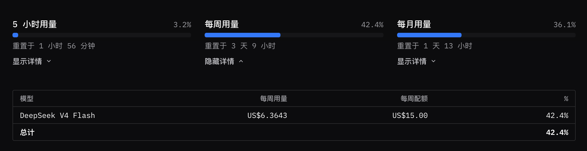
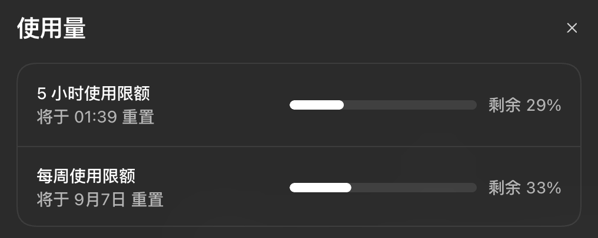

## 前言

经常访问本站的朋友，可能已经发现本站换了新的主题。

回顾折腾博客的这一路，已经用过了5个主题，其中 PaperMod 这个用的时间最长。

```
cactus
jane
yinyang
meme
PaperMod
```

一直想换个新主题，但查了一下，没有找到特别喜欢的主题了。

查 Hermes 资料时，偶然发现一个类似终端风格的[网站](https://blakecrosley.com/guides/hermes)。

没办法，程序员，就喜欢这种终端风格。😂

7月份的时候，用 Codex 搞了一次，搞的 Demo 页效果一般，后来就懒得折腾了，这个事情就又放下了。

最近又重新开启折腾博客，又想起这个事情了，这次拿 DeepSeek 先做了一个初版，还行，后面遇到的一些细节、难点问题由 Codex 解决。

于是，就有现在这个主题。

## 主题介绍

> Terminal — 复古 CRT 风格 Hugo 主题


这是一个将网站呈现在橙色荧光 CRT 终端窗口中的 Hugo 主题，灵感来自 blakecrosley.com。

文章通过 `less index.md` 打开，目录显示为 `ls -la` 列表，页脚采用 Vim 风格状态栏， 整个界面在 CRT 扫描线下安静地闪烁。

交由 AI 实现时，最核心的一点就是页面简单干净，模拟终端风格。

- 引入了[博客加速实践](https://liudon.com/posts/blog-performance-optimization/)里的响应式图片布局和静态资源合并特性
- 支持 VIM 终端的快捷键  /  /  /  进行滚动操作
- 支持首页/单页的 ASCII 艺术图像





## 开发历程

前前后后折腾了两天，总算搞出来了。

主要使用 DeepSeek 和 Codex 配合完成，大部分功能由 DeepSeek 实现，Codex 主要负责解决疑难和细节问题，以及审视方案。

DeepSeek 通过 OpenCode GO 调用，共花费 $6，消耗周限额的 40%。

Codex 消耗周限额的 70%，共计 1.3 亿 Token。




实际用下来，两者还是有一些比较明显的区别。

DeepSeek 不支持多模态，有些细节需要看截图进行处理，只能交给 Codex 解决。

还有一些问题，DeepSeek 容易发散，Codex 能很快定位问题解决掉。

## 后记

终于换上了一套自己满意的主题了，甚是喜欢。

目前可能还有些小问题，还会继续调整。

如果您访问过程中发现有什么问题，欢迎评论指出，我会尽快修复。
