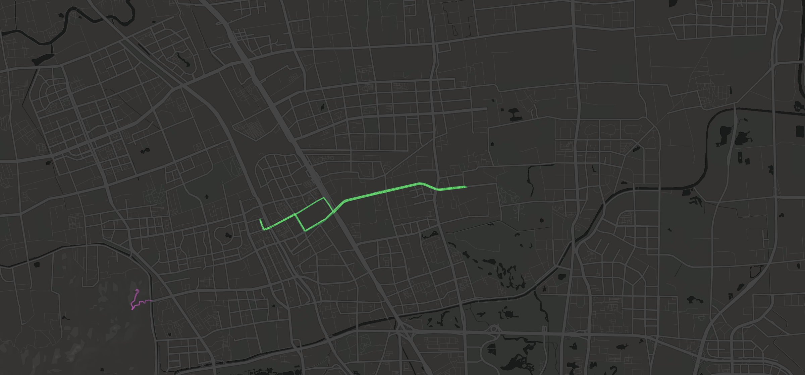

工作的缘故，平时基本一坐一天，缺少运动。

时间久了，各种毛病也就出来了。

搬到新大楼后，每天中午吃完饭楼下遛个弯，走一走，身体精神也好了很多。

坚持了一段时间，也不了了之了。

今年开始，决定骑车通勤，上下班路上运动一下。

最近在别人博客里发现了运动记录，发现是通过[running_page](https://github.com/yihong0618/running_page)项目实现的。

顺藤摸瓜，又发现了[workouts_page](https://github.com/ben-29/workouts_page)项目，支持多种运动。

于是看文档，部署起来，我的[个人锻炼页面](https://workout.liudon.com/)。

整个流程：

使用`Apple Watch`记录运动，导入到`Strava`应用里，在通过`workouts_page`工作流拉取数据构建页面。

部署过程中，顺带发现个问题，提了个PR。

这里还有个小插曲，没搞明白PR的流程，在未合入前又提交了其他代码，只好重新提了一个PR。😂