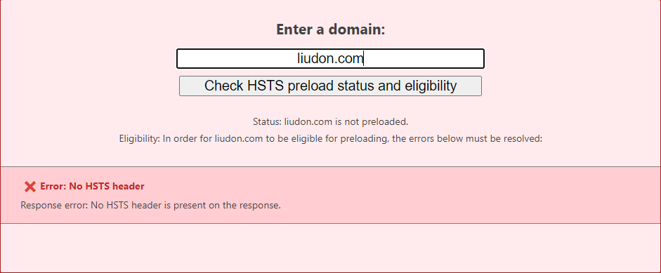
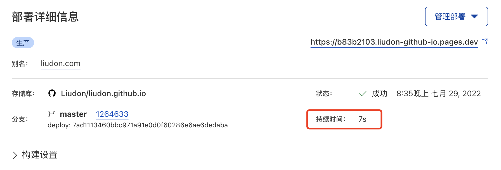

目前博客是部署到了`Github Pages`上，具体实现见[博客架构说明](https://liudon.com/posts/%E5%8D%9A%E5%AE%A2%E6%9E%B6%E6%9E%84%E8%AF%B4%E6%98%8E/)。

#### 缘由

`Github Pages`部署有一个问题，就是不支持`HSTS`。

> HTTP Strict Transport Security（通常简称为HSTS）是一个安全功能，它告诉浏览器只能通过 HTTPS 访问当前资源，而不是HTTP。


虽然`Github Pages`提供了`Enforce HTTPS`的选项，开启后`http`请求会301跳转到`https
`请求。

但是因为返回包缺少`Strict-Transport-Security`的Header头，导致HSTS校验失败。



为了彻底支持`HSTS`，决定切换到`Cloudflare Pages`。

#### 部署

`Cloudflare Pages`部署非常简单，授权`Github`仓库权限，配置好分支即可，这里不多介绍。

在`Github Pages`上，`code`分支保存原始文件，`master`分支保存`hugo`构建后的文件。


`Cloudflare Pages`这里生成分支选择`master`，同时禁用其他分支的自动构建。

这样提交代码后，`github actions`构建文件提交到`master`分支，然后触发`Cloudflare Pages`部署。

这里为什么没有采用`Cloudflare Pages`的自动构建呢？因为很慢，构建一次要3分钟左右。

采用拉取`master`构建好的文件的话，只需要7秒左右。



#### 补齐Header头

部署好后，`Cloudflare Pages`的返回也是没有`Strict-Transport-Security`Header头的。

这里需要通过自定义Header头实现，增加`_headers`文件，内容如下：

```
/*
  strict-transport-security: max-age=31536000; includeSubDomains; preload
```


至此`HSTS`搞定。

[HSTS资料](https://developer.mozilla.org/zh-CN/docs/Web/HTTP/Headers/Strict-Transport-Security)