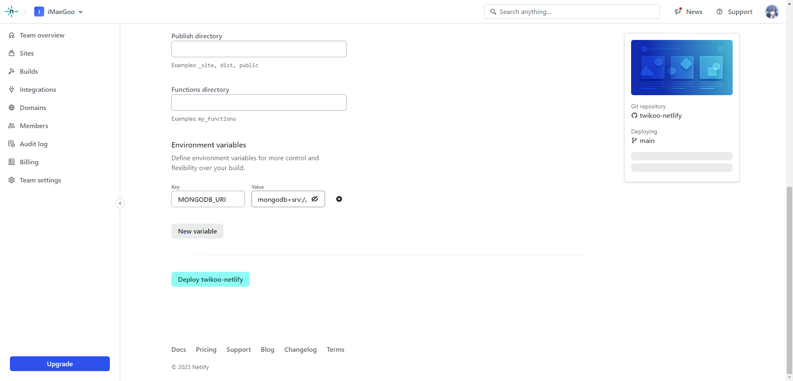
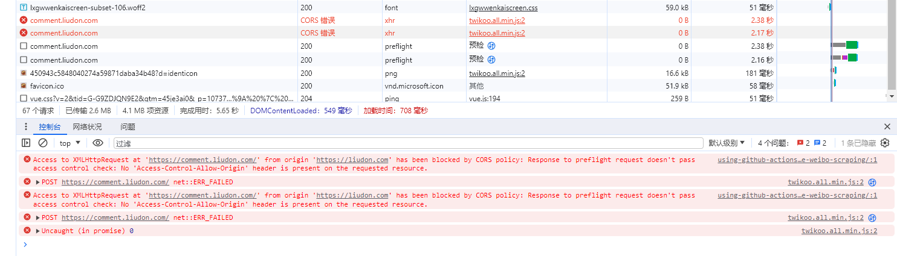
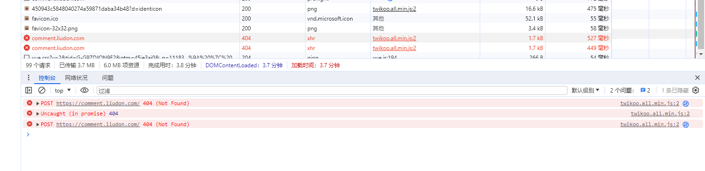
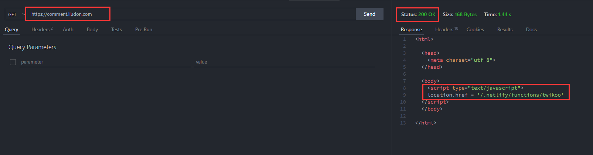
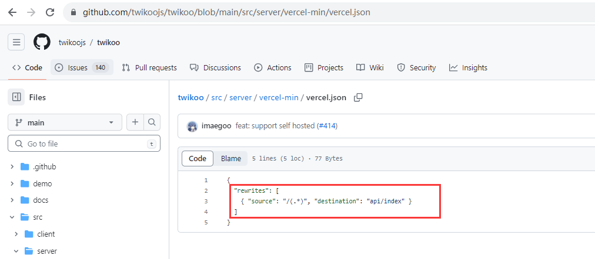
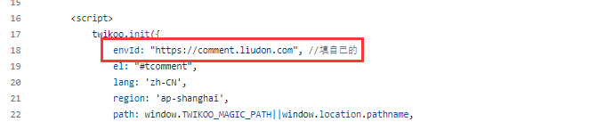

> 在本篇文章里，我会介绍如何在Netlify上部署Twikoo评论系统，如何接入到静态博客Hugo，以及如何实现Twikoo系统版本自动更新。

*2024年7月30日更新：因为[Github接口策略调整](https://docs.github.com/rest/overview/resources-in-the-rest-api#rate-limiting)，原有的匿名通过接口获取版本号方法失效，已更改为带token方式请求接口获取版本号，详见workflow里Get twikoo version步骤配置。*

#### 背景

博客之前通过`Vercel`部署了`Twikoo`评论系统，但是最近发现加载很慢。

看[Twikoo官网文档](https://twikoo.js.org/backend.html)，`Netlify`比`Vercel`国内访问会更优一些，于是搞了一把迁移。

迁移过程中遇到了一些问题，网上搜了一番，发现`Netlify`下部署`Twikoo`的信息很少，这篇文章我会介绍整个操作过程。

#### 部署

参考[官网文档](https://twikoo.js.org/backend.html#netlify-%E9%83%A8%E7%BD%B2)，部署即可。

这里一开始Fork成了`https://github.com/twikoojs/twikoo`，导致部署后访问404。

注意，正确的仓库是`https://github.com/twikoojs/twikoo-netlify`。



使用同一个`MongoDB`，配置原来的地址，这样已有的评论也不会丢。

部署后，通过`https://comment.liudon.com`访问，返回200。

但是访问`https://liudon.com`，提示`CORS跨域错误`，搜索一番网上资料也没找到相关信息。



一般跨域错误都是返回头里缺少跨域相关的字段导致，因此决定使用`Netlify`来新增返回头规避。

仓库下新增`netlify.toml`文件，针对根目录返回跨域头，内容如下。

```
[[headers]]
  # Define which paths this specific [[headers]] block will cover.
  for = "/"
    [headers.values]
    Access-Control-Allow-Origin = "*"
    Access-Control-Allow-Headers = "Content-Type"
    Access-Control-Allow-Methods = "*"
```

再次刷新页面，报错又变成了404，但是直接访问`https://comment.liudon.com`地址是返回的200。



经过一番定位，发现了问题所在：

`twikoo-netlify`库根目录地址是通过`Location`跳转到的`/.netlify/functions/twikoo`接口，`/.netlify/functions/twikoo`才是真正处理的接口。



而`vercel-netlify`库是通过rewrite将所有请求转发到了`/api/index`接口。



博客里写的`Twikoo`环境id填的是`https://comment.liudon.com`，更换为`Netlify`后，需要更换环境id，补齐后面的`/.netlify/functions/twikoo`。



因为`Netlify`也支持`Rewrite`转发，所以决定还是通过`netlify.toml`文件增加转发配置解决，内容如下：

```
[[redirects]]
  from = "/"
  to = "/.netlify/functions/twikoo"
  status = 200
  force = true
```

注意一定不要漏了`force`参数，因为根目录文件是存在的，不带这个参数的话`Rewrite`是不生效的，必须指定这个。

这下访问彻底ok了。

不过很快又发现另外一个问题，看到别人博客上`Twikoo`版本已经是`1.6.22`，自己的还是`1.5.11`。

搜索一番后，`Twikoo`已经给出了更新操作:

```
针对 Netlify 部署的更新方式

1. 登录 Github，找到部署时 fork 到自己账号下的名为 twikoo-netlify 的仓库
2. 打开 package.json，点击编辑
3. 将 "twikoo-vercel": "latest" 其中的 latest 修改为最新版本号。点击 Commit changes
4. 部署会自动触发
```

不过这样操作，每次版本更新，都需要手动去改一下`package.json`文件的版本，重新构建。

对于一个程序员，我们的追求就是自动化。

#### 自动版本更新

1. 服务端版本自动更新

这里利用`Github Actions`定时任务，通过接口拉取[twikoo](https://github.com/twikoojs/twikoo/releases)最新的版本，然后更新到`package.json`文件，从而实现版本自动更新。

在自己`twikoo-netlify`仓库下，新增`Actions`，代码如下：

```
# This is a basic workflow to help you get started with Actions

name: CI

# Controls when the workflow will run
on:
  # Triggers the workflow on push or pull request events but only for the "main" branch
  push:
    branches: [ "main" ]
  pull_request:
    branches: [ "main" ]

  # Allows you to run this workflow manually from the Actions tab
  workflow_dispatch:
  schedule:
    - cron: '0 2 * * *' # 每天定时2点执行一次

# A workflow run is made up of one or more jobs that can run sequentially or in parallel
jobs:
  # This workflow contains a single job called "build"
  build:
    # The type of runner that the job will run on
    runs-on: ubuntu-latest
  
    permissions:      
      contents: write

    # Steps represent a sequence of tasks that will be executed as part of the job
    steps:
      # Checks-out your repository under $GITHUB_WORKSPACE, so your job can access it
      - uses: actions/checkout@v3

      # Runs a single command using the runners shell
      - name: update version
        env:
          github_token: ${{ secrets.TOKEN }}
        run: |
          response=$(curl -sf -H "Authorization: token $github_token" -H "Accept: application/vnd.github+json" https://api.github.com/repos/twikoojs/twikoo/releases/latest)
          version=$(echo $response | jq -r '.tag_name')
          if [ -n "$version" ]; then
            sed -i "s/\"twikoo-netlify\": \".*\"/\"twikoo-netlify\": \"$version\"/" package.json
          fi
        shell: bash
        
      # Runs a set of commands using the runners shell
      - name: Commit changes
        uses: EndBug/add-and-commit@v9
        env:
          github_token: ${{ secrets.TOKEN }}
          add: .
```

这里会把修改后的`package.json`文件提交到仓库，所以需要申请一个`Token`，可以参考我上一篇[文章](https://liudon.com/posts/using-github-actions-to-schedule-weibo-scraping/)申请，然后添加到仓库变量里。

2. 博客引用版本自动更新

这里一开始想到在前端去查服务端最新版本号，然后引用对应版本的js文件来实现。

但是这样就会导致每次页面加载都要去查一次版本，会导致加载时间变长。

因此还是决定在服务端部署时，获取最新版本号更新服务。

- 引用版本配置化

`comments.html`文件修改：

```
<script src="https://cdn.staticfile.org/twikoo/{{ .Site.Params.twikoo.version }}/twikoo.all.min.js">
```

`config.tml`配置修改：

```
params:
  env: production # to enable google analytics, opengraph, twitter-cards and schema.
  
  ... # 其他配置

  assets:
    disableHLJS: true # to disable highlight.js
    
  twikoo:
    version: 1.5.11 # 配置twikoo版本号
```

- 获取最新版本号部署

`Actions`新增步骤：

```
    - name: Setup Hugo
    uses: peaceiris/actions-hugo@v2
    with:
        hugo-version: 'latest'

    ####
    - name: Get twikoo version
    id: twikoo
    run: |
        version=$(curl -s https://raw.githubusercontent.com/Liudon/twikoo-netlify/main/package.json | jq -r '.dependencies."twikoo-netlify"')
        echo "Twikoo version: $version"
        echo "twikoo_version=$version" >> $GITHUB_OUTPUT

    - name: Update config.yml version
    uses: fjogeleit/yaml-update-action@main
    with:
        valueFile: 'config.yml'
        propertyPath: 'params.twikoo.version'
        value: ${{ steps.twikoo.outputs.twikoo_version }}
        commitChange: true
    ####
        
    - name: Build
    run: hugo --gc --minify --cleanDestinationDir 
```

`####`内代码即为获取版本号，更新`config.tml`版本号逻辑，然后再进行`hugo`部署。

需要将`https://raw.githubusercontent.com/Liudon/twikoo-netlify/main/package.json`这个url里的`Liudon/twikoo-netlify`改为你的仓库名。

这下后面`Twikoo`官方更新版本，博客的`Twikoo`也会跟着自动更新。
