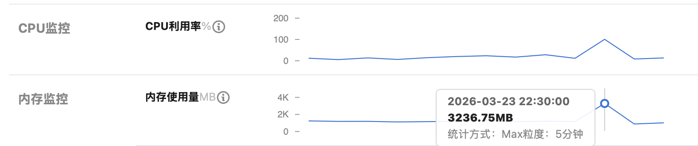
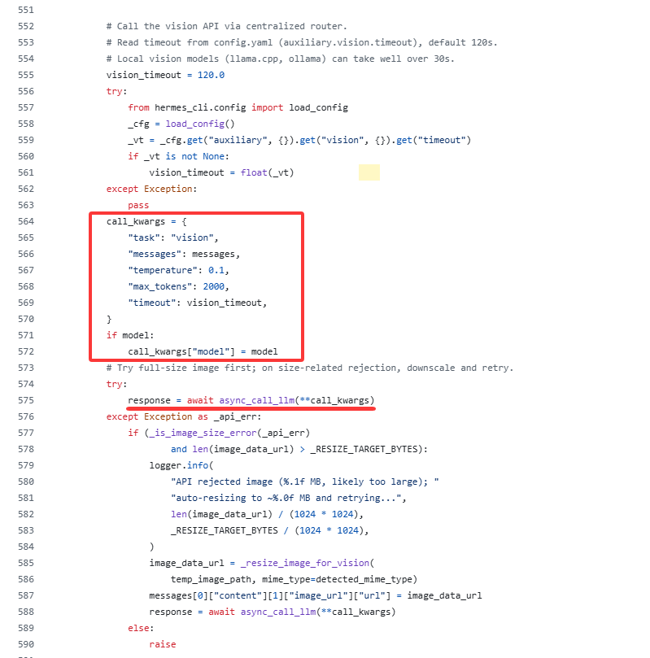
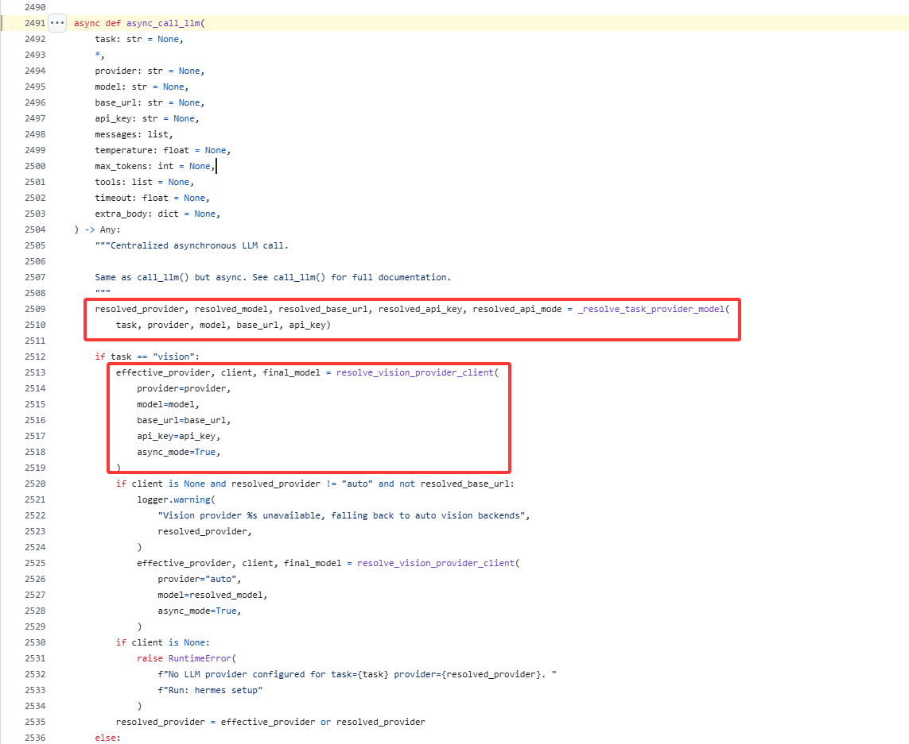
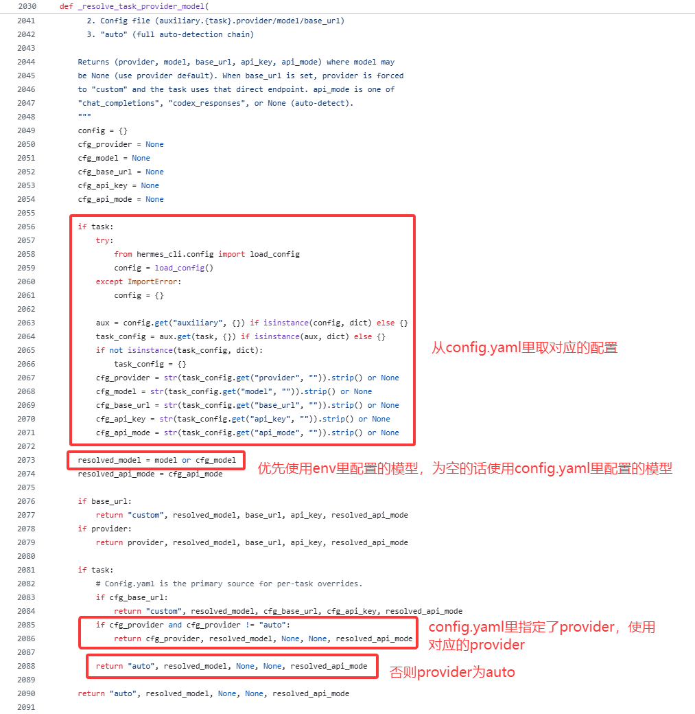
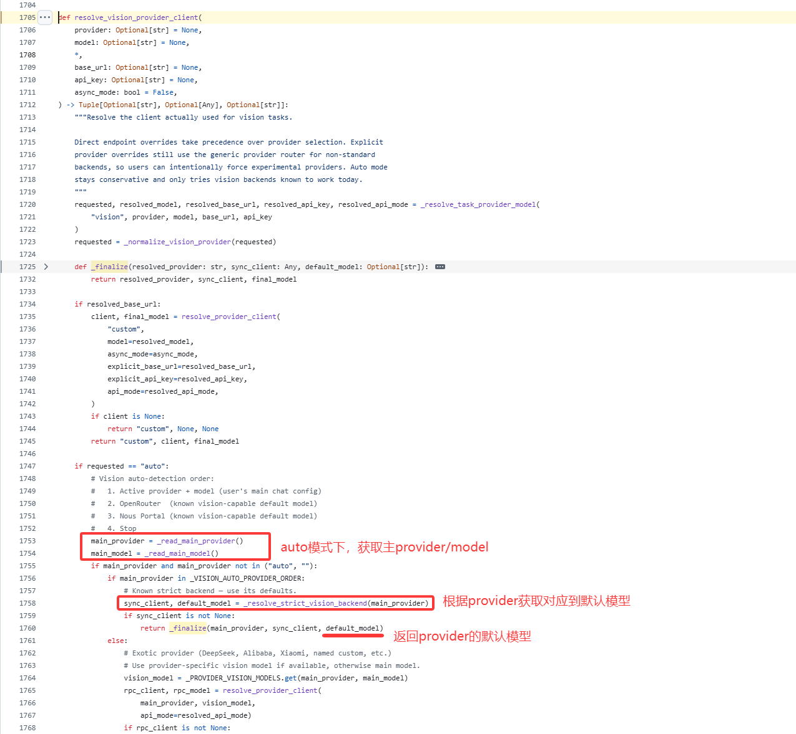

> AI 智能体（AI Agent）是一种能够感知环境、进行推理并自主行动以实现特定目标的智能系统。

OpenClaw和Hermes Agent属于目前开源社区最受关注的两个项目。

## OpenClaw（小龙虾）

> What is OpenClaw?
>
> OpenClaw is a self-hosted gateway that connects your favorite chat apps and channel surfaces — built-in channels plus bundled or external channel plugins such as Discord, Google Chat, iMessage, Matrix, Microsoft Teams, Signal, Slack, Telegram, WhatsApp, Zalo, and more — to AI coding agents like Pi. You run a single Gateway process on your own machine (or a server), and it becomes the bridge between your messaging apps and an always-available AI assistant.

### 安装

本着快速重置的想法，基于Docker进行部署，参考[官方文档](https://openclaws.io/zh/blog/openclaw-docker-deployment)。

```
# 创建根目录
mkdir -p ~/.openclaw

# 启动openclaw容器
docker run -d \
  --name openclaw \
  --restart unless-stopped \
  --memory="3g" \
  --memory-swap="6g" \
  --memory-reservation="1g" \
  --shm-size="2gb" \
  -e TZ=Asia/Shanghai \
  -v ~/.openclaw:/home/node/.openclaw \
  -p 3000:3000 \
  ghcr.io/openclaw/openclaw:latest

# 进行openclaw配置
docker exec -it openclaw openclaw onboard

# 安装微信插件
docker exec -it -u node openclaw npx -y @tencent-weixin/openclaw-weixin-cli@latest install
```

### 问题

1. 安装微信插件失败，到最后一步输出二维码时中断退出。



查看机器监控，看到内存基本满了。

我这是一台Lighthouse主机，2核4G，配置较低。

找AI看了下错误，需要配置下swap分区，防止内存溢出。

```
# 1. 创建一个 2GB 的交换文件 (可以根据需要把 2G 改为 4G)
sudo fallocate -l 2G /swapfile

# 2. 设置正确的权限（仅 root 可读写，出于安全考虑）
sudo chmod 600 /swapfile

# 3. 将文件格式化为交换分区
sudo mkswap /swapfile

# 4. 启用交换文件
sudo swapon /swapfile

# 5. 验证是否成功
sudo swapon --show

# 6. 设置开机自动挂载
echo '/swapfile none swap sw 0 0' | sudo tee -a /etc/fstab
```

2. 配置cron任务，经常无法按时执行。

```
gateway connect failed: Error: gateway closed (1000): 
◇  
Gateway not reachable. Is it running and accessible?
Gateway target: ws://127.0.0.1:18789
Source: local loopback
Config: /home/node/.openclaw/openclaw.json
Bind: loopback
```

检查发现有时gateway会连接失败，这个问题时好时坏，怀疑可能还是机器配置较低引起的。

## Hermes Agent

> What is Hermes Agent?
>
> It's not a coding copilot tethered to an IDE or a chatbot wrapper around a single API. It's an autonomous agent that gets more capable the longer it runs. It lives wherever you put it — a $5 VPS, a GPU cluster, or serverless infrastructure (Daytona, Modal) that costs nearly nothing when idle. Talk to it from Telegram while it works on a cloud VM you never SSH into yourself. It's not tied to your laptop.

看了文档，貌似对于机器配置要求更低一些。

### 安装

依旧是Docker部署。

```
# 创建根目录
mkdir -p ~/.hermes

# 启动容器，配置模型/消息通道
docker run -it --rm \
  -v ~/.hermes:/opt/data \
  nousresearch/hermes-agent setup

# 启动gateway
docker run -d \
  --name hermes \
  --restart unless-stopped \
  -v ~/.hermes:/opt/data \
  nousresearch/hermes-agent gateway run
```

模型我选择了OpenRouter，输入API Key，选择`nvidia/nemotron-3-super-120b-a12b:free`免费模型。

消息通道选择weixin，模式选择pairing，扫描二维码进行绑定。

启动gateway后，微信Clawbot会收到一个配对消息，类似如下：

```
Hi~ I don't recognize you yet!

Here's your pairing code: `RLU2WUYX`

Ask the bot owner to run:
`hermes pairing approve weixin RLU2WUYX`
```

进入hermes镜像里执行最后这个命令，之后就可以通过微信Clawbot控制了。

### 问题


我配置的是免费模型，但是看OpenRouter的Logs，时不时会有`Gemini 3 Flash Preview`模型的调用，产生费用。

通过走读代码，终于发现问题所在了，hermes agent有主模型和辅助模型两类。

> Hermes uses lightweight "auxiliary" models for side tasks like image analysis, web page summarization, and browser screenshot analysis. By default, these use Gemini Flash via auto-detection — you don't need to configure anything.

这里以`vision`图像识别举例：

config.yaml文件里`vision`配置默认如下，provider为auto：

```
auxiliary:
  # Image analysis (vision_analyze tool + browser screenshots)
  vision:
    provider: "auto"           # "auto", "openrouter", "nous", "codex", "main", etc.
    model: ""                  # e.g. "openai/gpt-4o", "google/gemini-2.5-flash"
    base_url: ""               # Custom OpenAI-compatible endpoint (overrides provider)
    api_key: ""                # API key for base_url (falls back to OPENAI_API_KEY)
    timeout: 120               # seconds — LLM API call timeout; vision payloads need generous timeout
    download_timeout: 30       # seconds — image HTTP download; increase for slow connections
```

工具入口文件，tools/vision_tools.py

```
def _handle_vision_analyze(args: Dict[str, Any], **kw: Any) -> Awaitable[str]:
    image_url = args.get("image_url", "")
    question = args.get("question", "")
    full_prompt = (
        "Fully describe and explain everything about this image, then answer the "
        f"following question:\n\n{question}"
    )
    // 从env文件获取vision模型
    model = os.getenv("AUXILIARY_VISION_MODEL", "").strip() or None
    return vision_analyze_tool(image_url, full_prompt, model)

// 注册工具
registry.register(
    name="vision_analyze",
    toolset="vision",
    schema=VISION_ANALYZE_SCHEMA,
    handler=_handle_vision_analyze,
    check_fn=check_vision_requirements,
    is_async=True,
    emoji="👁️",
)
```

通过registry.register注册`vision_analyze`工具，处理逻辑在`_handle_vision_analyze`方法，从env文件里获取`AUXILIARY_VISION_MODEL`变量值作为vision模型，最终调用`vision_analyze_tool`方法。

```
    """
    Analyze an image from a URL or local file path using vision AI.
    
    This tool accepts either an HTTP/HTTPS URL or a local file path. For URLs,
    it downloads the image first. In both cases, the image is converted to base64
    and processed using Gemini 3 Flash Preview via OpenRouter API.
    
    The user_prompt parameter is expected to be pre-formatted by the calling
    function (typically model_tools.py) to include both full description
    requests and specific questions.
    
    Args:
        image_url (str): The URL or local file path of the image to analyze.
                         Accepts http://, https:// URLs or absolute/relative file paths.
        user_prompt (str): The pre-formatted prompt for the vision model
        model (str): The vision model to use (default: google/gemini-3-flash-preview)
    
    Returns:
        str: JSON string containing the analysis results with the following structure:
             {
                 "success": bool,
                 "analysis": str (defaults to error message if None)
             }
    
    Raises:
        Exception: If download fails, analysis fails, or API key is not set
        
    Note:
        - For URLs, temporary images are stored in ./temp_vision_images/ and cleaned up
        - For local file paths, the file is used directly and NOT deleted
        - Supports common image formats (JPEG, PNG, GIF, WebP, etc.)
    """
```

根据`vision_analyze_tool`方法参数说明，model默认为google/gemini-3-flash-preview。



env文件指定了模型的话，使用指定的模型，调用了`async_call_llm`方法。

注意，这里没有指定provider参数。

`async_call_llm`方法如下：



先看`_resolve_task_provider_model`方法实现。



指定了task的情况，会从config.yaml里读取对应的配置，模型会优先使用env文件的配置，为空的话使用config.yaml文件里的配置。

如果config.yaml里指定了provider，则使用对应的provider，否则返回auto。

再来看`resolve_vision_provider_client`方法实现。



_read_main_provider/_read_main_model为读取config.yaml里配置。

```
def _read_main_model() -> str:
    """Read the user's configured main model from config.yaml.

    config.yaml model.default is the single source of truth for the active
    model. Environment variables are no longer consulted.
    """
    try:
        from hermes_cli.config import load_config
        cfg = load_config()
        model_cfg = cfg.get("model", {})
        if isinstance(model_cfg, str) and model_cfg.strip():
            return model_cfg.strip()
        if isinstance(model_cfg, dict):
            default = model_cfg.get("default", "")
            if isinstance(default, str) and default.strip():
                return default.strip()
    except Exception:
        pass
    return ""


def _read_main_provider() -> str:
    """Read the user's configured main provider from config.yaml.

    Returns the lowercase provider id (e.g. "alibaba", "openrouter") or ""
    if not configured.
    """
    try:
        from hermes_cli.config import load_config
        cfg = load_config()
        model_cfg = cfg.get("model", {})
        if isinstance(model_cfg, dict):
            provider = model_cfg.get("provider", "")
            if isinstance(provider, str) and provider.strip():
                return provider.strip().lower()
    except Exception:
        pass
    return ""
```

```
_VISION_AUTO_PROVIDER_ORDER = (
    "openrouter",
    "nous",
)
```

auto模式会依次尝试openrouter和nous两个提供商。

查看`_resolve_strict_vision_backend`方法实现：

```
def _resolve_strict_vision_backend(provider: str) -> Tuple[Optional[Any], Optional[str]]:
    provider = _normalize_vision_provider(provider)
    if provider == "openrouter":
        return _try_openrouter()
    if provider == "nous":
        return _try_nous(vision=True)
    if provider == "openai-codex":
        return _try_codex()
    if provider == "anthropic":
        return _try_anthropic()
    if provider == "custom":
        return _try_custom_endpoint()
    return None, None
```

我配置的是openrouter，查看`_try_openrouter`方法实现。

```
def _try_openrouter() -> Tuple[Optional[OpenAI], Optional[str]]:
    pool_present, entry = _select_pool_entry("openrouter")
    if pool_present:
        or_key = _pool_runtime_api_key(entry)
        if not or_key:
            return None, None
        base_url = _pool_runtime_base_url(entry, OPENROUTER_BASE_URL) or OPENROUTER_BASE_URL
        logger.debug("Auxiliary client: OpenRouter via pool")
        return OpenAI(api_key=or_key, base_url=base_url,
                       default_headers=_OR_HEADERS), _OPENROUTER_MODEL

    or_key = os.getenv("OPENROUTER_API_KEY")
    if not or_key:
        return None, None
    logger.debug("Auxiliary client: OpenRouter")
    return OpenAI(api_key=or_key, base_url=OPENROUTER_BASE_URL,
                   default_headers=_OR_HEADERS), _OPENROUTER_MODEL
```

注意这里调用接口时传入的model为**_OPENROUTER_MODEL**常量。

```
# Default auxiliary models per provider
_OPENROUTER_MODEL = "google/gemini-3-flash-preview"
_NOUS_MODEL = "google/gemini-3-flash-preview"
_NOUS_FREE_TIER_VISION_MODEL = "xiaomi/mimo-v2-omni"
_NOUS_FREE_TIER_AUX_MODEL = "xiaomi/mimo-v2-pro"
_NOUS_DEFAULT_BASE_URL = "https://inference-api.nousresearch.com/v1"
_ANTHROPIC_DEFAULT_BASE_URL = "https://api.anthropic.com"
_AUTH_JSON_PATH = get_hermes_home() / "auth.json"
```

auto模式下，不指定model的情况下，主provider为openrouter时，使用的是`google/gemini-3-flash-preview`模型，这就是为什么配置的免费模型，但仍产生了`google/gemini-3-flash-preview`收费模型的调用。

将配置里的`provider: "auto"`改为`provider: "main"`，使辅助模型也走主模型配置。

## 总结

两个Agent使用下来，Hermes Agent明显更快一些，对机器的要求也更低。

把OpenClaw的cron迁移到Hermes Agent上，未执行的问题也解决了。