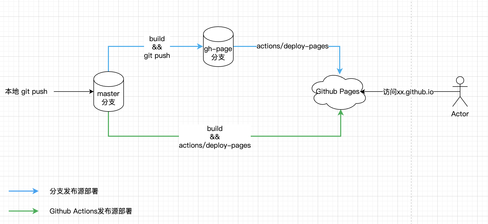

上周末在[搭建个人锻炼页面](https://liudon.com/posts/building-a-workout-page/)时，遇到个`Github Pages`部署的困惑。

看了`running_page`项目文档，是支持部署到`Github Pages`页面的，对应的操作流程定义在[github/workflows/gh-pages.yml](https://github.com/yihong0618/running_page/blob/master/.github/workflows/gh-pages.yml)文件。

```
    - name: Install dependencies
    run: pnpm install
    - name: Build
    run: PATH_PREFIX=/${{ github.event.repository.name }} pnpm build

    - name: Upload artifact
    uses: actions/upload-pages-artifact@v3
    with:
        # Upload dist repository
        path: './dist'
    - name: Deploy to GitHub Pages
    id: deployment
    uses: actions/deploy-pages@v4
```

核心逻辑就是上面这段。

之前搞过部署`hugo`静态站点到`Github Pages`，使用的分支方式部署，编译后的静态文件单独用一个分支存放。

这里以我自己的博客项目举例，大致流程如下图：


按我的理解，这里最终访问的文件内容是存在`master`分支下的。

但是实际部署完`running_page`项目后，我发现并没有出现`gp-pages`分支，但是`Github Pages`却可以正常访问。

有点不可思议，这个访问的数据是在哪里的呢？

带着这个疑问，在`v2ex`上发了个[咨询贴](https://www.v2ex.com/t/1074875)。

经过网友解惑，大致搞明白了这里的流程：



`Github Pages`的发布源有两种方式，通过分支部署和通过`Github Actions`部署，分别对应上图的两条分支。

这里最终都会将build后的静态文件部署到`Github Pages`服务上，供用户访问。

分支部署的方式，其实是有一个[内置工作流](https://github.com/Liudon/liudon.github.io/actions/workflows/pages/pages-build-deployment)部署到`Github Pages`服务上的。


整个部署流程大致就是这样，最终的静态文件都是存在`Github Pages`服务上的。