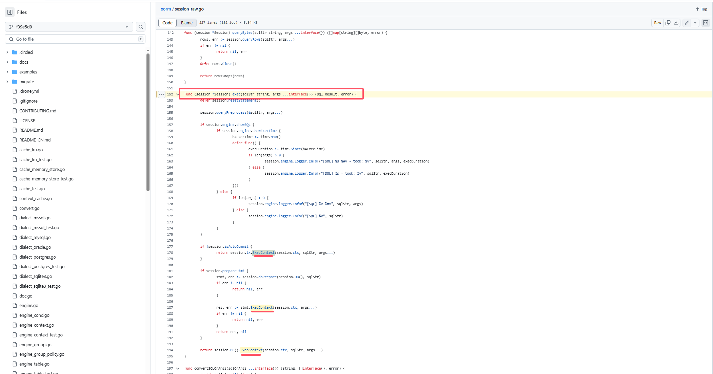
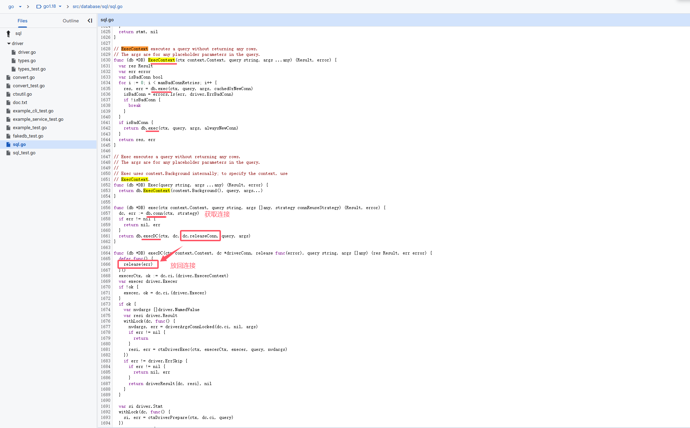
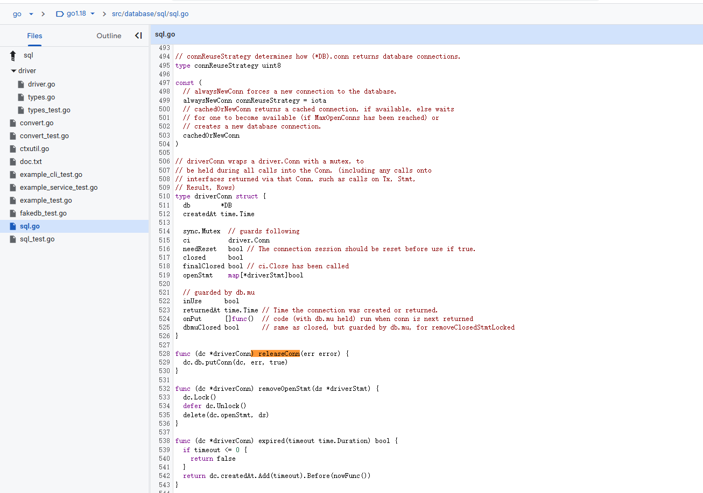
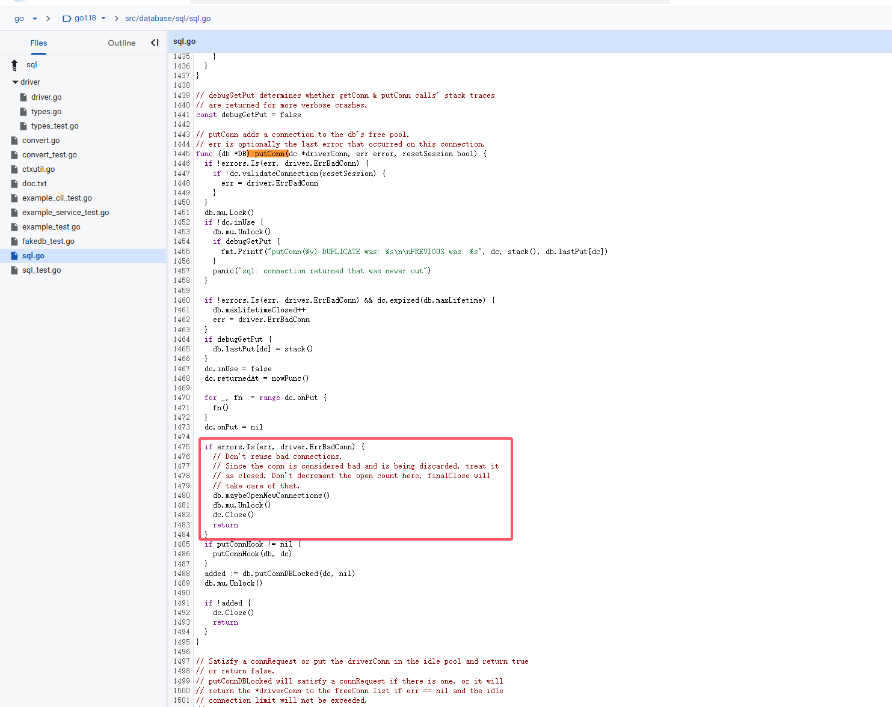

最近有个交接服务的数据库要升级版本，升级最后切换瞬间会有一个闪断。

这里业务侧需要确保有自动重连机制，否则会影响服务。

因为是交接的服务，得通过代码再确认一下。

业务代码里使用了xorm包操作的数据库，连接池管理是底层database/sql负责的。

读了一遍代码，总算搞清楚这里断连自动重连的机制了：

xorm对外的增删改查方法最终都会调用到了exec方法，[代码出处](https://github.com/go-xorm/xorm/blob/f39e5d9bfdb70c435f8649555f224c0fa4f51e54/session_raw.go#L152)。

可以看到这里调到了database/sql里的ExecContext方法，[代码出处](https://cs.opensource.google/go/go/+/refs/tags/go1.18:src/database/sql/sql.go)。

这里调用到了exec方法:

1. db.conn 从连接池获取连接；
2. db.execDC 执行sql，最后会通过release方法将连接再放回连接池；

这里release传入的是db.releaseConn方法，实现如图:

这里调用了putConn方法，实现如图：

注意红框部分，这里检查执行结果如果为连接错误，会通过maybeOpenNewConnections创建一个新连接，同时将此连接关闭。