6月底给家里添置了辆车，还在磨合期。

平时爸妈开的不多，这次暑假回家，想着找一天带爸妈出门逛逛。

上午带老妈去医院做了个CT检查，检查完结果要4个小时才能出来。

昨天下了雨，今天特别凉快，适合外出。

虽然拿驾照开车几年了，但是一直没上过高速，稳妥起见，还是走下道在附近逛一逛。

之前查了一下，附近近一点的有广府古城和正定古城，正定的话要更远一点，想着下午回来看结果，所以就选择了广府古城。

> 广府城，又称永年城，是位于中国河北省邯郸市永年区的一座古城，也是明清广平府府治、永年县县治所在地。
> 城址位于永年区东南60公里处的永年洼中，永年洼面积28平方公里，而古县城坐落于延伸至湖中的半岛上。

从医院出发，导航不走高速，大概1小时40分钟左右到达。

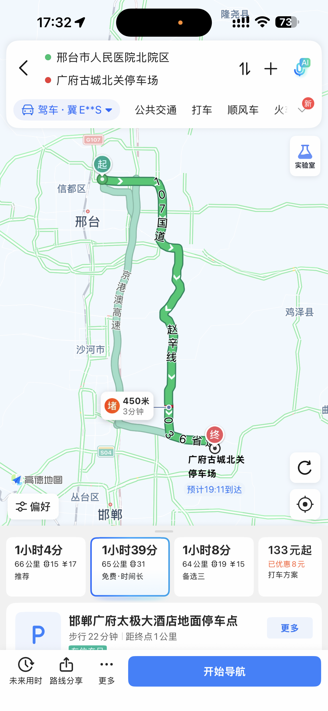

因为前一天下了雨，先是在107国道辅路下来上桥的地方，有一处大的积水。

停车观察了一下有小车经过，应该问题不大，慢慢开了过去。

最后在还有20多公里到的地方，又遇到了1公里左右的堵车，原因也是路口中间一个大水坑，两个方向的车全部堵在路上了。

这个大水坑要比前面那个更深，开过去的时候前方雷达一直在报警。

经过快半个小时的龟速前进，总算过了这段拥堵路段。

11点12的时候，终于到了广府古城，耗时近3个小时。

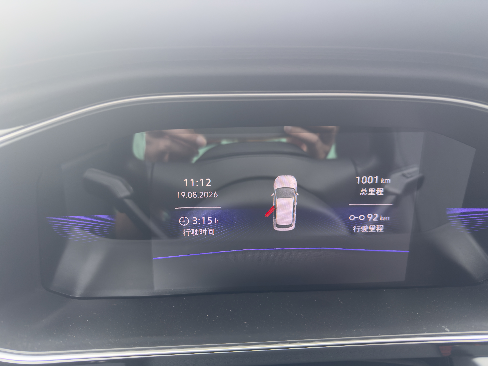

我们是从北门进的，城外面一圈水系围绕。

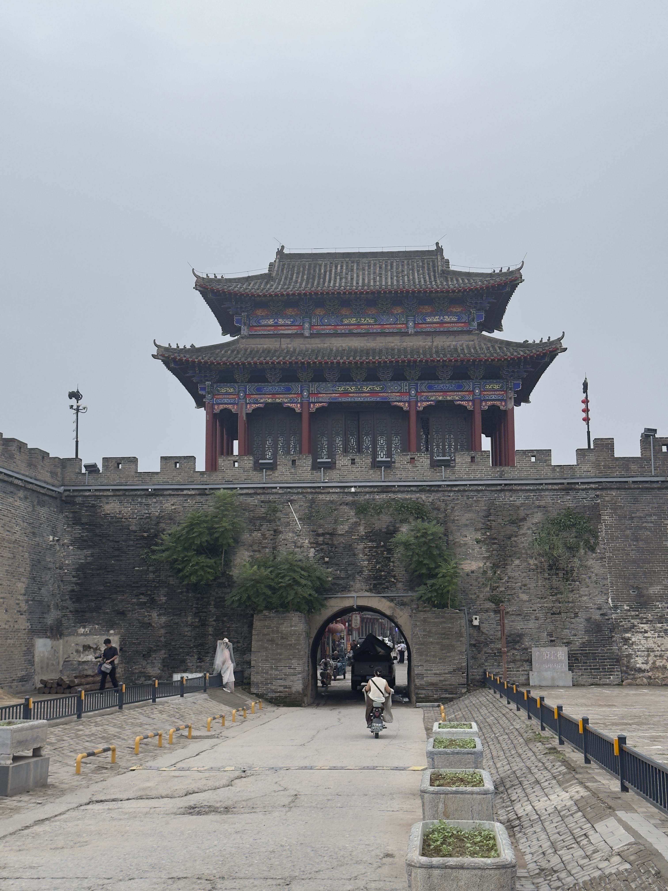

进去后，全都是各种小店，商业气息浓厚。

到饭点时间了，所以先找地方吃饭。

美团上查了一下，有个宋海饭店，说是上过央视。

点了缯肘、特色乱炖、小酥鱼三道菜，味道不错，个人更喜欢缯肘，酥鱼我觉得一般。

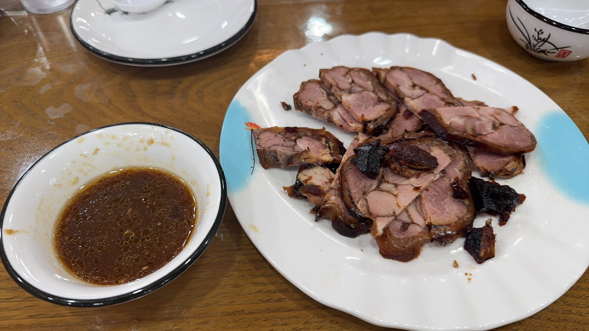
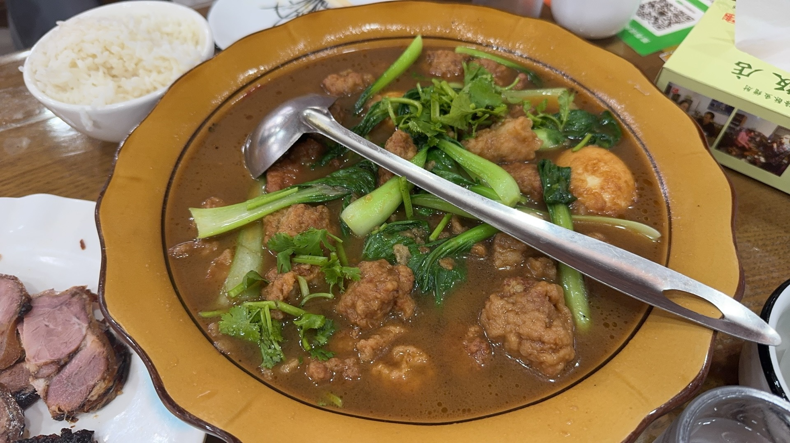

吃完饭，离的不远有个广府署衙，买门票进去逛了逛。

大堂里可以免费拍照，让老爸拍了一张。

免费的说是6寸照片，结果发现是6寸明信片，右下角只有一个小小的照片；花了20大洋买了升级版的照片，连明信片都给封膜了。

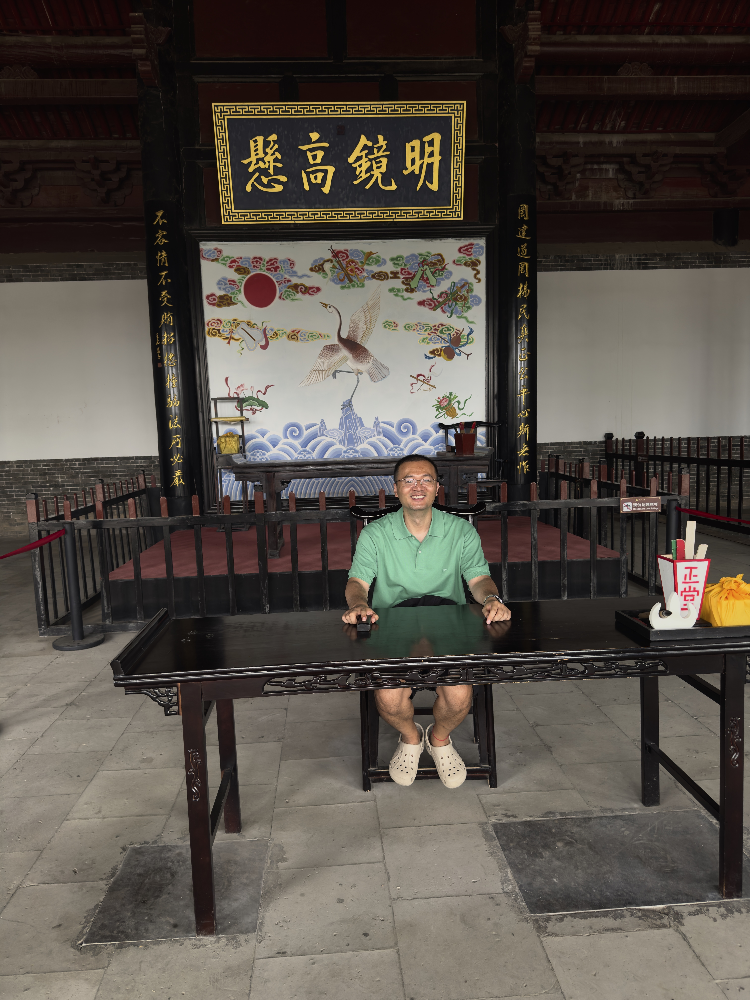
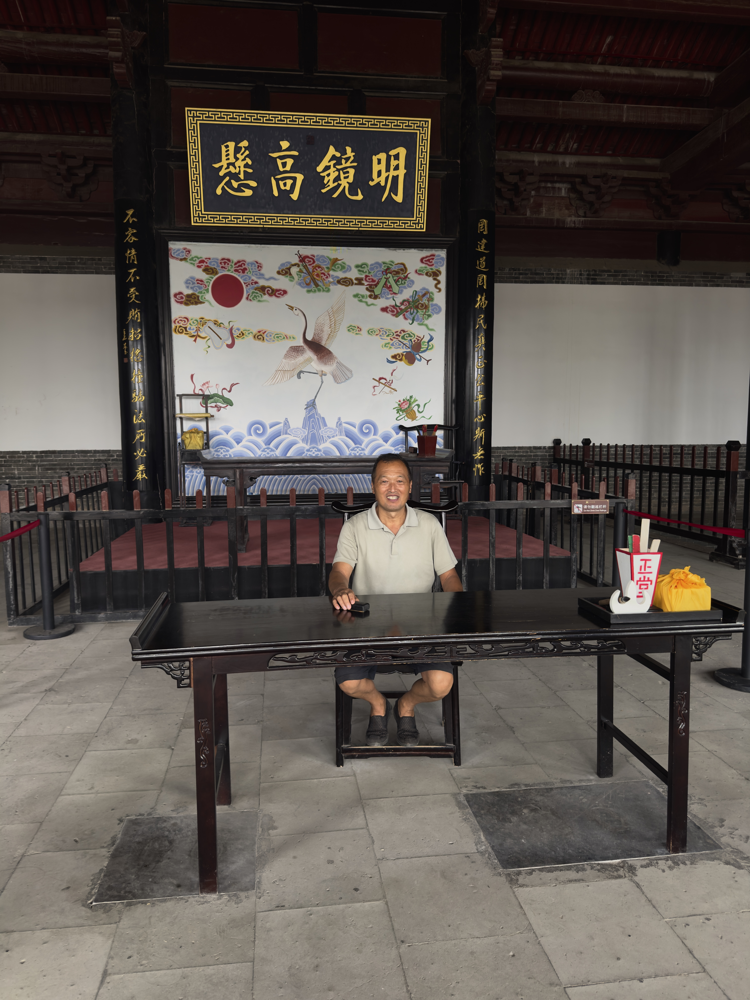

本以为就一个大堂，门票花的实在太冤了。

从旁边往后走，地方越来越大，这署衙可真大啊。

屋子不少，里面的摆件都被粘在了桌子上，应该都不是老物件。

后面还有一个浮青阁，可以拜一拜。

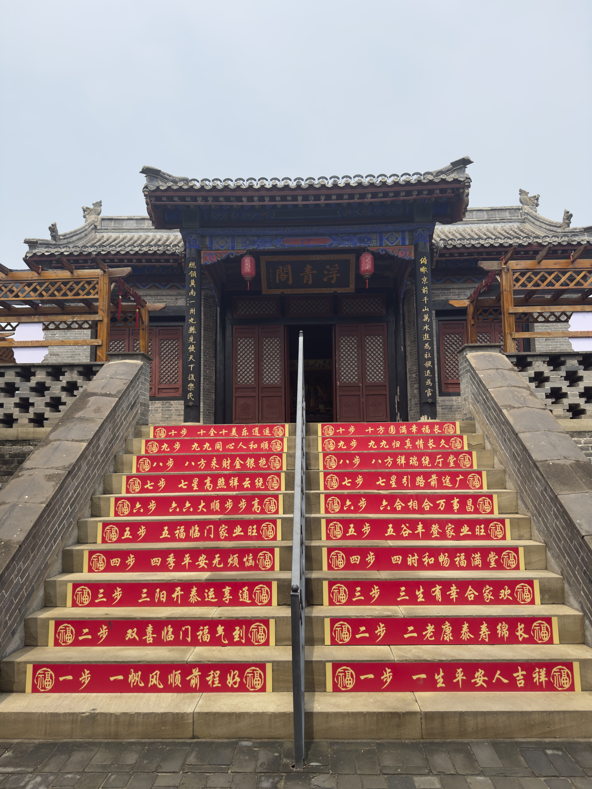

最后面是三皇宫，到跟前才发现这里还曾是跑男的场地。

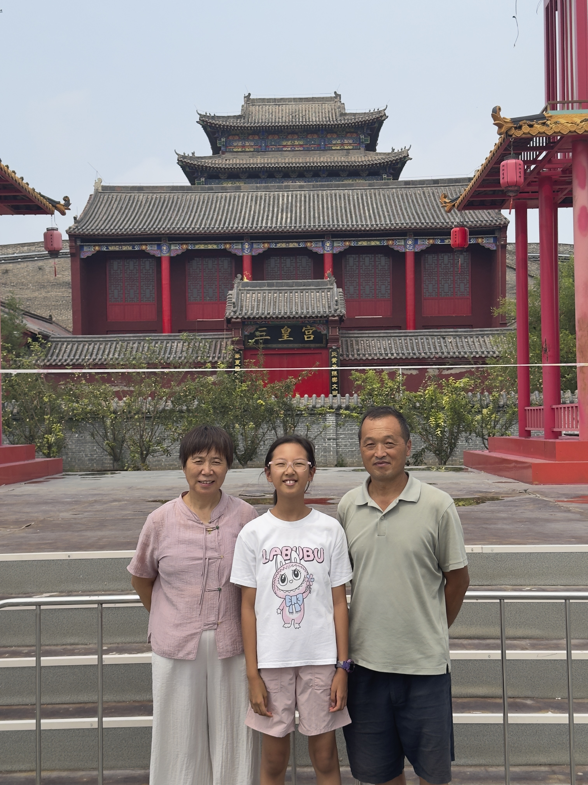

旁边还有一个小花园，亭台假山流水，一个不少。

时间还早，出来后决定上城墙转一转，后来发现大中午上城墙这是一个错误的决定。

从署衙出来，这个时候晴天出太阳了，往东走到东门，买门票上城墙。

上面其实没有什么东西，大中午的还非常晒，可以远眺北边的一座桥。

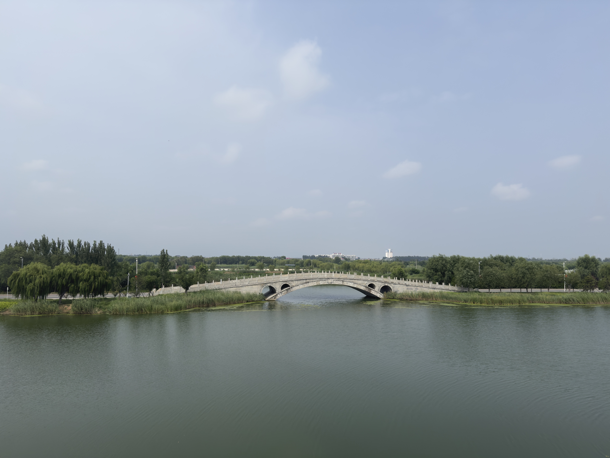

走到北边的角楼，碰到一个大爷，问了一嘴北门不能下，还好问一下，不然又得走冤枉路。

又原路返回，从城里绕回北门，路上娃热的不行，给她买了把编制的扇子。

下午2点半准备返程，早上来的时候路上没碰到加油站没加油，得先找地方加油。

高德搜了一下，附近都是些小加油点，距离最近的中石油在10公里，导航出发。

加完油快3点了，决定今天直接回家，下午5点到家。

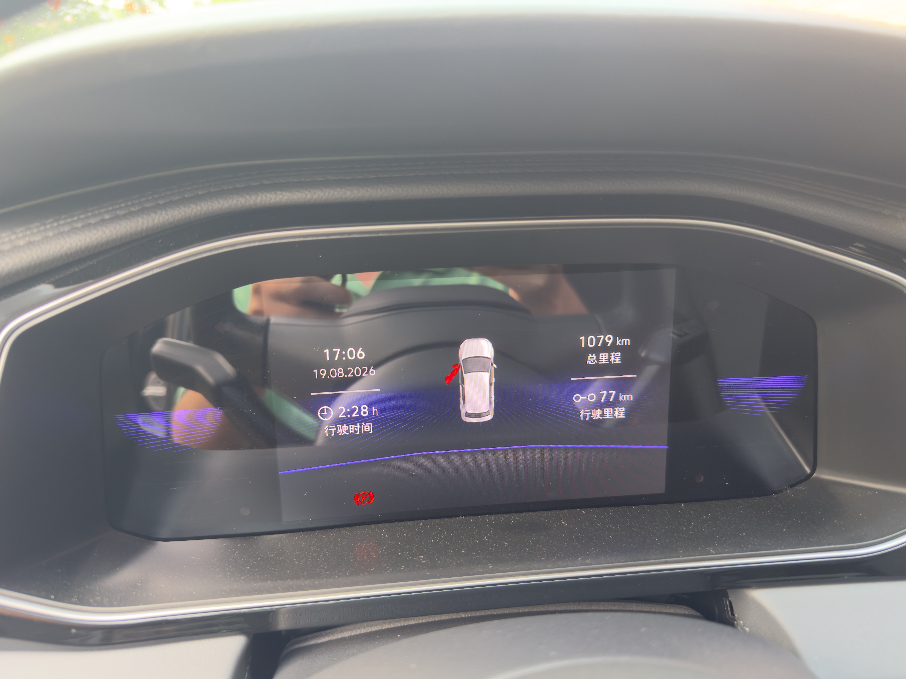

第一次开车这么久，坐的屁股疼，一路有惊无险，平安到家。 😄
