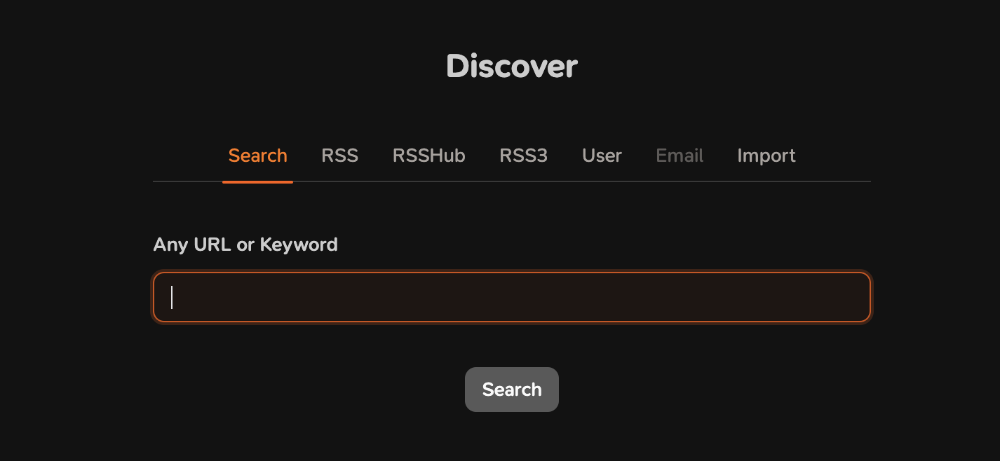

> Follow:  Next generation information browser.

最近博客圈开始流行`Follow邀请码`，大家各种求码，一码难求。

蹲在`Discord`群里一周，虽然时有发码，但最终还是狼多肉少，抢不到码呀。

上周五好不容易加上管理员，要到了一枚邀请码，终于可以激活体验了。

在`Follow`里，订阅变的异常简单，输入url，它会自己检查rss订阅。



另外发现我的博客，在`Follow`显示的内容不全。

检查了一下，发现是输出的RSS内容不全。

修改`hugo`配置文件，开启RSS输出全文。

```
ShowFullTextinRSS: true
```

从木木大佬那里看到，可以认证自己的Feed，我也来搞一下我的。

```
This message is used to verify that this feed (feedId:55815884011044914) belongs to me (userId:56204227179125760). Join me in enjoying the next generation information browser https://follow.is.
```