上一篇《[博客时光机 2.0 后端篇：构建可视索引](/posts/hugo-ipfs-time-machine-v2-visual-index/)》讲了后端的实现，如何把完整的 CID 构建历史整理成一条真正有意义的「可视时间线」。

后端提前生成好了可视索引，前端只需要按索引展示就好了，但如何实现前端的效果也是折腾了一番。

今天就来讲讲前端折腾的过程。

## 探索：博客时光机的前端原型

在后端篇方案验证的时候，已经做了一个类似图片轮播的 Demo 页。

但这个效果太像普通的图片轮播了，和我想象中的“时光机”还差得有点远。

一开始也没有特别明确的想法，就直接交给了 AI 来进行探索。

ChatGPT 前后生成了四版 Demo。

从最开始信息很多的「时光放映机」，到根据变化区域移动镜头的「时光显影」，再到保持连续视角的「时光放映厅」，最后又做了一版木质、黄铜风格的拟物时光机。

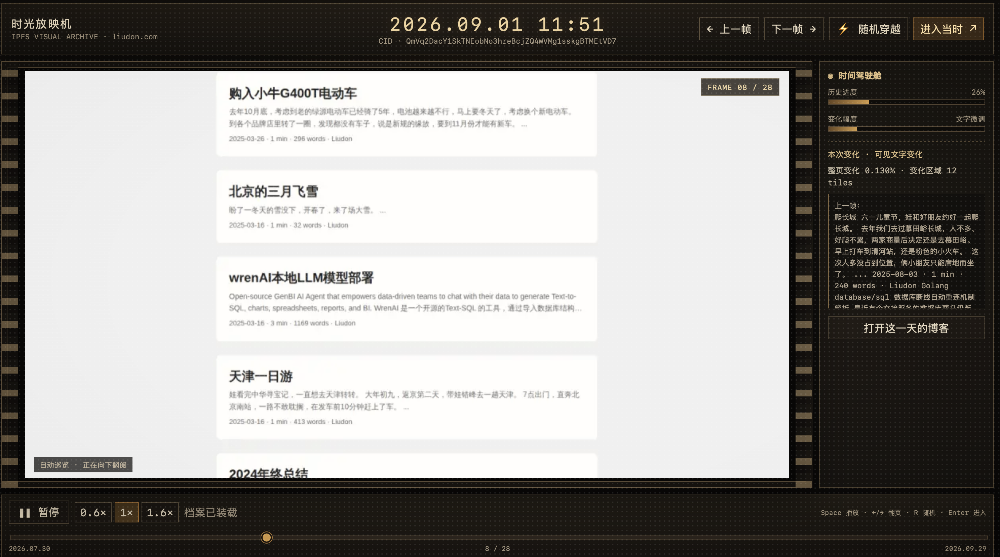
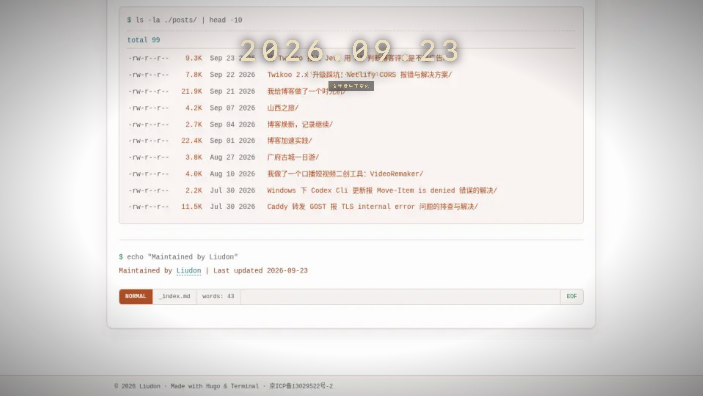
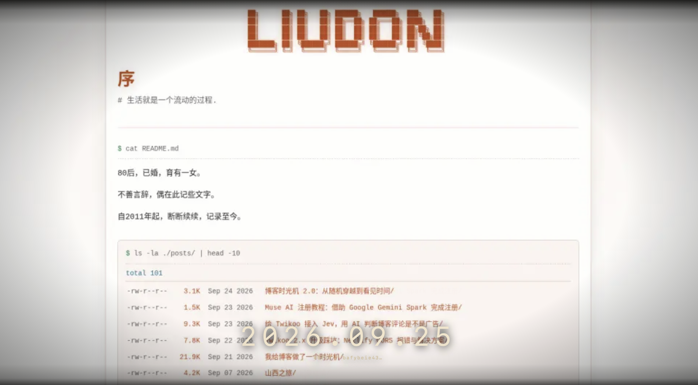
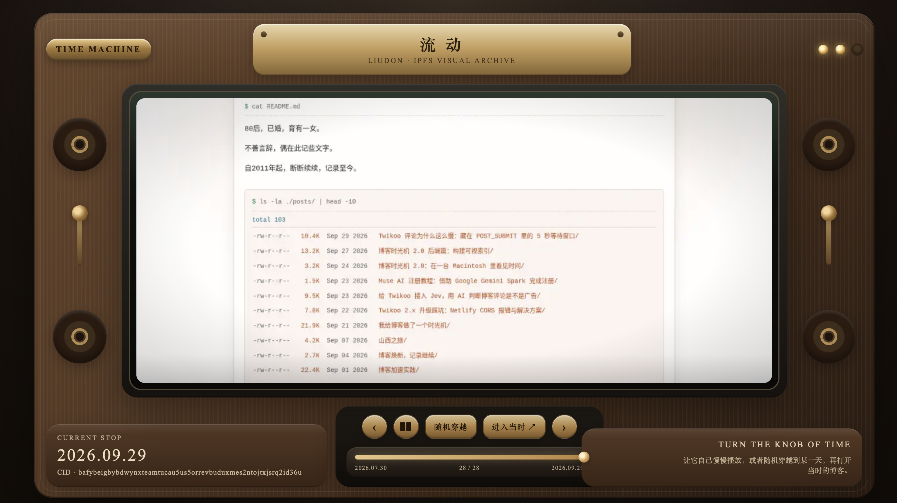

虽然不知道要做成什么样，但这四个肯定不是我想要的。

## 收敛：从 CRT、System 7 到 Macintosh

这几版始终没找到感觉，继续沿着这个方向调下去意义也不大了。

突然想起来我还有 Gemini 会员，之前在微博上老看到人说前端能力很强，那就用它来试试看吧。

**终端 CRT**

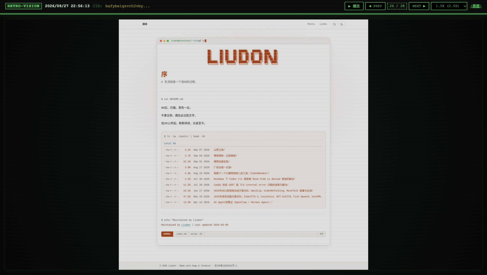

效果非常好，而且和我的博客主题也很配，就是阅读起来有些费劲。

**老式监视器**

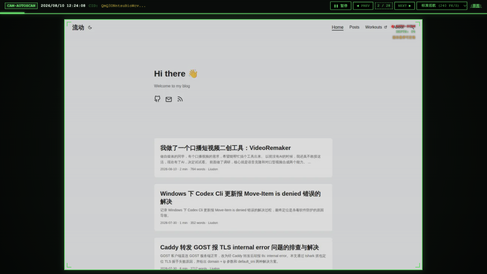

总感觉还是差点意思。

突然想到能不能搞一个复古的 Mac 效果。

**System 7**

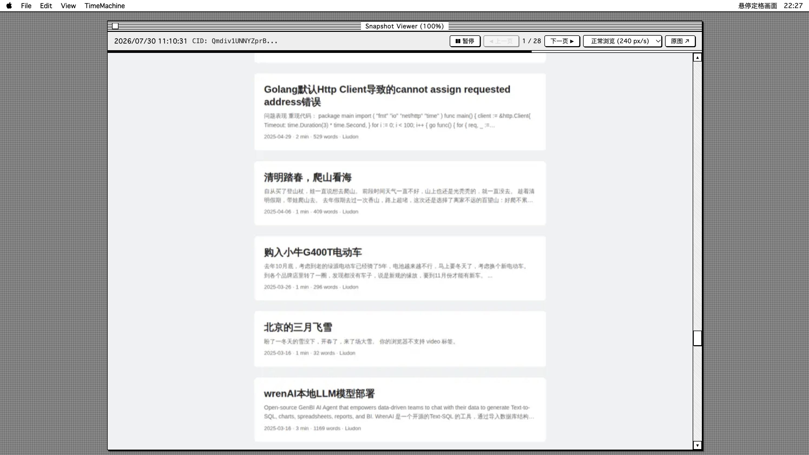

有点意思了，好兴奋啊。

我想再进一步，在一台 Mac 电脑里显示内容。

**Macintosh**

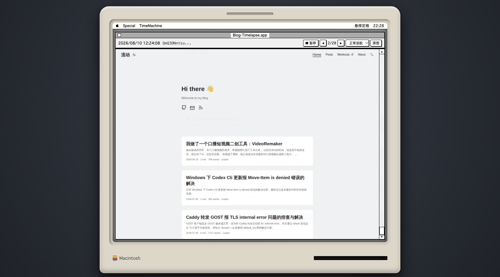

哇，感觉就是我要的效果了。

**继续尝试**

在这个基础上，又继续尝试了马赛克风穿梭机、红蓝机器搭配复古电视、德罗宁时间仪表舱、VCR 磁带机、复古街机，甚至还做了个《人生切割术》里的 Lumon 电脑。

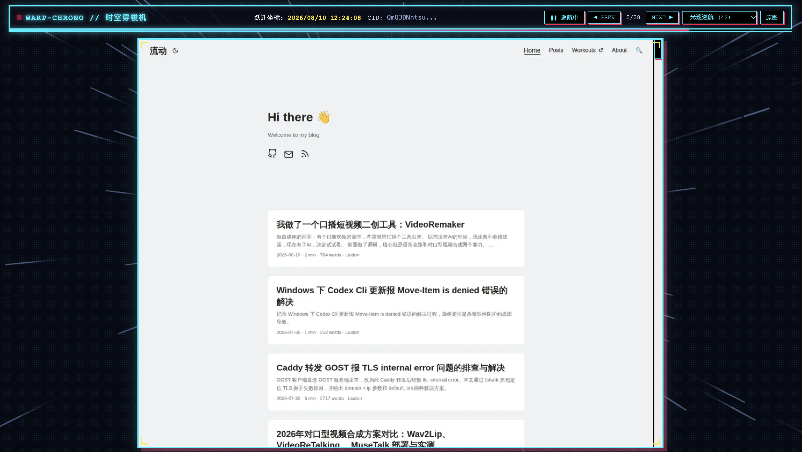
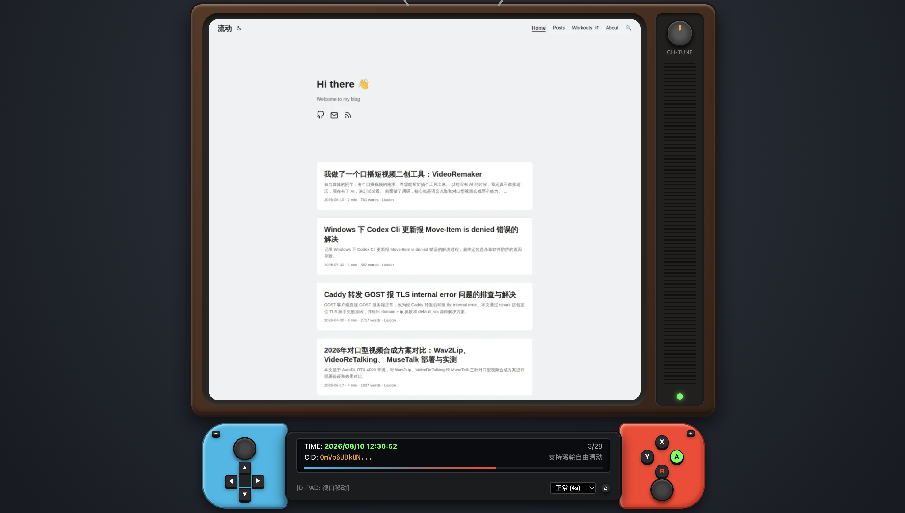
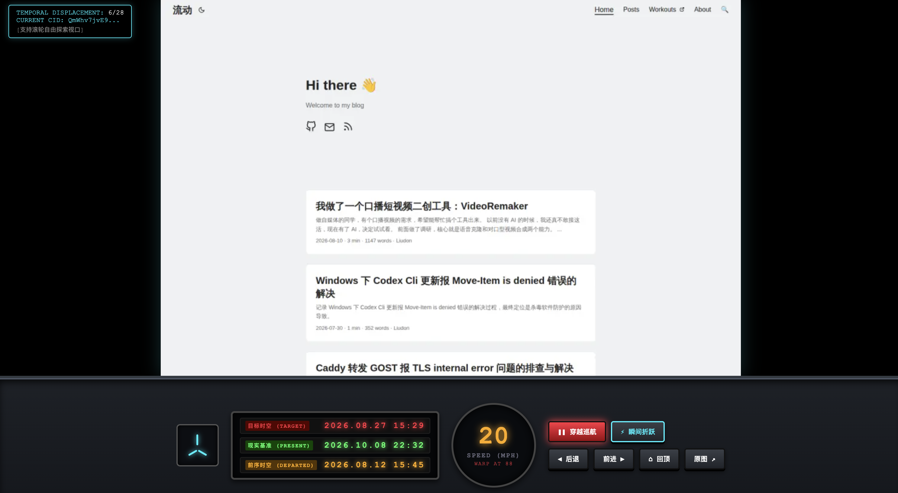

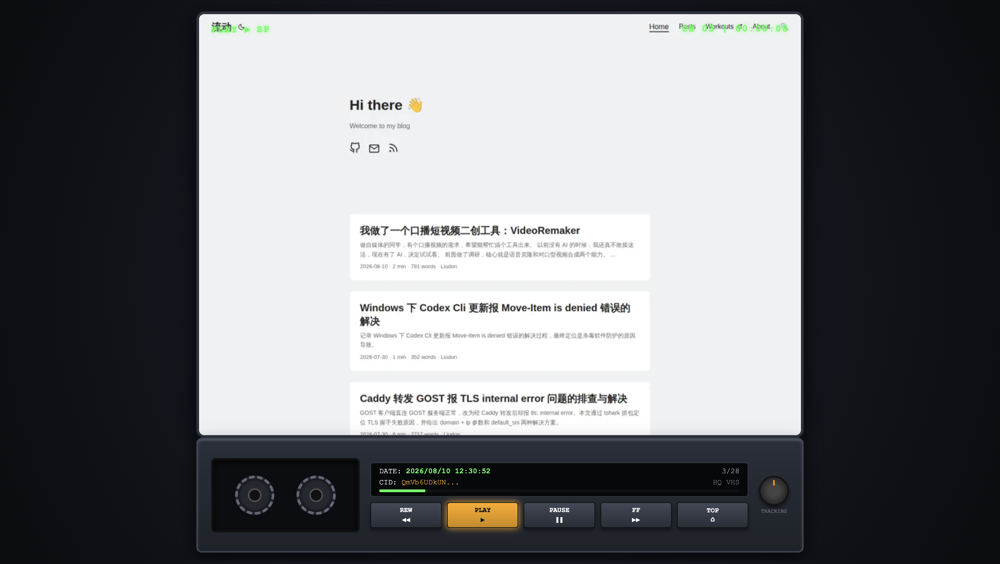

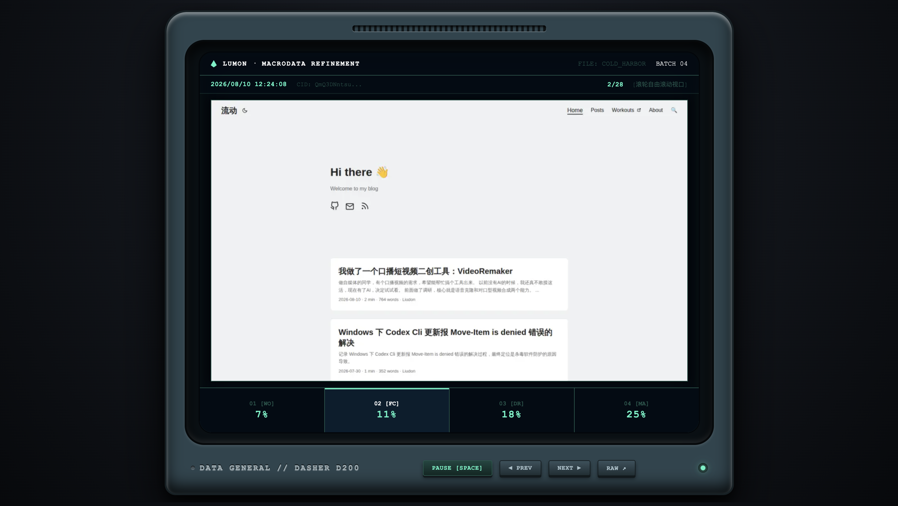

这些方案效果更酷炫，但抢掉了博客本身的内容。

一圈体验下来，最终还是 Macintosh 的方案最得我心。

> **在一台复古的 Macintosh 里重现博客历史**

这是多么酷的一件事！

## 实现：Macintosh 时光机的交互设计

### 先做减法：保持克制

**去掉图片自动滚动**

某些截图很长，所以 Demo 做了一个自动往下滚动，再定时切换的效果。

真实体验后，发现：

> 自动滚动和阅读是冲突的。

最后只让时间自己往前走，截图里面怎么看，交给用户自己。

**去掉多余的操作按钮和展示信息**

一开始的工具栏上放了很多按钮，页面上还展示 CID、快照编号等信息。

真正用下来发现，大部分时候我只是想：

> 看它自己播放，偶尔暂停一下。

这些信息不仅没什么用，反而会让第一次打开页面的人疑惑：

“CID 是什么？这些数字需要看吗？”

所以最终把和浏览历史无关的操作、状态信息继续删掉，只留下真正需要的东西。

**去掉音效**

中间尝试的时候，还给按钮增加了音效。

但最终还是去掉了，保持简单。

### 再做加法：复古彩蛋

在做的时候，我就希望这个页面要有趣，能让人留下来。

所以参考 Mac 上的一些交互，在页面上加了一些彩蛋。



**这些按钮真的可以点**

顶部的苹果菜单可以展开，里面还藏了关机、重启之类的操作；System 7 风格的按钮按下去，也会像老 Mac 一样直接**黑白反色**。

**窗口可以缩小，也可以重新打开**

标题栏左上角那个经典的小方块也不是装饰。

点击以后，博客时光机窗口会缩小，露出后面的 System 7 桌面；双击桌面上的应用图标，又可以重新打开窗口。

**软驱指示灯**

Macintosh 下方软驱位置也留了一个小指示灯。

时间切换的时候，它会配合做一点反馈。

**正在看的时候，时间会等一下**

自动播放时，只要读者的鼠标指针移入屏幕区域，或者主动滚动页面，时光机就会暂时停止计时。

等离开以后，时间再继续往前走。

> **当你正在看的时候，时间会停下来等你。**

**让历史截图“活”过来**

IPFS 上保存了历史各个 CID 的构建页面，通过 `https://liudon.xyz/ipfs/xxx` 可以访问到对应 CID 的页面进行操作。

本来的“打开”按钮是跳转新页面，为了保持体验统一，最后改成了在当前的 Macintosh 里打开历史网页。

刚刚看到的还是一张静态截图，下一秒，里面的导航、文章和链接都可以真正点击了。

> 刚才是在看过去，现在是真的把过去打开了。

## 总结

这就是博客时光机 2.0 前端的折腾过程。

从一开始的一个模糊想法，到各种 Demo 的反复尝试，最终用一台 Macintosh 落地。

现在回过头看，在没有 AI 的年代，这是我完全不敢想的事情。

如今，却只用了短短两天，就让一个突然冒出来的点子变成了现实。
