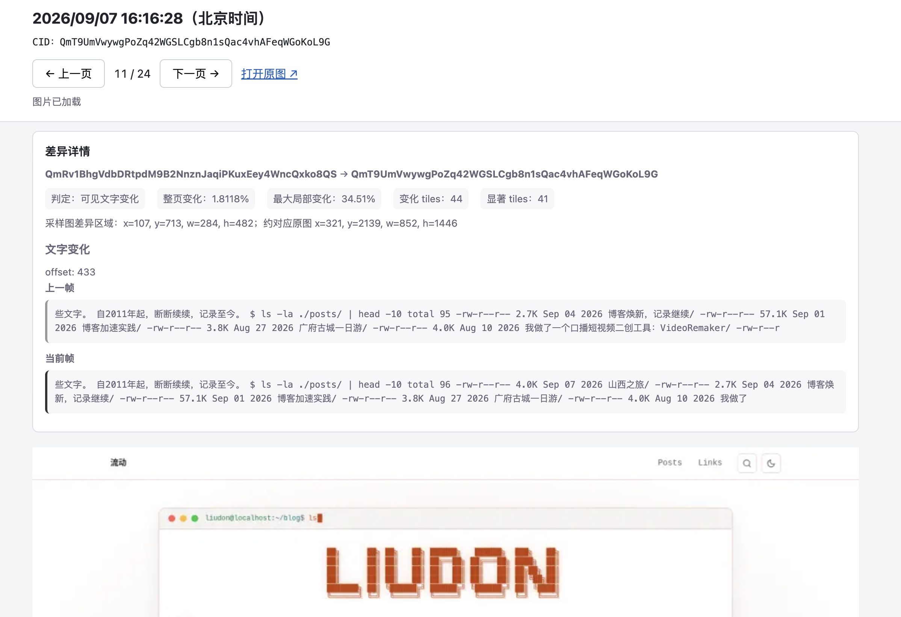

## 前言

上一篇介绍了[博客时光机 2.0](/posts/hugo-ipfs-time-machine-v2/)的更新，这篇来聊聊它背后的实现。

2.0 想做的事情其实很直观：

> 让博客从过去开始，一版一版走到今天。

原本以为，把历史页面截下来，按时间播放就行了。

真正做起来以后才发现，截图只是一个开始。

## 有 CID，直接截图不就行了？

在 1.0 版本中，已经记录了每一次 IPFS 发布对应的 CID 和部署时间，保存在 `ipfs-history` 分支里：

```text
ipfs-history/
├── latest.json
├── months.json
└── history/
    ├── 2026-08.jsonl
    └── 2026-09.jsonl
```

每条历史记录大概包含这些信息：

```json
{
  "cid": "...",
  "source_commit": "...",
  "deployed_at": "..."
}
```

既然 CID 和时间都有了，那实现起来不就很简单了嘛。

```text
读取 CID 历史
      ↓
访问对应 IPFS 页面
      ↓
Playwright 完整截图
      ↓
按照部署时间排序
      ↓
前端依次播放
```

方案上感觉是可行的，接下来先做个 Demo 来验证。

博客首页的变化最直观，所以第一版就把范围限定在首页。

实现上也很直接，先从 `history/YYYY-MM.jsonl` 里读取历史记录，拿到每个版本对应的 CID：

```text
CID
 ↓
拼接 IPFS Gateway 地址
 ↓
https://liudon.xyz/ipfs/<CID>/
```

然后用 Playwright 依次访问这些历史页面，对首页进行完整页面截图：

```javascript
await page.goto(`https://liudon.xyz/ipfs/${cid}/`);

await page.screenshot({
  path: `${cid}.png`,
  fullPage: true,
});
```

最后按照 deployed_at 排序，前端依次播放这些截图。

第一版的整个流程大概如下：

```text
history/*.jsonl
      ↓
     CID
      ↓
IPFS Gateway
      ↓
  Playwright
      ↓
Full Page Screenshot
      ↓
按时间顺序播放
```

实现并不复杂，把需求交给 AI，很快就做出了第一版 Demo，看起来方案完全可行。

但真正把历史版本跑起来以后，第一个问题马上就出现了。

## 不同的 CID，截图却一样

每个被记录下来的 CID，都对应着一次网站内容发生变化后的构建结果。

很多 CID 明明不一样，截出来的首页却一模一样。

有时候只是修改了一篇旧文章正文，或者调整了一个不会出现在首页上的内容，也会产生一次新的构建和新的 CID。

但首页可能什么都没有发生。

例如：

```text
部署记录：A → B → C → D
首页状态：①   ①   ①   ②
```

如果完全按照 CID 播放，看到的就是：

```text
A
↓
还是 A
↓
还是 A
↓
终于变成 B
```

日期一直在变化，画面却没有变化。

IPFS 保存的是完整历史，但时光机真正需要展示的，并不是每一次部署，而是那些真正发生变化的时间点。

问题也随之变成了：怎么判断两个历史版本到底有没有变化？

## 那就比较截图

既然不同 CID 的首页可能没有变化，那就直接比较截图。

第一版采用的是 dHash，把完整截图缩成很小的灰度图，计算图片 Hash，再通过 Hamming Distance 判断两张截图是否足够相似。

```text
截图 A
  ↓
dHash
  ↓
Hamming Distance
  ↑
dHash
  ↑
截图 B

足够接近 → 跳过
差异明显 → 保留
```

比较方式也很直接，按照 CID 的时间顺序逐个比较：

```text
A → B
B → C
C → D
```

拿全量 CID 索引跑了一遍，当时一共有 63 个历史 CID，经过图片比较去重后，剩下了 31 个可视版本。

看起来效果不错，正在我高兴的时候，又有了新问题。

## 截图一样的问题仍然存在

打开 Demo 一张张往后看，发现里面仍然存在一些肉眼看起来几乎一样的截图。

第一反应当然还是算法的问题，于是又把 dHash 换成了一版更直接的像素相似度比较。

因为首页是一张很长的截图，如果整张图直接缩小后再比较，局部变化很容易被稀释，所以这一版同时比较：

```text
完整页面
+
页面顶部区域
```

再根据像素差异和阈值判断是否相同。

调整了几轮，问题依旧存在，而且定位起来非常麻烦耗时。

为了快速验证，我一开始把截图的变化筛选和展示逻辑都塞进了 Demo 前端，想着验证完后在线上实施时再进行拆分。

当某个版本看起来不对时，很难马上知道问题究竟出在哪：

```text
历史页面真的没变？
      ↓
截图有问题？
      ↓
比较算法误判？
      ↓
CID 和截图对应错了？
      ↓
前端过滤错了？
      ↓
还是最终展示错图了？
```

每次都要从头到尾排查一遍，非常耗时间。

因此决定，在不影响线上 1.0 版本的前提下，提前做拆分的方案：

1. 后端提前生成 Visual Index 可视索引
2. 前端只读取 Visual Index 进行展示

这样两部分角色清晰，实现也变得简单了。

整个的流程就变成了：

```text
历史页面
   ↓
截图
   ↓
可视变化比较
   ↓
Visual Index
   │
   ├── 有变化 → 保留
   └── 无变化 → 跳过

Visual Index + 截图
        ↓
   前端时间线展示
```

## 让可视比较稳定下来

按新方案调整后，Visual Index 里仍然保留了一些 CID 不同、但肉眼看起来几乎一样的截图。

这样问题范围一下就缩小了：不用再怀疑前端展示，只需要继续检查截图和比较逻辑。

逻辑拆分的好处一下子就感受到了。

接下来要解决的，就是怎么让这份索引足够稳定、足够可信。

### 1. 使用无损图片进行比较

新方案实现时，考虑到前端需要连续加载很多张历史截图，所以截图会先 resize，再转换成 WebP。

> 给用户看的图片，并不一定适合拿来做像素比较。

resize、WebP 有损编码，本身就会改变像素，这会导致算法上的误判。

因此决定增加无损截图进行比较：

```text
历史页面
   ↓
无损截图
   ↓
可视变化比较
   ↓
生成 Visual Index
  │
  ├── 有变化 → 保留
  └── 无变化 → 跳过

同时生成
   ↓
有损 WebP + Visual Index
         ↓
    前端时间线展示
```

比较始终使用无损截图，前端使用另外生成体积更小的 WebP。

这样至少先排除了 resize 和有损编码给比较带来的干扰。

### 2. 固定截图环境

去掉有损图片后，重新跑索引，又发现了新问题。

重建索引的过程中，发现同一个页面，重新截图，像素结果发生了变化。

继续排查，发现影响截图结果的东西比想象中多：

- Chromium 版本
- 字体和字体抗锯齿
- 广告
- 动画
- Lazy Load
- 图片和 Web Font 是否加载完成
- 页面布局是否已经稳定

也就是说：

> 页面内容没变，不代表两次截图一定逐像素相同。

最后把这些条件统一成了 Capture Profile，固定截图的环境：

```text
固定 Chromium
固定字体
固定 viewport / DPR
固定 locale / timezone
固定 light mode

阻断广告
删除广告容器

等待 stylesheet
等待 image
等待 font

滚动触发 lazy load
再回顶部

持续检查文字和布局是否稳定
```

最开始还想过一个最简单的方案，等三秒再截图。

后来发现这种方式还是太玄学，加载快的时候白等，加载慢的时候三秒又未必够。

最终改成了持续采集页面文字和元素布局，连续几次结果都不再变化，才认为页面稳定。

截图前后还会各检查一次，如果截图过程中页面又动了，这次 Capture 直接作废重试。

到这里，比较输入算是相对稳定了。

### 3. 增加文字与局部比较

截图环境稳定以后，再回头检查之前的比较结果，又发现了另一个问题。

```text
QmYHSNJDhtn3dyqmt5SRra8yWiiSdi82PBs5CuYJLHFsC6
↓
QmTvL4HCt2mqJ7pPrGT9YCpHAea8kzdEAqqgnpZzj2orui
```

首页里有一处很小的文字变化：

```text
57.6K → 58.7K
```

对于用户来说，这已经是一次真实变化。

但把它放到整张首页长截图里，只占非常小的一部分。

这时候如果继续只依赖图片相似度，就会陷入一个比较尴尬的问题。

阈值放宽一点，可能把这种真实的小变化吞掉。

阈值收紧一点，又容易把字体抗锯齿、浏览器渲染之类的细碎像素差异留下来。

既然文字本身就能直接判断，那就没必要再让像素算法去猜。

因此比较逻辑增加了一层：**优先比较用户真正能看到的文字**。

截图时同时提取页面 Visible Text，合并连续空格和换行以后进行比较。

```text
候选页面
   ↓
Visible Text 是否变化？
   ├── 是 → 直接保留
   └── 否 → 再比较图片
```

这样，只要用户能看到的文字发生了变化，就直接认为产生了新的视觉版本。

不过 Visible Text 只能解决文字变化问题。

如果文字完全一样，但页面里的图片、布局、间距或者颜色发生了变化，还是得继续比较截图。

而首页又是一张很长的图片，如果只计算一个整页差异值，某个很小的局部变化，还是有可能被整张长图平均掉。

**整页变化很小 ≠ 局部没有明显变化**

所以图片比较又增加了局部 Tile：将缩小后的截图划分成一个个小区域，除了整体变化以外，再额外观察局部区域的变化程度。

最终的流程变成了：

```text
先比较 Visible Text
        ↓
文字变化
   └── 直接保留

文字没有变化
        ↓
比较无损图片
        ↓
整体差异 + Tile 局部差异
        ↓
判断保留 / 跳过
```

Visible Text 负责判断文字变化；Tile 则用来补充判断图片、布局等局部的像素变化。

### 4. 调整比较基准

算法继续检查下去以后，又发现比较对象本身也有问题。

第一版一直比较相邻版本：

```text
A → B
B → C
C → D
```

如果每一次只有一点点变化：

```text
A → B：没超过阈值
B → C：没超过阈值
C → D：没超过阈值
```

每一步可能都被认为相同。

但这些微小变化不断累积以后，A ↔ D 可能已经形成了比较明显的差异。

> 相邻部署比较，存在把小变化一点点漂掉的风险。

这种连续的小差异逐步累积，可以理解为一种基准漂移（Baseline Drift）。

于是 Baseline 也做了调整：不再和上一条 CID 比，而是始终和**最近一个已经被保留下来的视觉版本**进行比较。

```text
A ← Baseline
│
├── B vs A → same
├── C vs A → same
└── D vs A → changed
                ↓
             保留 D
                ↓
          D 成为新 Baseline
```

这样真正判断的是：

> 当前页面相比最近一次确认过的视觉状态，有没有形成一个新的版本。

到这里，整套比较逻辑才逐渐稳定下来。

```text
History
   ↓
Stable Capture
   ↓
Candidate vs Retained Baseline
   ↓
Visible Text
   ├── 变化 ──────────────┐
   │                      │
   └── 不变               │
        ↓                 │
   Lossless Pixel Diff    │
        ↓                 │
    Overall + Tile        │
        ↓                 │
      有变化 ─────────────┤
        │                 │
      无变化              ↓
        ↓             保留 Candidate
       跳过                ↓
                    更新 Baseline
                          ↓
                     Visual Index
```

## 如何验收？

算法调到这里，剩下的问题就是：

> 怎么确认它真的判断对了？

最开始的办法很原始，在 Demo 里一张一张往后点，再自己用肉眼找变化。

次数少的时候还能看，几十张以后就开始怀疑人生了。

所以又做了一轮改动：

增加 `visual-diffs.jsonl` 文件，把每一次比较的详细信息都记下来：

```text
baseline CID
candidate CID
same / changed
reason
overall diff
max tile diff
mean delta
changed bounds
visible text before / after
```

然后又单独做了一个 Diff 核对 Demo。



它不负责展示效果，只回答一个问题：

> 这一帧为什么被保留？

第一版图片去重，从 63 个历史 CID 中筛出了 31 个可视版本。

经过截图环境、比较算法和 Baseline 几轮调整后，最终进一步收敛到了 22 个。

经过人工逐个核对后，确认都能找到对应的页面变化。

第一步的预生成索引工作，到这里总算是搞定了！

## 总结

到这里，原来那条 CID 时间线，终于变成了一条真正能够“看见变化”的时间线。

从中午的一个点子，到晚上方案可行性验证通过。

太激动了，真的就像回到以前第一次做产品的感觉。

兴奋地一晚上没有睡好，一心想着下一步前端的展示要怎么做。

这就是这个版本的后端实现了，至于这些历史截图最后如何展示，以及为什么最终被装进了一台 Macintosh，放在下一篇：

[博客时光机 2.0 前端篇：把时间装进一台 Macintosh](/posts/hugo-ipfs-time-machine-v2-frontend/)
