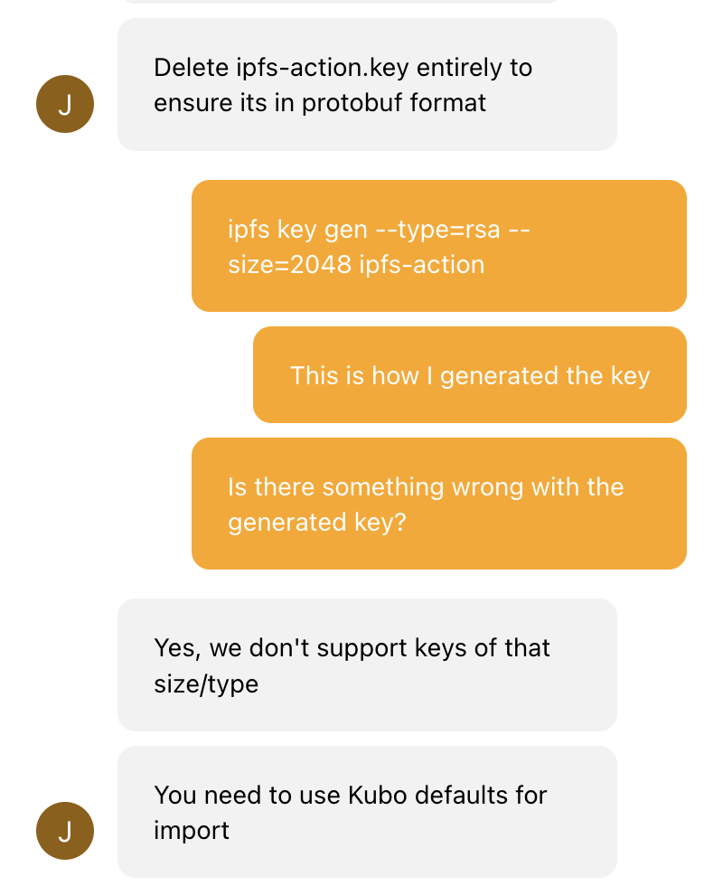
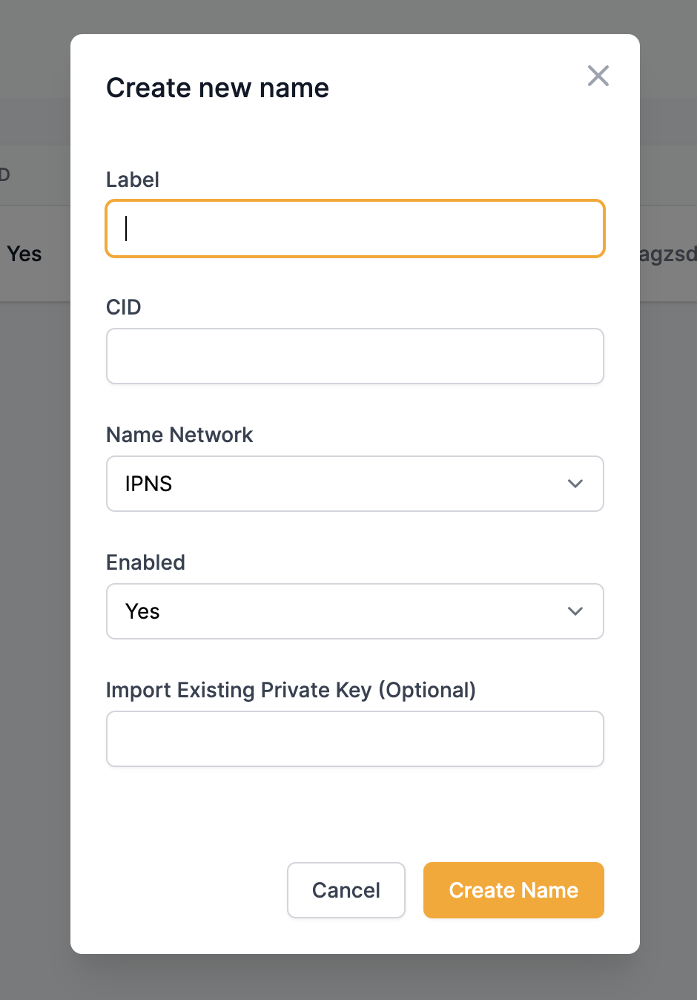
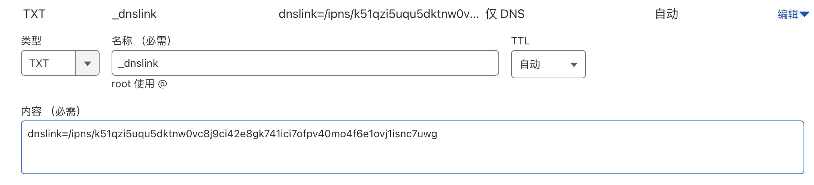

本文会介绍如何接入`filebase`的`IPNS`服务，使你的`IPFS`站点永久在线。

#### 背景

周末更新博客时，发现workflow的上传IPFS任务执行失败了。

```
Run aquiladev/ipfs-action@master
Error: RequestInit: duplex option is required when sending a body.
node:internal/deps/undici/undici:12502
      Error.captureStackTrace(err, this);
            ^

TypeError: RequestInit: duplex option is required when sending a body.
    at node:internal/deps/undici/undici:12502:13
    at process.processTicksAndRejections (node:internal/process/task_queues:95:5)

Node.js v20.13.1
```

查了一下，应该是`Github`更新了NodeJS版本导致的。

```
The following actions use a deprecated Node.js version and will be forced to run on node20: actions/checkout@v2, peaceiris/actions-hugo@v2, peaceiris/actions-gh-pages@v3, aquiladev/ipfs-action@master. For more info: https://github.blog/changelog/2024-03-07-github-actions-all-actions-will-run-on-node20-instead-of-node16-by-default/
```

研究了一下，问题在于[js-ipfs](https://github.com/ipfs/js-ipfs)包的`fetch`方法没有传`duplex`参数导致。

看`Github`文档，官方已经不再更新了。

```
DEPRECATED: js-IPFS has been superseded by Helia
```

搜索一番，发现了两个包[helia](https://github.com/ipfs/helia)和[js-kubo-rpc-client](https://github.com/ipfs/js-kubo-rpc-client)。

`helia`调用方法有[变化](https://github.com/ipfs/helia/wiki/Migrating-from-js-IPFS)，`js-kubo-rpc-client`和原来的`js-ipfs`使用一致。

捣鼓了一番，没调通，不懂前端的锅，只能放弃，顺便给作者提了个[issue](https://github.com/aquiladev/ipfs-action/issues/78)，还是作者来适配吧。

隔天看的时候，在[Pull requests](https://github.com/aquiladev/ipfs-action/pulls)里发现已经有升级后的提交了。

哈哈，原来`filebase`官方早就升级适配了，[filebase/ipfs-action](https://github.com/filebase/ipfs-action/tree/master)，顺带发现居然还支持了`IPNS`更新，太完美了！！！

#### 折腾记录

关于`IPNS`的作用，可以参考zu1k大佬的[IPFS 新手指北](https://zu1k.com/posts/tutorials/p2p/ipfs/)。

关于`IPFS`的部署，可以参考我的[将博客部署到星际文件系统(IPFS)](https://liudon.com/posts/deploy-blog-to-ipfs/)。

##### 生成密钥

因为我在云主机上部署了`ipfs`服务，已经有在更新`IPNS`。

这里引入`filebase`后，相当于多个节点来更新，需要保证`IPNS`地址上一致的。

所以需要将云主机的密钥导出后，导入到`filebase`。

之前使用的是`ipfs`默认密钥，这个是无法导出的，所以只能重新生成一个密钥,
`ipfs-action`为密钥名字，改成你自己的：

```
ipfs key gen ipfs-action

> k51qzi5uqu5dh5kbbff1ucw3ksphpy3vxx4en4dbtfh90pvw4mzd8nfm5r5fnl
```

**注意：**`filebase`还不支持`type/size`参数，这里必须使用默认方式创建，否则在`filebase`导入已有密钥会报错。



查看已有密钥：

```
ipfs key list -l
> k51qzi5uqu5djx9olgjcibdiurrr09w75v6rdfx0cvwye295k787sssssf0d9d self        
> k51qzi5uqu5dktnw0vc8j9ci42e8gk741ici7ofpv40mo4f6e1ossssnc7uwg ipfs-action
```

导出密钥：

```
ipfs key export ipfs-action
```

执行后，当前目录下会生成一个`ipfs-action.key`文件，内容为二进制。

`filebase`导入key要求为base64编码，将其转为base64编码：

```
cat ipfs-action.key | base64
> 5oiR5piv5rWL6K+V
```

记住这里的base64内容，下面会用到。

##### 创建NAME

进入[filebase控制台](https://console.filebase.com/names)，点击`Create Name`。



```
Label: 备注，可以随便填
CID: 填入IPFS的cid地址
Name Network: 固定选IPNS
Enabled：固定选Yes
Import Existing Private Key (Optional)：填入第一步的base64内容
```

确定提交。

#### 修改workflow

```
- name: IPFS upload to filebase
uses: filebase/ipfs-action@master
with:
    path: ./public
    service: filebase
    pinName: ipfs-action
    filebaseBucket: ${{ secrets.FILEBASE_BUCKET }}
    filebaseKey: ${{ secrets.FILEBASE_KEY }}
    filebaseSecret: ${{ secrets.FILEBASE_SECRET }}
    key: ipfs-action
```

新增`key`参数，值为第二步`Label`填入的内容。

提交后，执行workflow，在执行结果里找到`IPNS`地址。

```
Run filebase/ipfs-action@master
Parsing options...
Parsed Options: {"path":"/home/runner/work/***.github.io/***.github.io/public","service":"filebase","host":"ipfs.io","port":"5001","protocol":"https","headers":{},"key":"ipfs-action","pinName":"ipfs-action","pinataKey":"","pinataSecret":"","pinataPinName":"","filebaseBucket":"***","filebaseKey":"***","filebaseSecret":"***","infuraProjectId":"","infuraProjectSecret":"","timeout":"60000","verbose":false,"pattern":"public/**/*"}
Adding files...
Starting filebase client
Started filebase client
Storing files...
Stored files...
CID: bafybeihagzsdupyrecky7bnstzckgf5flxbrdz542jmfaep4xtbj6aa2ea
Updating name...
Updated name...
Done
Upload to IPFS finished successfully {
  cid: 'bafybeihagzsdupyrecky7bnstzckgf5flxbrdz542jmfaep4xtbj6aa2ea',
  ipfs: 'bafybeihagzsdupyrecky7bnstzckgf5flxbrdz542jmfaep4xtbj6aa2ea',
  ipns: 'k51qzi5uqu5dktnw0vc8j9ci42e8gk741ici7ofpv40mo4f6e1ovj1isnc7uwg'
}
```

#### 更新DNSlink

更新域名的dnslink值：

普通域名



eth域名


