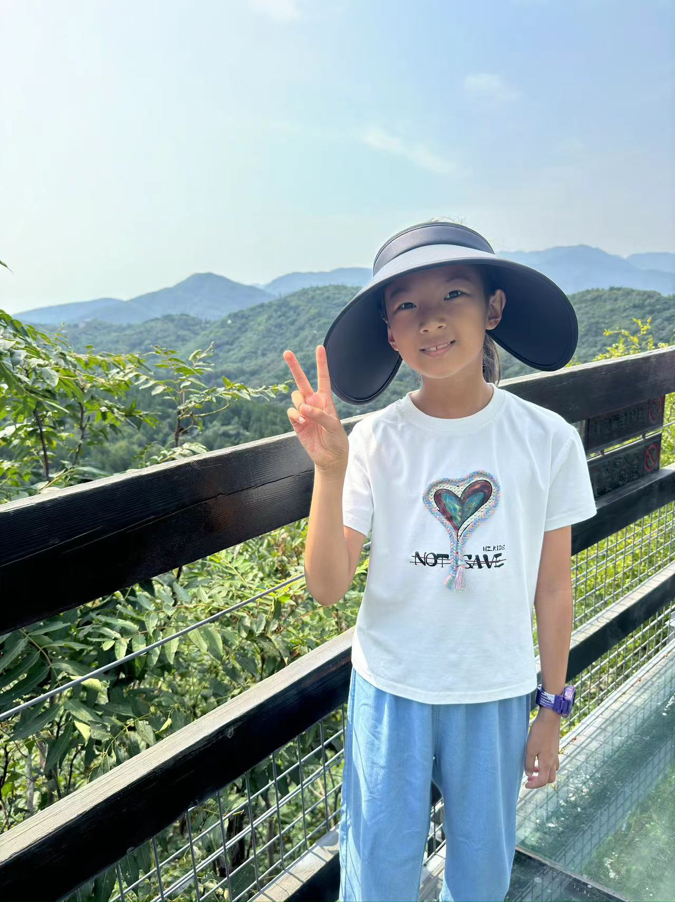
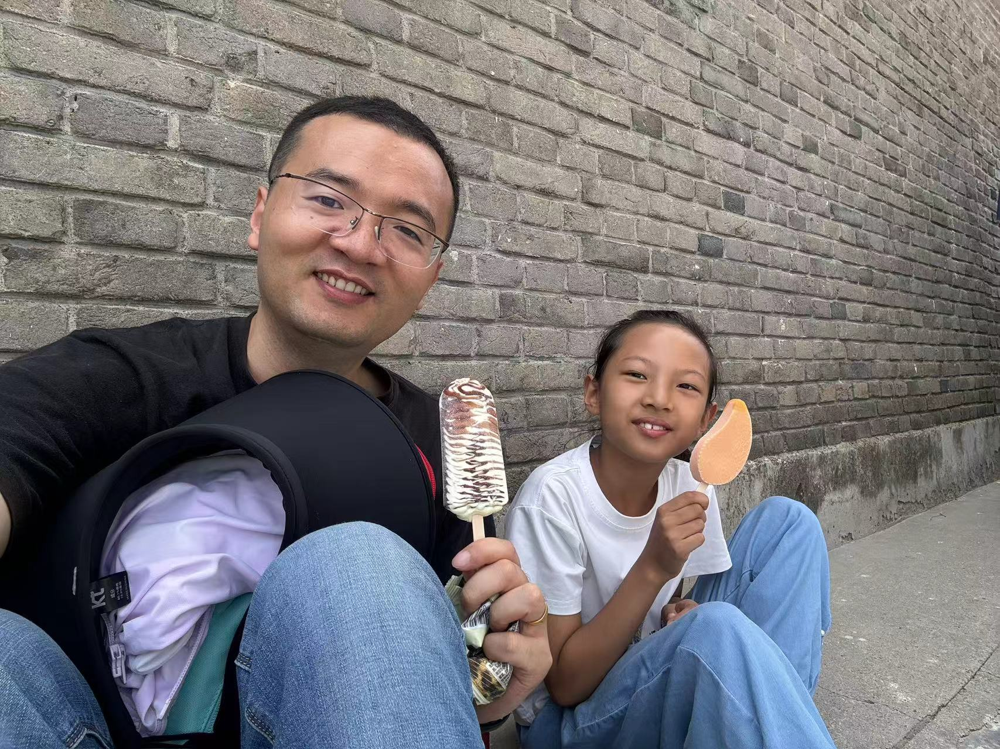
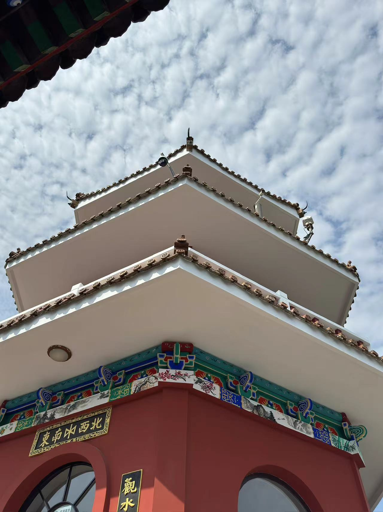
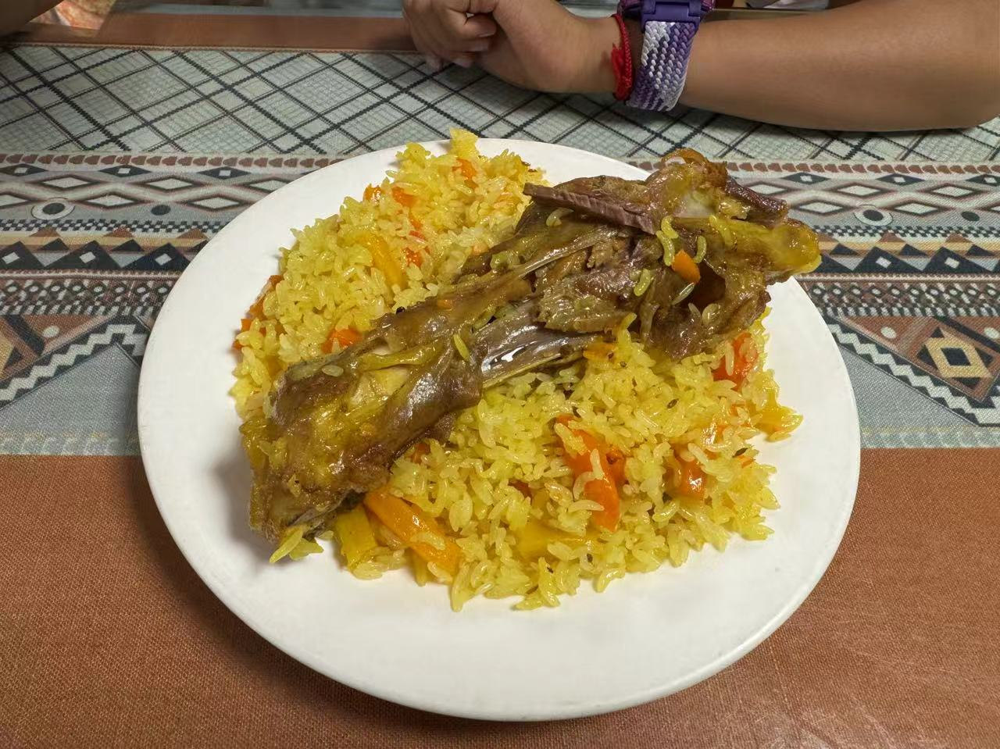
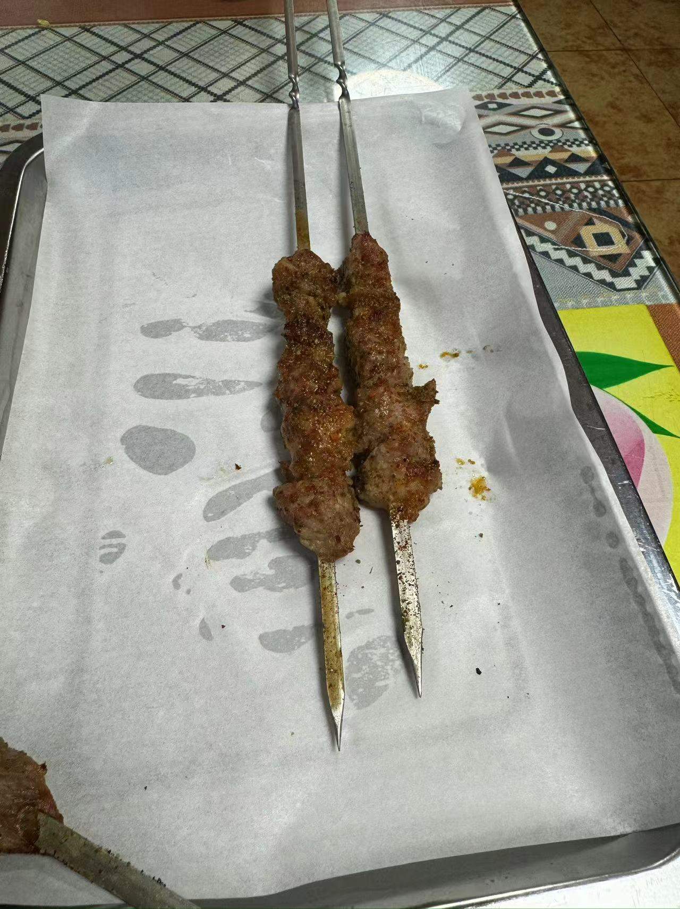
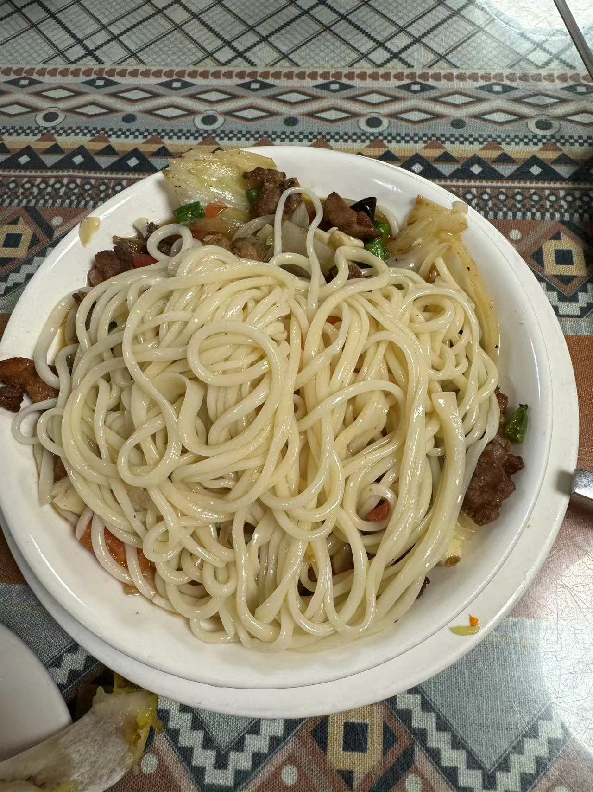
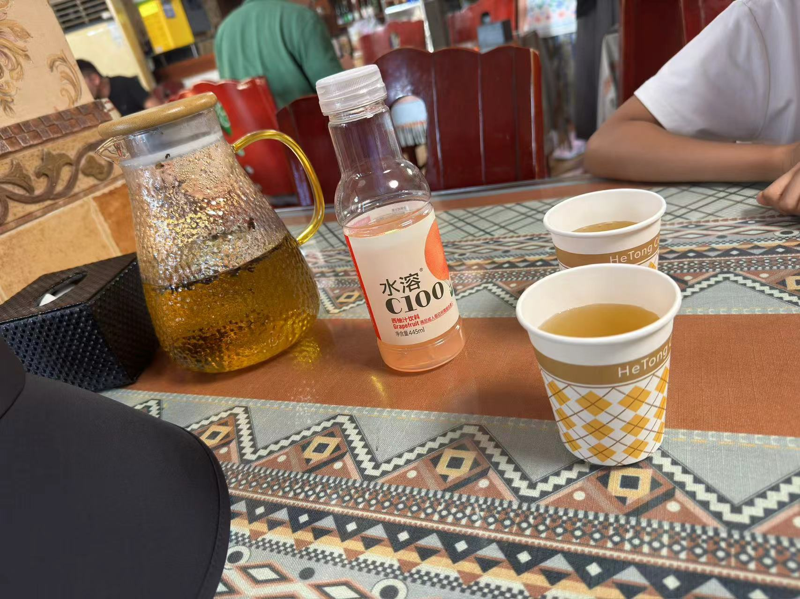
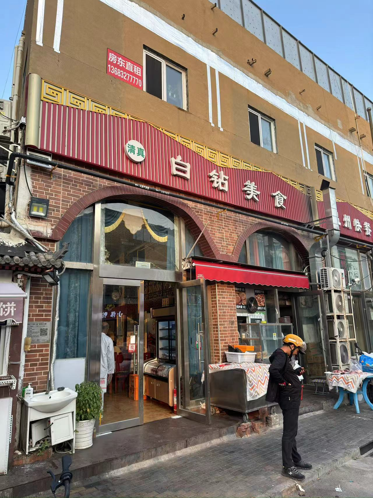
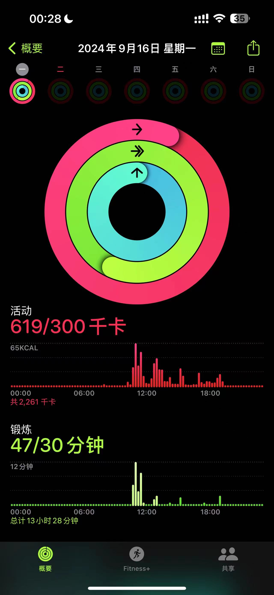

中秋第一天，娃约了同学在公园玩，骑车、滑轮滑，晚上娃带我去了她说非常好吃的一家店吃饭。

晚上回来，想着第二天在家呆一天也是看电视，打算带她爬长城，查了一下，往返的票早已售罄，只好放弃这个方案。

园博园开了灯会，微博上看说是人巨多，还是放弃吧。

跟娃商量了一下，最后我们决定还是爬山，再刷一次百望山。

第二天一早睡到9点，起床洗漱，吃早饭，收拾东西，出门的时候都已经10点半了。

还好不远，山也不高，我们也不着急，就当遛弯。

来了好几次了，进园就直奔主题：爬。

这次我俩先走了一段山路，虽然是台阶，但是确实快。

昨天玩的太累，我们商量着还是继续走坡道吧。

花了40分钟左右登顶，最快的一次记录了。

爬到山顶，找了个阴凉，补充能量，娃请我吃雪糕。

今天天气一般，能见度不高，远处都是灰蒙蒙的。

歇到1点多，我俩开始下山。

之前在微博看到陈晓卿分享的一家新疆馆子[白钻美食](https://weibo.com/1647375747/OshW9uUIS)，决定晚上带娃去尝尝。

坐了1个半小时的地铁，到了吕营大街。

高德导航说是十里河K2出口出站，这个口确实离的近，但是出站需要爬超级长的楼梯。

我俩傻乎乎的爬楼上来，累个够呛。

建议选择K1出站口，电梯出站，上来跟K2出口挨着，没有多远。

4点多到店，一开始还担心不到饭点有没有饭，进门一看已经有几桌在吃饭的了。

馆子里吃饭的维族人不少，看来确实是本地特色，吃完饭娃还问我是不是外国人。😂

不知道份量，先点了羊腿抓饭和羊肉串，娃说好吃，推荐的烤包子已经没有了。

然后又点了一份过油拌面，面条非常劲道，味道非常棒。

喝了据说是本地的茶，查了一下，说是叫“砖茶”，免费的。

店不大，但是味道挺好，推荐去试试，就是有点远。

吃完地铁回家，等公交的时候错过了一趟车，还多等了半个小时。

今天是暴走的一天。

