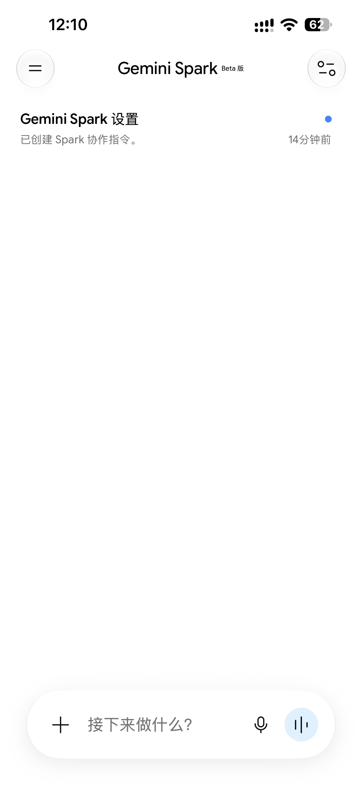
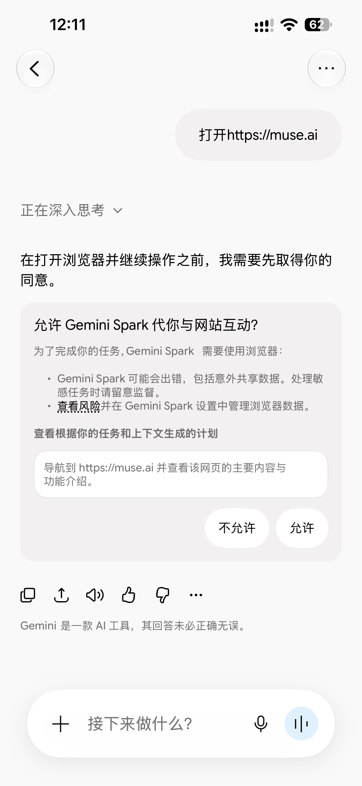
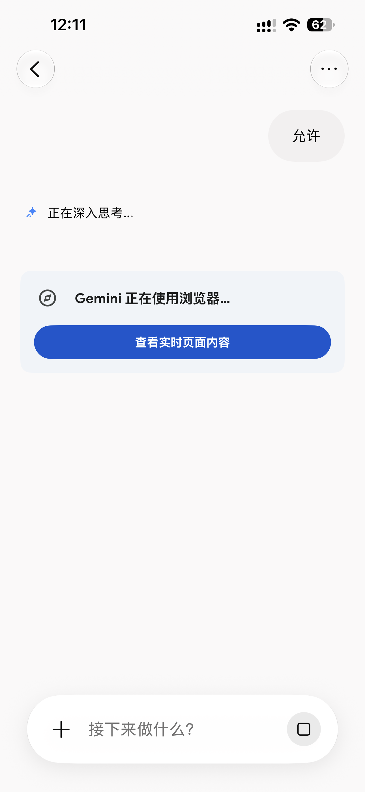
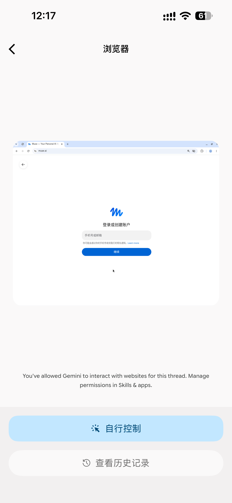
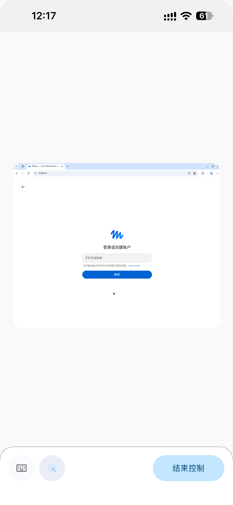
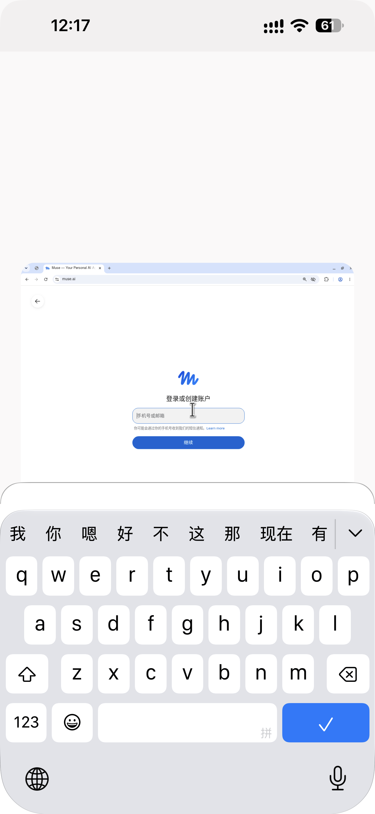

Muse 是 Meta 于 2026 年 9 月 8 日推出的全球首款面向普通消费者的个人 AI 智能体（AI Agent）应用。

现在仅面向美国和加拿大地区的 18 岁以上用户开放。

在 [V2ex](https://v2ex.com) 上看到可以通过 Gemini Spark 进行注册，绕过 IP 检测，本文记录整个操作过程。

前提你需要有 Gemini 会员，这样才能使用 Spark 服务。

手机端打开 Gemini 应用，点击左边导航里的 Spark。

第一次会有一个关联提示，自行选择即可。

进入后的页面如下：



发送下面内容。

```text
打开https://muse.ai
```



提示权限，点击允许。



点击查看实时页面内容，进入远端浏览器页面。



点击自行控制。



左下角有两个按钮：

```text
点箭头按钮，就可以在页面进行点击操作了。
点键盘按钮，就可以输入内容到页面上了。
```



点箭头按钮，然后在页面上点击邮箱输入框，再点击键盘按钮，输入邮箱内容，之后再点击继续。

输入收到的验证码继续下一步，最后验证年龄使用的是招行 VISA 卡做的验证，会扣费 1$，过几天会退回。

注册成功后，就可以进入桌面端/手机端进行操作使用了。

这是我的邀请码: **E9FH7C**，填写后咱俩各获得 10 亿 Token 额度。

目前这个方案可行，需要的可以参考进行注册。
