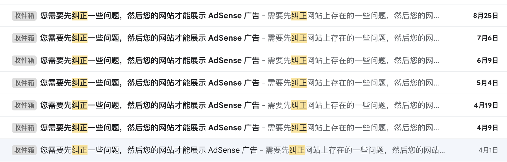

中午的时候，突然收到一条消息，打开一看，提示我的`Google Adsense`审核通过了。

偶然发现`Google Adsense`里居然有40美金，想起来是之前[老博客](https://liudon.org)加的广告。

看着[新博客](https://liudon.com)每天也有了一些访问，打算申请`Google Adsense`，补充些维护成本。

按之前的流程搞了一遍，提交了申请。

结果过了1周多，收到审核不通过邮件，说是不符合规范：低质内容，质量不高。

搜了一下，说是现在新网站审核门槛高了。

不放弃，继续申请呗。

从3月份开始，申请了7次，全部被拒。

尤其是8月25日被拒后，提示我审核次数过多，必须得等到8月31日以后才能再次申请。

上社区发了[帖子](https://support.google.com/adsense/thread/292831058/%E7%BD%91%E7%AB%99%E5%AE%A1%E6%A0%B8%E4%B8%8D%E9%80%9A%E8%BF%87%EF%BC%8C%E5%B8%AE%E7%9C%8B%E4%B8%8B%E5%8E%9F%E5%9B%A0?hl=zh-Hans&sjid=5393313994536777596-AP)，咨询到底是什么原因，结果也没收到答复。

这个时候，就已经有点心灰意冷，想要放弃了。

9月5日的时候，想着再最后申请一把试试看，再不通过就算了。

等了1周多，感觉这次估计又悬了，已经放弃了，结果今天竟然审核通过了。

历经了8次申请，耗时半年，终于申请下来了，算是这段时间难得的一件好事。

