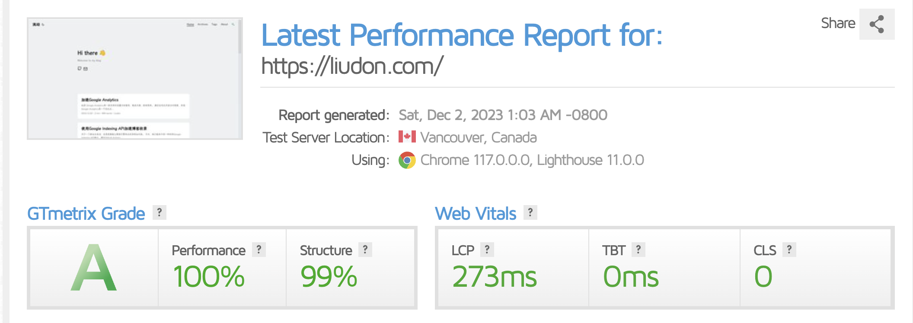

### 起因

`Google Analytics`是一款优秀的流量分析服务，集成方便，使用简单。

最近在优化页面访问速度，发现`Google Analytics`是一个优化点。

### 优化

#### 1. 访问加速

国内访问`Google Analytics`很慢，同时还面临着各种广告屏蔽插件拦截。

这里借助`Cloudflare Worker`实现`Google Analytics`反代，同时更换采集路由规避广告屏蔽插件的拦截。

`Cloudflare`新建Worker，代码如下，保存后部署。

```
addEventListener('fetch', (event) => {
    // 这里可以加 filter
    return event.respondWith(handleRequest(event));
  });
  
  // worker 应用的路由地址，末尾不加 '/'，改为你的博客地址
  const DOMAIN = 'xxx.com';
  // 博客插入的js地址文件名，可自定义
  const JS_FILE = 'ga.js'
  // 响应上报的接口路径，可自定义，规避广告屏蔽插件拦截
  const COLLECT_PATH = 'collect_path';
  // 原 gtag 地址，将G-XXX改为你的id
  const JS_URL = 'https://www.googletagmanager.com/gtag/js?id=G-XXX'
  
  // 下面不需要改
  const G_DOMAIN = 'google-analytics.com';
  const G_COLLECT_PATH = 'g\/collect';
  
  async function handleRequest(event) {
    const url = event.request.url;
    if (url.match(`${DOMAIN}/${JS_FILE}`)) {
      const requestJs = await (await fetch(JS_URL)).text();
      const jsText = requestJs.replaceAll('\"www\"', '\"\"').replaceAll('.' + G_DOMAIN, DOMAIN).replaceAll(G_COLLECT_PATH, COLLECT_PATH);
  
      return new Response(jsText, {
        status: 200,
        statusText: 'OK',
        headers: {
          'Content-Type': 'application/javascript',
        },
      });
    } else if (url.match(`${DOMAIN}/${COLLECT_PATH}`)) {
        const newReq = await readRequest(event.request);
        event.waitUntil(fetch(newReq));
    }
    return new Response(null, {
      status: 204,
      statusText: 'No Content',
    });
  }
  
  async function readRequest(request) {
    const { url, headers } = request;
    const body = await request.text();
    const ga_url = url.replace(`${DOMAIN}/${COLLECT_PATH}`, `www.${G_DOMAIN}/${G_COLLECT_PATH}`);
    const nq = {
      method: 'POST',
      headers: {
        Host: 'www.google-analytics.com',
        Origin: headers.get('origin'),
        'Cache-Control': 'max-age=0',
        'User-Agent': headers.get('user-agent'),
        Accept: headers.get('accept'),
        'Accept-Language': headers.get('accept-language'),
        'Content-Type': headers.get('content-type') || 'text/plain',
        Referer: headers.get('referer'),
      },
      body: body,
    };
    return new Request(ga_url, nq);
  }
```

页面插入对应js

```
<!-- Google tag (gtag.js) -->
<script async src="https://xxx.com/ga.js"></script> // 对应worker里的DOMAIN 和 JS_FILE，需要保持一致
<script>
  window.dataLayer = window.dataLayer || [];
  function gtag(){dataLayer.push(arguments);}
  gtag('js', new Date());

  gtag('config', 'G-XXX'); // 将G-XXX改为你的id
</script>
```

#### 2. 文件瘦身

通过[性能分析](https://gtmetrix.com/)，发现js文件过大，影响页面加载速度。

虽然使用了`Cloudfare`代理，但是`Google Analytics`原始的js文件为80KB左右。

搜索一番，找到一个[瘦身版Google Analytics](https://minimalanalytics.com/)。

```
Minimal Google Analytics Snippet
A simple snippet for tracking page views on your website without having to add external libraries. Also works for single page applications made with the likes of react and vue.js.

Before
Google Tag Manager + Analytics = 73kB

After
Snippet = 1.5kB
```

插入的js片断，只有1.5kb大小。

唯一的缺点就是只有基本功能，这对于我们来说足够了。

将第一步插入的js代码，更换为下述代码，需要将其中的xxx.com/collect_path改为第一步定义的DOMAIN和COLLECT_PATH变量值。

```
<script>
enScroll=!1,enFdl=!1,extCurrent=void 0,filename=void 0,targetText=void 0,splitOrigin=void 0;const lStor=localStorage,sStor=sessionStorage,doc=document,docEl=document.documentElement,docBody=document.body,docLoc=document.location,w=window,s=screen,nav=navigator||{},extensions=["pdf","xls","xlsx","doc","docx","txt","rtf","csv","exe","key","pps","ppt","pptx","7z","pkg","rar","gz","zip","avi","mov","mp4","mpe","mpeg","wmv","mid","midi","mp3","wav","wma"];function a(e,t,n,o){const j="G-G9ZDJQN9E2",r=()=>Math.floor(Math.random()*1e9)+1,c=()=>Math.floor(Date.now()/1e3),F=()=>(sStor._p||(sStor._p=r()),sStor._p),E=()=>r()+"."+c(),_=()=>(lStor.cid_v4||(lStor.cid_v4=E()),lStor.cid_v4),m=lStor.getItem("cid_v4"),v=()=>m?void 0:enScroll==!0?void 0:"1",p=()=>(sStor.sid||(sStor.sid=c()),sStor.sid),O=()=>{if(!sStor._ss)return sStor._ss="1",sStor._ss;if(sStor.getItem("_ss")=="1")return void 0},a="1",g=()=>{if(sStor.sct)if(enScroll==!0)return sStor.sct;else x=+sStor.getItem("sct")+ +a,sStor.sct=x;else sStor.sct=a;return sStor.sct},i=docLoc.search,b=new URLSearchParams(i),h=["q","s","search","query","keyword"],y=h.some(e=>i.includes("&"+e+"=")||i.includes("?"+e+"=")),u=()=>y==!0?"view_search_results":enScroll==!0?"scroll":enFdl==!0?"file_download":"page_view",f=()=>enScroll==!0?"90":void 0,C=()=>{if(u()=="view_search_results"){for(let e of b)if(h.includes(e[0]))return e[1]}else return void 0},d=encodeURIComponent,k=e=>{let t=[];for(let n in e)e.hasOwnProperty(n)&&e[n]!==void 0&&t.push(d(n)+"="+d(e[n]));return t.join("&")},A=!1,S="https://xxx.com/collect_path",M=k({v:"2",tid:j,_p:F(),sr:(s.width*w.devicePixelRatio+"x"+s.height*w.devicePixelRatio).toString(),ul:(nav.language||void 0).toLowerCase(),cid:_(),_fv:v(),_s:"1",dl:docLoc.origin+docLoc.pathname+i,dt:doc.title||void 0,dr:doc.referrer||void 0,sid:p(),sct:g(),seg:"1",en:u(),"epn.percent_scrolled":f(),"ep.search_term":C(),"ep.file_extension":e||void 0,"ep.file_name":t||void 0,"ep.link_text":n||void 0,"ep.link_url":o||void 0,_ss:O(),_dbg:A?1:void 0}),l=S+"?"+M;if(nav.sendBeacon)nav.sendBeacon(l);else{let e=new XMLHttpRequest;e.open("POST",l,!0)}}a();function sPr(){return(docEl.scrollTop||docBody.scrollTop)/((docEl.scrollHeight||docBody.scrollHeight)-docEl.clientHeight)*100}doc.addEventListener("scroll",sEv,{passive:!0});function sEv(){const e=sPr();if(e<90)return;enScroll=!0,a(),doc.removeEventListener("scroll",sEv,{passive:!0}),enScroll=!1}document.addEventListener("DOMContentLoaded",function(){let e=document.getElementsByTagName("a");for(let t=0;t<e.length;t++)if(e[t].getAttribute("href")!=null){const n=e[t].getAttribute("href"),s=n.substring(n.lastIndexOf("/")+1),o=s.split(".").pop();(e[t].hasAttribute("download")||extensions.includes(o))&&e[t].addEventListener("click",fDl,{passive:!0})}});function fDl(e){enFdl=!0;const t=e.currentTarget.getAttribute("href"),n=t.substring(t.lastIndexOf("/")+1),s=n.split(".").pop(),o=n.replace("."+s,""),i=e.currentTarget.text,r=t.replace(docLoc.origin,"");a(s,o,i,r),enFdl=!1}
</script>
```

#### 效果

