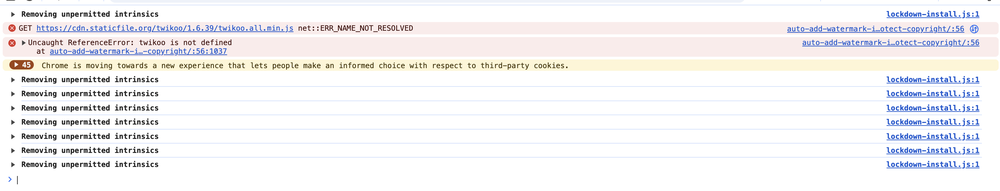

昨天像往常一样打开博客，发现评论没有加载出来。

一开始以为是手机网络问题，用电脑复现了一下，发现twikoo的js访问报错了。

staticfile.org是一个公共的前端cdn，怎么证书有问题了呢？

搜索了一下，结果找到这么一篇内容：

> 和 WDCP 、LNMP 、OneinStack 一样，这次的 Staticfile 、BootCDN 、Polyfill 事件也是背后指向同一个组织[[1]]。更进一步的研究表明这些组织似乎会恶意攻击其他提供类似服务的供应商，同时采取接触洽谈来并入攻击目标。 在这种做法下，曾经由七牛云提供服务的Staticfile.org被易手，而原先由个人提供服务、由又拍云提供接入服务的BootCSS也同样被易手。 但是这些背后的交易在事件发生前却没有人进行公开，也许是原来的提供者厌倦了日复一日付出却看不到回报的生活，也许是这些组织瞒天过海许下了虚假的承诺，让原本积累了大量用户的基础服务成为了这些组织用来攻击用户们的利刃。
> 
> 详细内容见[供应链投毒后，我们的选择还剩下哪些？](https://www.v2ex.com/t/1056428)

staticfile.org目前已不再由七牛负责维护，而是一个叫河南泉磐网络科技有限公司负责，该服务已不可靠，存在黑产利用的情况。

更换为cdnjs.cloudflare.com服务后，评论功能恢复正常。