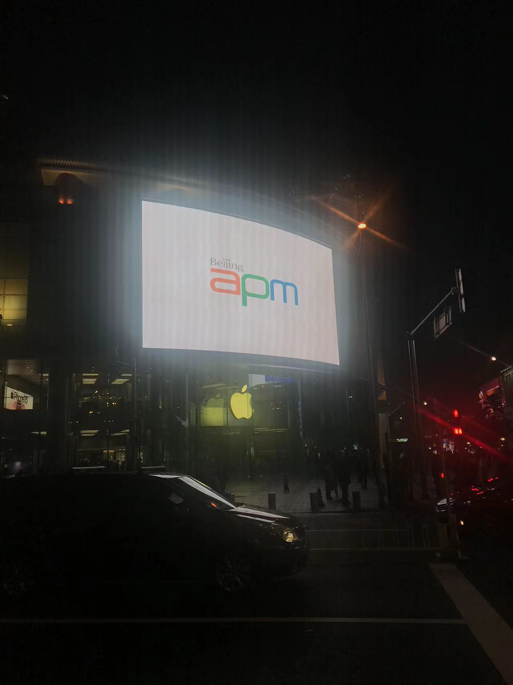
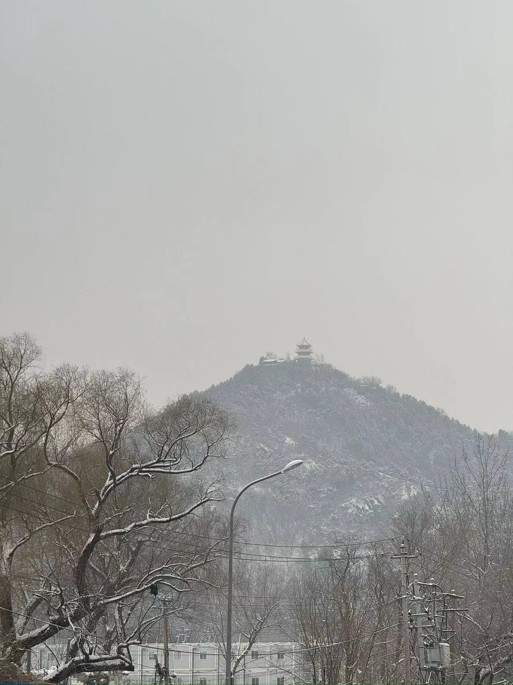

2023年过完了，是时候来个总结了。

#### 博客

2023年一共更新了15篇内容，共计12000字。

访问Top3的文章：

[将博客部署到星际文件系统(IPFS)](https://liudon.com/posts/deploy-blog-to-ipfs/)
[利用Github Actions定时抓取微博](https://liudon.com/posts/using-github-actions-to-schedule-weibo-scraping/)
[优化博客的累计布局偏移(CLS)问题](https://liudon.com/posts/fix-blog-cls/)

主要是因为有在v2ex发帖导流，所以访问量高一些。

[2023年12月北京暴雪记录](https://liudon.com/posts/2023%E5%B9%B412%E6%9C%88%E5%8C%97%E4%BA%AC%E6%9A%B4%E9%9B%AA%E8%AE%B0%E5%BD%95/)

没想到的是一篇暴雪记录，收获了最多的评论，可能大家更容易共情。

不过从侧面也说明了技术的东西并没有太多人看，所以后来就不再分享导流了。

#### 工作

今年搬到了后厂村，见识了互联网的人流。

在23年最后一个工作日，下班路上，算了一下，这一年晚上9点半之后打车59次。

而且年底这段时间，打车愈发困难，至少要排队1个小时。

相比之前一坐坐一天，每天中午会绕公司大楼转两圈。

#### 驾照

[驾照终于到手了](https://liudon.com/posts/my-journey-of-learning-to-drive/)。

趁着娃暑假、十一假期，开车上路了。

参与了第一次摇号。

#### 换了新手机

用了5年的iPhone7 plus，过地铁NFC时不时刷不开了，感觉得换手机了。

十一假期回来在官网订了15pro，需要11月21日才能发货。

订货后，老手机的问题越来越多，换手机变的急迫起来。

于是，开始刷实体店取货。

用了探火app监控，10月11日中午抢到一台王府井取货。

10月12日晚上8点出发，上16号线地铁后，老手机开始持续发烫，过一会自动黑屏了。

按键有触感，但是屏幕不亮，怎么捣鼓也不行，手机越来越烫，都有点怕它炸了。

换乘8号线的路上，试了试按住所有按键，手机重启了，看见苹果logo那一刻真好。

重启完总算正常了，进店排队取货，提前了一个月拿到了新手机。

升级体验非常好，使用丝滑，再也不用插着充电器玩手机了，感谢老婆。

#### 财务

提前还了两笔房贷，希望明年可以把商贷还完。

股市收益率-1.11%，港股套牢中，美股稍微回了点血。

本命年了，希望一切顺利。

祝大家新年快乐！