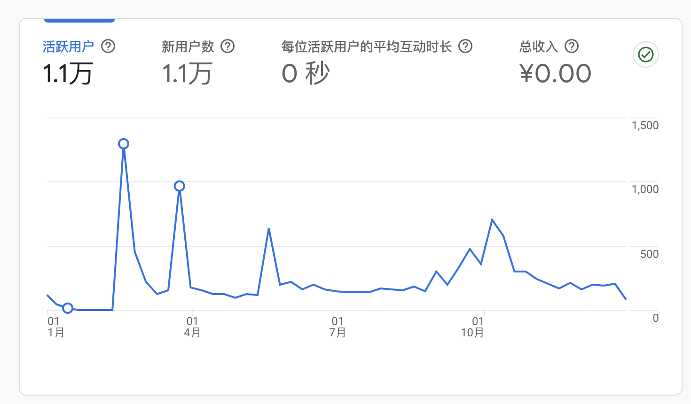

> 2024年已经过去3个月了，这篇年终总结从元旦拖到了现在。

2024年是我的本命年，这一年发生了很多事，这一年过的并不太如意。

早就想要总结这一年，但不知道从哪下笔。

### 工作

今年的工作愈发忙碌，统计了一下这一年9点半下班打车85次。

工作的时间越来越长，持续的加班让整个人变得疲惫、易怒。

到公司基本一坐就是一天，没时间活动，尝试了两个月骑行上下班。

### 生活

因为一些事情，跟媳妇闹得一度想要离婚。

好在聊开了，也让我懂得有事一定要沟通，不要憋在心里。

上一次带娃出行是18年了，趁着暑假带娃出去走走。

我们全家去了一趟[青岛](https://liudon.com/posts/the-trip-of-qingdao/)，虽然时间很短，但是娃玩的很开心。

十一的时候，带娃爬了一次[长城](https://liudon.com/posts/climbing-mutianyu-great-wall-on-october-1st/)，我俩也算“好汉”了。

尝试了一次[绿道骑行](https://liudon.com/posts/changping-42km-greenway-cycling/)，路况不好，不建议走。

车技一般，还是容易起步熄火，不过媳妇说开的越来越好了，也敢一个人上路了。

### 博客

今年可以用笔耕不辍来形容，全年一共更新了23篇内容，共计18w字。

访问Top3的文章：

[加速Cloudflare访问](https://liudon.com/posts/%E5%8A%A0%E9%80%9Fcloudflare%E8%AE%BF%E9%97%AE/)

[你好 Follow](https://liudon.com/posts/hi-follow/)

[搭建自托管IPFS Gateway服务，替代Cloudflare的IPFS Gateway](https://liudon.com/posts/replacing-cloudflare-ipfs-gateway-with-self-hosted-gateway/)

今年搞定了新站的Google Adsense申请，蚂蚁肉也是肉。

### 财务

今年把商贷还清了。

股市收益+24%，重仓NVDA，悲剧的是开年获利已经全部回吐了。

新的一年，继续加油！
