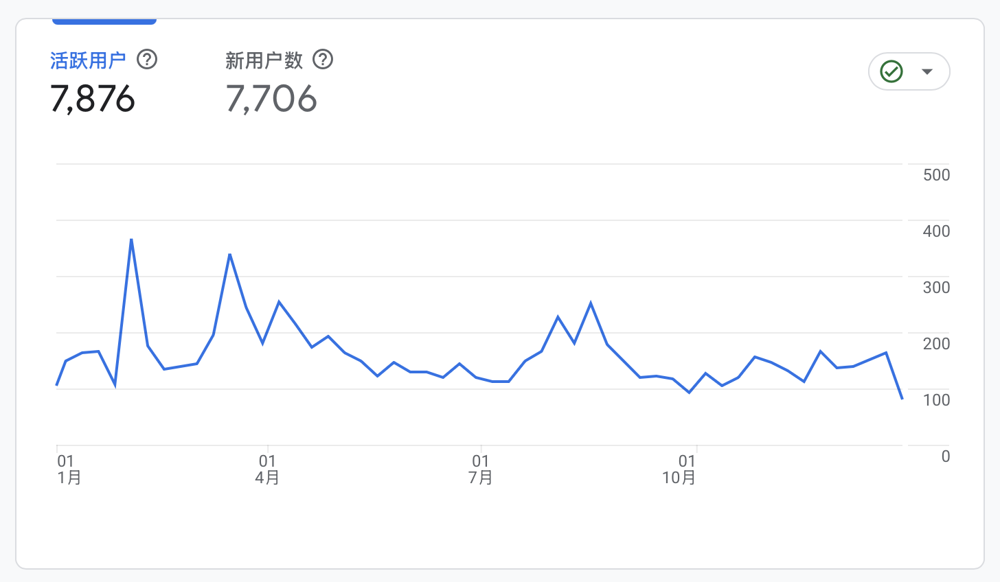

2025年，会是我人生的一个重要节点。

### 工作

这一年，处于一种持续性、高强度的加班状态，晚上9点算是早下班了。

24年底，接手了一个历史模块，对于一直在做运营开发的我来说，算是一个不小的挑战。

梳理已有问题，设计优化方案，新方案开发实施。

今年大部分时间都投入在了这个新模块上，到年底，基本上把现网老系统的问题，全部定位解决掉了。

为了解决老系统的现网问题，有一段时间持续加班到10点以后，经常是办公区最后一个走的。

以至于每天到家娃早就睡觉了，只能早上见一面，每天上学的时候娃都会提醒我，“早点下班”。

虽然投入了巨大的精力，但是却没有收获到该有的结果，属实有些寒心。

### 生活

趁着假期休息的时候，带家人出去走了走：

[春节天津一日游](https://liudon.com/posts/the-trip-of-tianjin/)

[六一爬长城](https://liudon.com/posts/hiking-great-wall-childrens-day/)

[暑假大连行](https://liudon.com/posts/dalian-trip/)

偶尔的出行，换一下生活的节奏，放松一下自己。

希望之后能走的越来越远，走遍中国的大好河山。

### 博客

今年产出较少，全年更新了11篇内容，共计3687字。

访问最高的文章为[wrenAI本地LLM模型部署](https://liudon.com/posts/wrenai-local-llm-usage-guide/)。

不得不说，今年AI真是进步神速，从年初的基本不可用，到年底已经依赖AI来写代码了。

去年加了Google Adsense的广告，一年下来有44$了。

### 财务

买房的时候借了公司的贷款，今年还了一笔，还剩最后一笔，明年就能还清了。

在股市最低点的时候割肉躺平，一直到下半年才重新投入，总算把亏损补回来了，全年收益+4%。

不知道多年以后，自己会怎么看待2025年发生的这些事。

2026年，希望自己往前看，别回头。