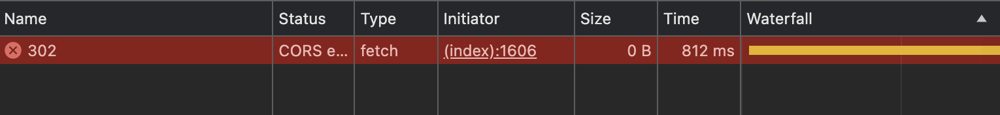

302跳转的跨域问题


#### 场景一：302不返回跨域头

**请求**

```
GET /302 HTTP/1.1
Host: liudon.xyz
Origin: https://www.baidu.com
User-Agent: Mozilla/5.0 (Macintosh; Intel Mac OS X 10_15_7) AppleWebKit/537.36 (KHTML, like Gecko) Chrome/124.0.0.0 Safari/537.36
```

**返回**

```
HTTP/1.1 200 OK
Cache-Control: private, max-age=0, no-store, no-cache, must-revalidate, post-check=0, pre-check=0
Cf-Ray: 88535773eaf5107e-HKG
Content-Length: 143
Content-Type: text/html
Date: Fri, 17 May 2024 11:42:00 GMT
Expires: Thu, 01 Jan 1970 00:00:01 GMT
Location: https://liudon.org
Server: cloudflare
Vary: Accept-Encoding
```

**浏览器报错**

```
Access to fetch at 'https://liudon.xyz/302' from origin 'https://www.baidu.com' has been blocked by CORS policy: No 'Access-Control-Allow-Origin' header is present on the requested resource. If an opaque response serves your needs, set the request's mode to 'no-cors' to fetch the resource with CORS disabled.
```



#### 场景二：302跳转返回跨域头

**请求**

```
GET /302_return_origin_header HTTP/1.1
Host: liudon.xyz
Origin: https://www.baidu.com
User-Agent: Mozilla/5.0 (Macintosh; Intel Mac OS X 10_15_7) AppleWebKit/537.36 (KHTML, like Gecko) Chrome/124.0.0.0 Safari/537.36
```

**返回**

```
HTTP/1.1 200 OK
Access-Control-Allow-Origin: https://www.baidu.com
Cache-Control: private, max-age=0, no-store, no-cache, must-revalidate, post-check=0, pre-check=0
Cf-Ray: 88535773eaf5107e-HKG
Content-Length: 143
Content-Type: text/html
Date: Fri, 17 May 2024 11:42:00 GMT
Expires: Thu, 01 Jan 1970 00:00:01 GMT
Location: https://liudon.org
Server: cloudflare
Vary: Accept-Encoding
```

**浏览器报错**

```
Access to fetch at 'https://liudon.org/' (redirected from 'https://liudon.xyz/302_return_origin_header') from origin 'https://www.baidu.com' has been blocked by CORS policy: No 'Access-Control-Allow-Origin' header is present on the requested resource. If an opaque response serves your needs, set the request's mode to 'no-cors' to fetch the resource with CORS disabled.
```


注意，这里302跳转请求没有报错，是跳转后的连接报了跨域错误。

**Location请求**

```
GET / HTTP/1.1
Host: liudon.org
Origin: null
Referer: https://www.baidu.com/
User-Agent: Mozilla/5.0 (Macintosh; Intel Mac OS X 10_15_7) AppleWebKit/537.36 (KHTML, like Gecko) Chrome/124.0.0.0 Safari/537.36
``


302返回了跨域头，所以浏览器请求了Location地址。

但为什么两次请求header头里的`Origin`字段值不一致呢？第二次Location请求为什么`Origin`字段值是null？

```
第一次：
Origin: https://www.baidu.com

第二次
Origin: null
```

经过一番搜索，终于找到了一些资料。

```
The Origin header value may be null in a number of cases, including (non-exhaustively):

Origins whose scheme is not one of http, https, ftp, ws, wss, or gopher (including blob, file and data).
Cross-origin images and media data, including that in , <video> and <audio> elements.
Documents created programmatically using createDocument(), generated from a data: URL, or that do not have a creator browsing context.
Redirects across origins.
iframes with a sandbox attribute that doesn't contain the value allow-same-origin.
Responses that are network errors.
Referrer-Policy set to no-referrer for non-cors request modes (e.g. simple form posts).

出自 https://developer.mozilla.org/en-US/docs/Web/HTTP/Headers/Origin#description

A request request has a redirect-tainted origin if these steps return true:

Let lastURL be null.

For each url of request’s URL list:

If lastURL is null, then set lastURL to url and continue.

If url’s origin is not same origin with lastURL’s origin and request’s origin is not same origin with lastURL’s origin, then return true.

Set lastURL to url.
Return false.
Serializing a request origin, given a request request, is to run these steps:

If request has a redirect-tainted origin, then return "null".

Return request’s origin, serialized.

出自 https://fetch.spec.whatwg.org/#concept-request-tainted-origin
```

简单说就是如果302跳转的域与上一次请求域不同的话，将Origin设置为`null`。