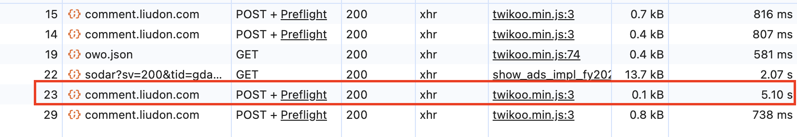

## 前言

博客的评论系统使用的是 Twikoo，通过部署在 Netlify 上对外服务。

Netlify 的服务都在海外，所以博客的评论确实会慢一些。

最近刚给 [Twikoo 接入了 Jev 做垃圾评论判断](/posts/twikoo-jev-spam-detection/)，又升级到了 2.x 版本。

发现评论愈发地慢了，一次评论耗时要在 5-6s 左右，实在是太慢了。



## Jev 的锅？

因为 Jev 是第一次接入使用，所以当时第一个怀疑的点是 Jev 引起的。

上后台把 Jev 关掉，重新评论，耗时不降反升了。

- 开启 Jev 下的日志：

```text
Sep 28, 04:42:50 PM: 9859abee INFO   9/28/2026, 8:42:50 AM Twikoo:[8ca0c8ca-d646-49a2-b37d-c62d908e1c25] Jev 判定为 HAM (score=0.1100, threshold=0.85, model="jev-1.13.0")
Sep 28, 04:42:50 PM: 9859abee INFO   9/28/2026, 8:42:50 AM Twikoo:[8ca0c8ca-d646-49a2-b37d-c62d908e1c25] 无父级评论，不通知
Sep 28, 04:42:50 PM: 9859abee INFO   9/28/2026, 8:42:50 AM Twikoo:[8ca0c8ca-d646-49a2-b37d-c62d908e1c25] 没有配置 pushoo，放弃即时消息通知
Sep 28, 04:42:50 PM: 9859abee INFO   9/28/2026, 8:42:52 AM Twikoo:[8ca0c8ca-d646-49a2-b37d-c62d908e1c25] SMTP 邮箱配置正常
Sep 28, 04:42:52 PM: 9859abee Duration: 5125.66 ms	Memory Usage: 134 MB
```

- 关闭 Jev 下的日志：

```text
Sep 28, 04:53:06 PM: 1daa18c0 INFO   9/28/2026, 8:53:06 AM Twikoo:[eaa8baa4-3f69-41e9-9f5c-7c0a3e05761f] 没有配置 pushoo，放弃即时消息通知
Sep 28, 04:53:08 PM: 1daa18c0 INFO   9/28/2026, 8:53:08 AM Twikoo:[eaa8baa4-3f69-41e9-9f5c-7c0a3e05761f] SMTP 邮箱配置正常
Sep 28, 04:53:08 PM: 1daa18c0 INFO   9/28/2026, 8:53:08 AM Twikoo:[eaa8baa4-3f69-41e9-9f5c-7c0a3e05761f] SMTP 邮箱配置正常
Sep 28, 04:53:08 PM: 1daa18c0 INFO   9/28/2026, 8:53:08 AM Twikoo:[eaa8baa4-3f69-41e9-9f5c-7c0a3e05761f] 回复自己的评论，不邮件通知
Sep 28, 04:53:11 PM: e08141da Duration: 6642.42 ms	Memory Usage: 193 MB
```

**那 Jev 的嫌疑可以排除了。**

这个时候，日志里的 SMTP 信息引起了我的注意。

当前是配置的是国内 QQ 邮箱的 SMTP 服务，而 Netlify 服务是在国外。

从国外访问国内，肯定会很慢。

## SMTP 的锅？

感觉找到问题原因了，关闭 SMTP 服务验证一下耗时就知道了。

- 开启 SMTP 下的日志：

```text
Sep 28, 10:14:23 PM: 32126af2 INFO   9/28/2026, 2:14:24 PM Twikoo:[29bf6691-c482-4d60-bba0-7e6fda08f63a] Jev 判定为 HAM (score=0.2600, threshold=0.85, model="jev-1.13.0")
Sep 28, 10:14:23 PM: 32126af2 INFO   9/28/2026, 2:14:24 PM Twikoo:[29bf6691-c482-4d60-bba0-7e6fda08f63a] 无父级评论，不通知
Sep 28, 10:14:23 PM: 32126af2 INFO   9/28/2026, 2:14:24 PM Twikoo:[29bf6691-c482-4d60-bba0-7e6fda08f63a] 没有配置 pushoo，放弃即时消息通知
Sep 28, 10:14:24 PM: 32126af2 Duration: 3974.06 ms	Memory Usage: 197 MB

Sep 28, 10:16:35 PM: 4def1809 INFO   9/28/2026, 2:16:35 PM Twikoo:[d6ed1d08-268d-4886-970d-dd03fcb6a41c] Jev 判定为 HAM (score=0.3800, threshold=0.85, model="jev-1.13.0")
Sep 28, 10:16:35 PM: 4def1809 INFO   9/28/2026, 2:16:35 PM Twikoo:[d6ed1d08-268d-4886-970d-dd03fcb6a41c] 无父级评论，不通知
Sep 28, 10:16:35 PM: 4def1809 INFO   9/28/2026, 2:16:35 PM Twikoo:[d6ed1d08-268d-4886-970d-dd03fcb6a41c] 没有配置 pushoo，放弃即时消息通知
Sep 28, 10:16:35 PM: 4def1809 Duration: 3686.96 ms	Memory Usage: 211 MB
```

- 关闭 SMTP 下的日志：

```text
Sep 28, 10:22:53 PM: 6dacb9ba INFO   9/28/2026, 2:22:53 PM Twikoo:[eb7221c4-425b-415a-8bda-d680d6719bc2] Jev 判定为 HAM (score=0.6500, threshold=0.85, model="jev-1.13.0")
Sep 28, 10:22:53 PM: 6dacb9ba WARN   9/28/2026, 2:22:53 PM Twikoo:[eb7221c4-425b-415a-8bda-d680d6719bc2] 邮件初始化异常： 数据库配置不存在
Sep 28, 10:22:53 PM: 6dacb9ba INFO   9/28/2026, 2:22:53 PM Twikoo:[eb7221c4-425b-415a-8bda-d680d6719bc2] 无父级评论，不通知
Sep 28, 10:22:53 PM: 6dacb9ba INFO   9/28/2026, 2:22:53 PM Twikoo:[eb7221c4-425b-415a-8bda-d680d6719bc2] 没有配置 pushoo，放弃即时消息通知
Sep 28, 10:22:53 PM: 6dacb9ba INFO   9/28/2026, 2:22:53 PM Twikoo:[eb7221c4-425b-415a-8bda-d680d6719bc2] 未配置邮箱或邮箱配置有误，不通知
Sep 28, 10:22:53 PM: 6dacb9ba Duration: 152.08 ms	Memory Usage: 146 MB	

Sep 28, 10:22:45 PM: b7f786b9 INFO   9/28/2026, 2:22:46 PM Twikoo:[4c184939-161e-4973-b2f2-12b738f3584b] Jev 判定为 HAM (score=0.4300, threshold=0.85, model="jev-1.13.0")
Sep 28, 10:22:45 PM: b7f786b9 WARN   9/28/2026, 2:22:46 PM Twikoo:[4c184939-161e-4973-b2f2-12b738f3584b] 邮件初始化异常： 数据库配置不存在
Sep 28, 10:22:45 PM: b7f786b9 INFO   9/28/2026, 2:22:46 PM Twikoo:[4c184939-161e-4973-b2f2-12b738f3584b] 无父级评论，不通知
Sep 28, 10:22:45 PM: b7f786b9 INFO   9/28/2026, 2:22:46 PM Twikoo:[4c184939-161e-4973-b2f2-12b738f3584b] 没有配置 pushoo，放弃即时消息通知
Sep 28, 10:22:45 PM: b7f786b9 INFO   9/28/2026, 2:22:46 PM Twikoo:[4c184939-161e-4973-b2f2-12b738f3584b] 未配置邮箱或邮箱配置有误，不通知
Sep 28, 10:22:46 PM: b7f786b9 Duration: 199.77 ms	Memory Usage: 146 MB	
```

结论已经很明确：**主要耗时来自 SMTP 邮件发送链路，而不是 Jev。**

| SMTP 状态 | 评论平均耗时 |
| -- | -- |
| 开启 | 3831ms |
| 关闭 | 176ms |

服务端的耗时足足减少了 3655ms，浏览器侧的请求耗时也从 5-6s 降到了 1s左右。

## 真的是 SMTP 的锅吗？

这个时候，我都准备要去测 Netlify 到 QQ 邮箱的 SMTP 链路耗时了。

但马上想到上次折腾 [Twikoo 接入 Jev](/posts/twikoo-jev-spam-detection) 时，我记得说评论通知这个是属于 POST_SUBMIT 流程的，不应该阻塞评论请求呢。

**POST_SUBMIT 不是异步的吗？**

评论的流程：

```text
COMMENT_SUBMIT
      ↓
保存评论
      ↓
派发 POST_SUBMIT
      ↓
返回成功
```

POST_SUBMIT 流程：

```text
POST_SUBMIT
      ↓
垃圾检测
      ↓
发送邮件
      ↓
其他通知
```

**既然 POST_SUBMIT 是异步执行，SMTP 为什么还能把评论请求拖慢 3 秒多？**

SMTP 耗时长是表象，看起来这个“事主”还另有其人。

## 深挖原因

又仔细走读了一遍代码，Twikoo 2.x 版本对代码做了重构。

增加了一个 `PostSubmitDispatcher`，不同平台负责实现自己的派发方式。

我用的是 Netlify，目前还是通过 HTTP 请求自己，再触发一次：

```text
COMMENT_SUBMIT
      ↓
HTTP 调用当前 Twikoo Function
      ↓
POST_SUBMIT
```

这个思路本身没有问题，POST_SUBMIT 会进入另一个请求，拥有自己独立的 Serverless 执行时间。

真正的问题在派发的逻辑上，简化后的代码：

```ts
await Promise.race([
  httpPost(url, {
    event: "POST_SUBMIT",
    comment,
  }),
  new Promise((resolve) =>
    setTimeout(resolve, 5000)
  ),
])
```

仔细一看，派发逻辑里其实还留着一个最长 5 秒的等待窗口。

## 原来 POST_SUBMIT 里还藏着一个 5 秒窗口

我一开始以为的流程：

```text
把 POST_SUBMIT 发出去
      ↓
不等它执行完
      ↓
评论直接返回
```

但实际上的流程是：

```text
POST_SUBMIT 请求执行完成
        VS
5 秒定时器结束
```

谁先完成，就继续往下走。

到这里，为什么评论慢的原因就清楚了：

```text
COMMENT_SUBMIT
      ↓
评论写入数据库
      ↓
调用 POST_SUBMIT
      ↓
开始发送 QQ 邮件
      ↓
SMTP 花了约 3.6 秒
      ↓
POST_SUBMIT 返回
      ↓
还没有触发 5 秒 timer
      ↓
httpPost 赢了 Promise.race
      ↓
COMMENT_SUBMIT 返回
```

单看 Netlify Function，POST_SUBMIT 这一段大约会把请求拖到 4 秒左右；算上浏览器到 Netlify 的网络耗时，前端实际看到的就是 5 秒甚至更久。

数据也刚好对上了。

**正是 SMTP 的慢，才把这个 5 秒等待窗口暴露了出来。**

## 更好的实现

Netlify 现在已经支持了 `context.waitUntil` 方法，更适合这里的场景。

```text
COMMENT_SUBMIT
      ↓
保存评论
      ↓
把 POST_SUBMIT 注册给 waitUntil
      ↓
立即返回
               │
               └────→ POST_SUBMIT
                          ↓
                       SMTP
                          ↓
                       其他通知
```

这样就不需要再靠一个 5 秒窗口来平衡“等待”和“异步”了。

评论保存完成后可以先返回结果，POST_SUBMIT 的执行生命周期交给 Netlify 继续管理，SMTP 再慢也不会继续占用用户的等待时间。

有人可能会想：**直接去掉 await 不行吗？**

在常驻的 Node.js 服务里，进程还在运行，未等待的异步任务通常还能继续执行；但在 Serverless 环境下，请求结束后不能再假设当前执行环境会一直存活，未完成的任务可能被中断。

如果希望在返回响应后继续可靠地执行这类任务，就需要把它交给平台提供的生命周期机制。

Netlify 现在提供了 context.waitUntil，刚好适合这里的场景。

## 总结

整个弄完已经晚上 12 点了，整个过程有一种抽丝剥茧的感觉。

一开始怀疑 Jev，接着锁定 SMTP，最后才发现 SMTP 只是把 POST_SUBMIT 里的 5 秒等待窗口暴露了出来。

当前优化 PR 已提，待官方审核合入后就能解决这个问题了。

[twikoojs/twikoo#1206](https://github.com/twikoojs/twikoo/pull/1206)

[twikoojs/twikoo-netlify#12](https://github.com/twikoojs/twikoo-netlify/pull/12)
