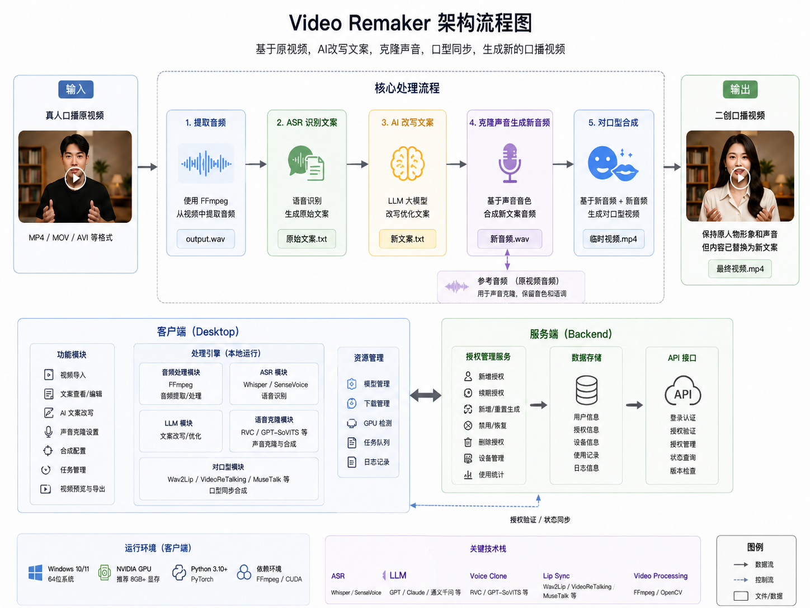
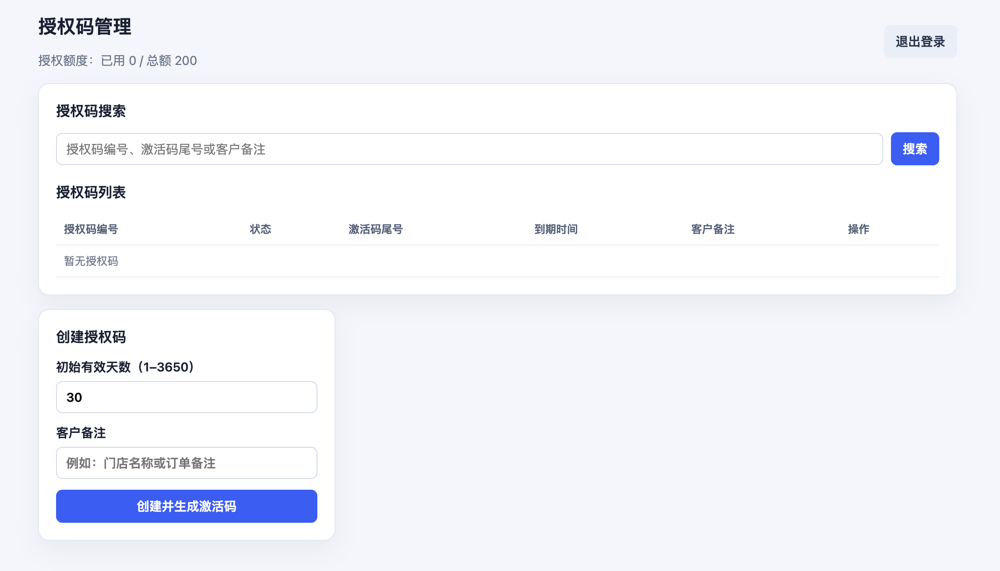
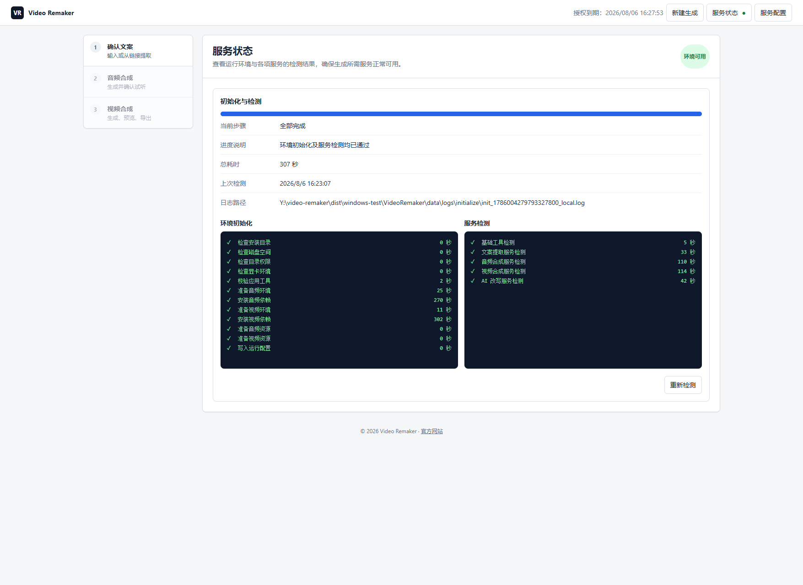

做自媒体的同学，有个口播视频的需求，希望能帮忙搞个工具出来。

以前没有AI的时候，我还真不敢接这活，现在有了AI，决定试试看。

前面做了调研，核心就是[语音克隆](https://liudon.com/posts/voice-cloning-solution-comparison/)和[对口型视频合成](https://liudon.com/posts/lip-sync-video-synthesis-comparison/)两个能力。

在AutoDL平台先做了分步骤的单独验证，确定可行后再开始进行实际编码。

经过2个月左右的开发验证，终于VibeCoding出来第一个小工具。

### VideoRemaker 是做什么的

[VideoRemaker](https://videoremaker.liudon.xyz/) 主要用于真人口播视频的二次创作。

工具首先从原视频中提取音频，通过 ASR 识别原始文案；然后使用 AI 对文案进行改写，并基于原人物声音生成改写后文案对应的新音频。最后，将新音频与准备好的新视频素材进行对口型合成，生成一条新的口播视频。

整个过程基本实现了从“原始口播视频”到“新文案、新音频、新画面”的自动化处理。

### VideoRemaker 使用介绍

VideoRemaker 分为服务端和客户端。

服务端进行授权管理，支持新增/续期/解绑重新生成/禁用/恢复/删除操作。

客户端需要激活后才能使用，第一次会自动进行环境初始化。

客户端的完整使用演示，可以参考B站的这个视频，基于	NVIDIA GeForce RTX 3070 显卡测试，请忽略背景里的网吧杂音。



### VibeCoding体验

早期使用Claude出方案，Codex编码，但是不久Claude就被封号了，所以基本上都是Codex干的活，官网落地页和管理平台少量使用了DeepSeek进行开发。

一开始受限于Codex的5h限额，基本上一个任务就触发限额了。

7月份Codex不断重置，同时去掉了5h限额，终于能愉快的编码了。

VibeCoding使人上头，每天起床第一件事就是看 Tibo 今天有没有重置；额度用完了，整个人都不知道干什么了。

好的模型事半功倍，DeepSeek做的事情总会有一些小尾巴，需要Codex再处理一下。

但是DeepSeek便宜量大，速度快，希望正式版能带来更大的惊喜。

第一次VibeCoding，很有成就感，有点像第一次编程的时刻，神奇。
