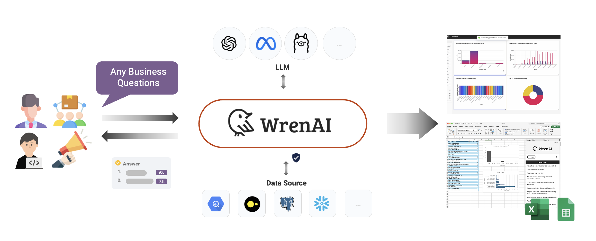
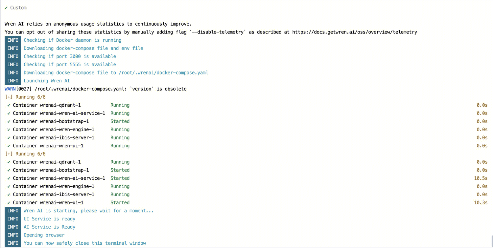

> Open-source GenBI AI Agent that empowers data-driven teams to chat with their data to generate Text-to-SQL, charts, spreadsheets, reports, and BI.

WrenAI 是一个开源的Text-SQL 的工具，通过导入数据库结构，通过提问的方式生成SQL。



出于安全考虑，我们使用本地llm模型进行部署。

### 部署ollama

参考安装文档：https://hub.docker.com/r/ollama/ollama

```
curl -fsSL https://nvidia.github.io/libnvidia-container/gpgkey \
    | sudo gpg --dearmor -o /usr/share/keyrings/nvidia-container-toolkit-keyring.gpg
curl -s -L https://nvidia.github.io/libnvidia-container/stable/deb/nvidia-container-toolkit.list \
    | sed 's#deb https://#deb [signed-by=/usr/share/keyrings/nvidia-container-toolkit-keyring.gpg] https://#g' \
    | sudo tee /etc/apt/sources.list.d/nvidia-container-toolkit.list
sudo apt-get update

sudo apt-get install -y nvidia-container-toolkit

sudo nvidia-ctk runtime configure --runtime=docker
sudo systemctl restart docker

docker run -d --gpus=all -v ollama:/root/.ollama -p 11434:11434 --name ollama ollama/ollama
```

部署对应模型

```
docker exec -it ollama ollama run nomic-embed-text:latest
docker exec -it ollama ollama run phi4:14b
```

部署完成后，需要在安全组里放开11434端口访问。

### 部署WrenAI

参考官方文档：https://docs.getwren.ai/oss/installation/custom_llm

创建本地配置目录

```
mkdir -p ~/.wrenai
```

配置目录下新增.env文件，内容如下：

```
COMPOSE_PROJECT_NAME=wrenai
PLATFORM=linux/amd64

PROJECT_DIR=/root/.wrenai

# service port
WREN_ENGINE_PORT=8080
WREN_ENGINE_SQL_PORT=7432
WREN_AI_SERVICE_PORT=5555
WREN_UI_PORT=3000
IBIS_SERVER_PORT=8000
WREN_UI_ENDPOINT=http://wren-ui:${WREN_UI_PORT}

LLM_PROVIDER=litellm_llm
GENERATION_MODEL=phi4:14b // 自定义LLM模型
LLM_OLLAMA_URL=http://部署机器IP:11434
EMBEDDER_OLLAMA_URL=http://部署机器IP:11434

OPENAI_API_KEY=sk-*****

EMBEDDER_PROVIDER=litellm_embedder
EMBEDDING_MODEL=nomic-embed-text // embedding模型
EMBEDDING_MODEL_DIMENSION=768

# ai service settings
QDRANT_HOST=qdrant
SHOULD_FORCE_DEPLOY=1

# vendor keys
LLM_OPENAI_API_KEY=
EMBEDDER_OPENAI_API_KEY=
LLM_AZURE_OPENAI_API_KEY=
EMBEDDER_AZURE_OPENAI_API_KEY=
QDRANT_API_KEY=

# version
# CHANGE THIS TO THE LATEST VERSION
WREN_PRODUCT_VERSION=0.15.3
WREN_ENGINE_VERSION=0.13.1
WREN_AI_SERVICE_VERSION=0.15.9
IBIS_SERVER_VERSION=0.13.1
WREN_UI_VERSION=0.20.1
WREN_BOOTSTRAP_VERSION=0.1.5

# user id (uuid v4)
USER_UUID=

# for other services
POSTHOG_API_KEY=phc_nhF32aj4xHXOZb0oqr2cn4Oy9uiWzz6CCP4KZmRq9aE
POSTHOG_HOST=https://app.posthog.com
TELEMETRY_ENABLED=true
# this is for telemetry to know the model, i think ai-service might be able to provide a endpoint to get the information
#GENERATION_MODEL=gpt-4o-mini
LANGFUSE_SECRET_KEY=
LANGFUSE_PUBLIC_KEY=

# the port exposes to the host
# OPTIONAL: change the port if you have a conflict
HOST_PORT=3000
AI_SERVICE_FORWARD_PORT=5555

# Wren UI
EXPERIMENTAL_ENGINE_RUST_VERSION=false
```

配置目录下新增config.yaml文件，内容如下：

```
# you should rename this file to config.yaml and put it in ~/.wrenai
# please pay attention to the comments starting with # and adjust the config accordingly

type: llm
provider: litellm_llm
timeout: 600
models:
- api_base: http://部署机器IP:11434/v1  # change this to your ollama host, api_base should be <ollama_url>/v1
  model: openai/phi4:14b  # openai/<ollama_model_name>
  kwargs:
    n: 1
    temperature: 0

---
type: embedder
provider: litellm_embedder
models:
- model: openai/nomic-embed-text  # put your ollama embedder model name here
  api_base: http://部署机器IP:11434/v1  # change this to your ollama host, url should be <ollama_url>
  timeout: 120 # 如果是CPU模式，需要调大这个超时时间

---
type: engine
provider: wren_ui
endpoint: http://wren-ui:3000

---
type: document_store
provider: qdrant
location: http://qdrant:6333
embedding_model_dim: 768  # put your embedding model dimension here
timeout: 120
recreate_index: false

---
# the format of llm and embedder should be <provider>.<model_name> such as litellm_llm.gpt-4o-2024-08-06
# the pipes may be not the latest version, please refer to the latest version: https://raw.githubusercontent.com/canner/WrenAI/<WRENAI_VERSION_NUMBER>/docker/config.example.yaml
type: pipeline
pipes:
  - name: db_schema_indexing
    embedder: litellm_embedder.openai/nomic-embed-text
    document_store: qdrant
  - name: historical_question_indexing
    embedder: litellm_embedder.openai/nomic-embed-text
    document_store: qdrant
  - name: table_description_indexing
    embedder: litellm_embedder.openai/nomic-embed-text
    document_store: qdrant
  - name: db_schema_retrieval
    llm: litellm_llm.openai/phi4:14b
    embedder: litellm_embedder.openai/nomic-embed-text
    document_store: qdrant
  - name: historical_question_retrieval
    embedder: litellm_embedder.openai/nomic-embed-text
    document_store: qdrant
  - name: sql_generation
    llm: litellm_llm.openai/phi4:14b
    engine: wren_ui
  - name: sql_correction
    llm: litellm_llm.openai/phi4:14b
    engine: wren_ui
  - name: followup_sql_generation
    llm: litellm_llm.openai/phi4:14b
    engine: wren_ui
  - name: sql_summary
    llm: litellm_llm.openai/phi4:14b
  - name: sql_answer
    llm: litellm_llm.openai/phi4:14b
    engine: wren_ui
  - name: sql_breakdown
    llm: litellm_llm.openai/phi4:14b
    engine: wren_ui
  - name: sql_expansion
    llm: litellm_llm.openai/phi4:14b
    engine: wren_ui
  - name: sql_explanation
    llm: litellm_llm.openai/phi4:14b
  - name: sql_regeneration
    llm: litellm_llm.openai/phi4:14b
    engine: wren_ui
  - name: semantics_description
    llm: litellm_llm.openai/phi4:14b
  - name: relationship_recommendation
    llm: litellm_llm.openai/phi4:14b
    engine: wren_ui
  - name: question_recommendation
    llm: litellm_llm.openai/phi4:14b
  - name: question_recommendation_db_schema_retrieval
    llm: litellm_llm.openai/phi4:14b
    embedder: litellm_embedder.openai/nomic-embed-text
    document_store: qdrant
  - name: question_recommendation_sql_generation
    llm: litellm_llm.openai/phi4:14b
    engine: wren_ui
  - name: chart_generation
    llm: litellm_llm.openai/phi4:14b
  - name: chart_adjustment
    llm: litellm_llm.openai/phi4:14b
  - name: intent_classification
    llm: litellm_llm.openai/phi4:14b
    embedder: litellm_embedder.openai/nomic-embed-text
    document_store: qdrant
  - name: data_assistance
    llm: litellm_llm.openai/phi4:14b
  - name: sql_pairs_indexing
    document_store: qdrant
    embedder: litellm_embedder.openai/nomic-embed-text
  - name: sql_pairs_deletion
    document_store: qdrant
    embedder: litellm_embedder.openai/nomic-embed-text
  - name: sql_pairs_retrieval
    document_store: qdrant
    embedder: litellm_embedder.openai/nomic-embed-text
    llm: litellm_llm.openai/phi4:14b
  - name: preprocess_sql_data
    llm: litellm_llm.openai/phi4:14b
  - name: sql_executor
    engine: wren_ui
  - name: sql_question_generation
    llm: litellm_llm.openai/phi4:14b
  - name: sql_generation_reasoning
    llm: litellm_llm.openai/phi4:14b

---
settings:
  column_indexing_batch_size: 50
  table_retrieval_size: 10
  table_column_retrieval_size: 100
  allow_using_db_schemas_without_pruning: false
  query_cache_maxsize: 1000
  query_cache_ttl: 3600
  langfuse_host: https://cloud.langfuse.com
  langfuse_enable: true
  logging_level: DEBUG
  development: true
```

下载部署shell，执行安装：
https://docs.getwren.ai/oss/installation#using-wren-ai-launcher

```
curl -L https://github.com/Canner/WrenAI/releases/latest/download/wren-launcher-linux.tar.gz | tar -xz && ./wren-launcher-linux
```

选择Custom模式，点击确定，部署成功。



记得防火墙放通3000端口访问。

部署完成后，通过浏览器访问http://部署机器IP:3000访问WrenAI服务。

### 限制

MySQL当前仅支持8.0以上版本；

纯CPU硬件下一次提问耗时在15分钟以上，腾讯云GPU计算型GN7 - 8核 32G下一次提问耗时在5分钟左右。