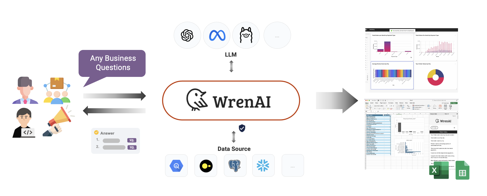
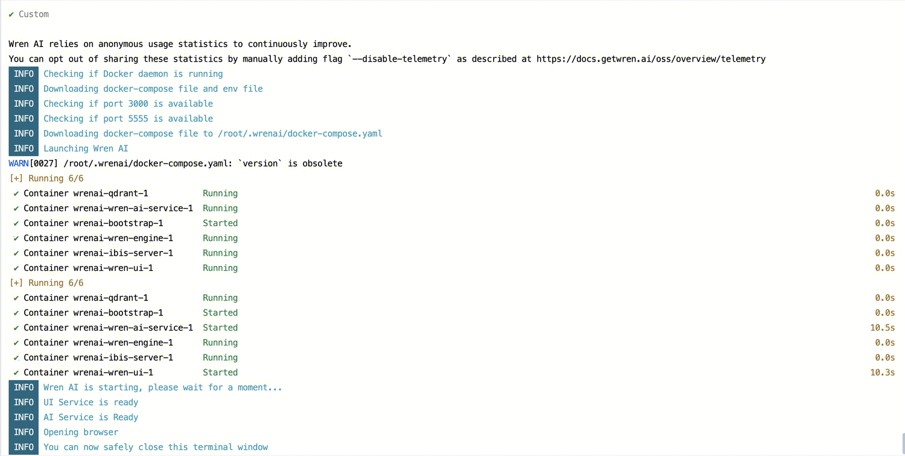

> 本文记录 WrenAI GenBI Classic 的 Docker + Ollama 本地模型部署过程。

> **版本说明（2026-09 更新）**
>
> 本文最初写于 2025 年 3 月，配置基于 WrenAI 0.15.x 的 GenBI UI 架构。2026 年 5 月，WrenAI 已将旧的 GenBI 应用归档至 [`legacy/v1`](https://github.com/Canner/WrenAI/tree/legacy/v1)：`wren-ui`、`wren-ai-service`、`wren-launcher` 与 Docker 部署均属于该路线。它仍可使用，但已冻结，不再获得新功能和安全更新。
>
> 当前主线是面向 AI Agent 的 Context Engine、Wren CLI、MDL 和 Memory；首次使用 WrenAI 请优先阅读[官方 Quickstart](https://github.com/Canner/WrenAI/blob/main/docs/core/get_started/quickstart.md)。本文仅适合需要部署 **WrenAI GenBI Classic / 旧版 Web UI** 的读者，文中的版本号不能直接替换为当前主线版本。

WrenAI GenBI Classic 是一个开源的 Text-to-SQL 工具：导入数据库结构后，可以通过提问生成 SQL。

## WrenAI GenBI Classic 本地部署方案

本文的目标是不调用 OpenAI 等外部 LLM API，而是让 SQL 生成和 Embedding 都使用 Ollama 提供的本地模型。部署架构如下：

```text
浏览器
  ↓
WrenAI UI
  ↓
Wren AI Service
  ├── LLM ───────→ Ollama → Phi-4
  ├── Embedder ──→ Ollama → nomic-embed-text
  └── Vector DB ─→ Qdrant
```



出于数据不离开本地环境的考虑，本文使用 Ollama 部署本地 LLM。

## 使用 Docker 部署 Ollama

参考安装文档：https://hub.docker.com/r/ollama/ollama

```
curl -fsSL https://nvidia.github.io/libnvidia-container/gpgkey \
    | sudo gpg --dearmor -o /usr/share/keyrings/nvidia-container-toolkit-keyring.gpg
curl -s -L https://nvidia.github.io/libnvidia-container/stable/deb/nvidia-container-toolkit.list \
    | sed 's#deb https://#deb [signed-by=/usr/share/keyrings/nvidia-container-toolkit-keyring.gpg] https://#g' \
    | sudo tee /etc/apt/sources.list.d/nvidia-container-toolkit.list
sudo apt-get update

sudo apt-get install -y nvidia-container-toolkit

sudo nvidia-ctk runtime configure --runtime=docker
sudo systemctl restart docker

docker run -d --gpus=all -v ollama:/root/.ollama -p 11434:11434 --name ollama ollama/ollama
```

### 下载本地 LLM 和 Embedding 模型

```
docker exec ollama ollama pull nomic-embed-text:latest
docker exec ollama ollama pull phi4:14b
```

> **安全提示**：11434 是 Ollama API，不应直接向公网或安全组全量放通。若 WrenAI 与 Ollama 不在同一 Docker 网络或同一主机，请仅允许必要的私网来源访问，并通过防火墙或 VPN 限制来源。下文以部署机器 IP 为示例；同机 Docker 部署时，优先让两个容器加入同一私有网络并使用容器名访问。

## 配置并部署 WrenAI GenBI Classic

> **历史配置提示**：以下 `.env`、`config.yaml` 与启动命令是 2025 年的部署快照，未按 2026 年冻结后的 GenBI Classic 环境重新验证。`releases/latest` 已可能指向当前主线，不应与下方 0.15.x 配置混用。需要新建旧版环境时，请从 [`legacy/v1`](https://github.com/Canner/WrenAI/tree/legacy/v1) 获取相互匹配的镜像、Launcher 和配置文件；本文保留原始步骤供维护既有部署时参考。

旧版 Custom LLM 文档：https://docs.getwren.ai/oss/installation/custom_llm

### 创建配置目录

```
mkdir -p ~/.wrenai
```

### 配置 `.env`

配置目录下新增 `.env` 文件，内容如下：

```
COMPOSE_PROJECT_NAME=wrenai
PLATFORM=linux/amd64

PROJECT_DIR=/root/.wrenai

# service port
WREN_ENGINE_PORT=8080
WREN_ENGINE_SQL_PORT=7432
WREN_AI_SERVICE_PORT=5555
WREN_UI_PORT=3000
IBIS_SERVER_PORT=8000
WREN_UI_ENDPOINT=http://wren-ui:${WREN_UI_PORT}

LLM_PROVIDER=litellm_llm
# 自定义 LLM 模型
GENERATION_MODEL=phi4:14b
LLM_OLLAMA_URL=http://部署机器IP:11434
EMBEDDER_OLLAMA_URL=http://部署机器IP:11434

EMBEDDER_PROVIDER=litellm_embedder
# embedding 模型
EMBEDDING_MODEL=nomic-embed-text
EMBEDDING_MODEL_DIMENSION=768

# ai service settings
QDRANT_HOST=qdrant
SHOULD_FORCE_DEPLOY=1

# vendor keys
LLM_OPENAI_API_KEY=
EMBEDDER_OPENAI_API_KEY=
LLM_AZURE_OPENAI_API_KEY=
EMBEDDER_AZURE_OPENAI_API_KEY=
QDRANT_API_KEY=

# version
# 本文经过验证的 GenBI Classic 历史版本；不要替换为当前主线 WrenAI 版本
WREN_PRODUCT_VERSION=0.15.3
WREN_ENGINE_VERSION=0.13.1
WREN_AI_SERVICE_VERSION=0.15.9
IBIS_SERVER_VERSION=0.13.1
WREN_UI_VERSION=0.20.1
WREN_BOOTSTRAP_VERSION=0.1.5

# user id (uuid v4)
USER_UUID=

# for other services
POSTHOG_API_KEY=phc_nhF32aj4xHXOZb0oqr2cn4Oy9uiWzz6CCP4KZmRq9aE
POSTHOG_HOST=https://app.posthog.com
TELEMETRY_ENABLED=false
# this is for telemetry to know the model, i think ai-service might be able to provide a endpoint to get the information
#GENERATION_MODEL=gpt-4o-mini
LANGFUSE_SECRET_KEY=
LANGFUSE_PUBLIC_KEY=

# the port exposes to the host
# OPTIONAL: change the port if you have a conflict
HOST_PORT=3000
AI_SERVICE_FORWARD_PORT=5555

# Wren UI
EXPERIMENTAL_ENGINE_RUST_VERSION=false
```

### 配置 `config.yaml`

配置目录下新增 `config.yaml` 文件，内容如下：

```
# you should rename this file to config.yaml and put it in ~/.wrenai
# please pay attention to the comments starting with # and adjust the config accordingly

type: llm
provider: litellm_llm
timeout: 600
models:
- api_base: http://部署机器IP:11434/v1  # change this to your ollama host, api_base should be <ollama_url>/v1
  model: openai/phi4:14b  # openai/<ollama_model_name>
  kwargs:
    n: 1
    temperature: 0

---
type: embedder
provider: litellm_embedder
models:
- model: openai/nomic-embed-text  # put your ollama embedder model name here
  api_base: http://部署机器IP:11434/v1  # change this to your ollama host, url should be <ollama_url>
  timeout: 120 # 如果是CPU模式，需要调大这个超时时间

---
type: engine
provider: wren_ui
endpoint: http://wren-ui:3000

---
type: document_store
provider: qdrant
location: http://qdrant:6333
embedding_model_dim: 768  # put your embedding model dimension here
timeout: 120
recreate_index: false

---
# the format of llm and embedder should be <provider>.<model_name> such as litellm_llm.gpt-4o-2024-08-06
# 此管道配置仅对应 GenBI Classic 0.15.x，不要引用 main 分支的当前主线配置。
# 0.15.3 历史配置：
# https://raw.githubusercontent.com/Canner/WrenAI/0.15.3/docker/config.example.yaml
type: pipeline
pipes:
  - name: db_schema_indexing
    embedder: litellm_embedder.openai/nomic-embed-text
    document_store: qdrant
  - name: historical_question_indexing
    embedder: litellm_embedder.openai/nomic-embed-text
    document_store: qdrant
  - name: table_description_indexing
    embedder: litellm_embedder.openai/nomic-embed-text
    document_store: qdrant
  - name: db_schema_retrieval
    llm: litellm_llm.openai/phi4:14b
    embedder: litellm_embedder.openai/nomic-embed-text
    document_store: qdrant
  - name: historical_question_retrieval
    embedder: litellm_embedder.openai/nomic-embed-text
    document_store: qdrant
  - name: sql_generation
    llm: litellm_llm.openai/phi4:14b
    engine: wren_ui
  - name: sql_correction
    llm: litellm_llm.openai/phi4:14b
    engine: wren_ui
  - name: followup_sql_generation
    llm: litellm_llm.openai/phi4:14b
    engine: wren_ui
  - name: sql_summary
    llm: litellm_llm.openai/phi4:14b
  - name: sql_answer
    llm: litellm_llm.openai/phi4:14b
    engine: wren_ui
  - name: sql_breakdown
    llm: litellm_llm.openai/phi4:14b
    engine: wren_ui
  - name: sql_expansion
    llm: litellm_llm.openai/phi4:14b
    engine: wren_ui
  - name: sql_explanation
    llm: litellm_llm.openai/phi4:14b
  - name: sql_regeneration
    llm: litellm_llm.openai/phi4:14b
    engine: wren_ui
  - name: semantics_description
    llm: litellm_llm.openai/phi4:14b
  - name: relationship_recommendation
    llm: litellm_llm.openai/phi4:14b
    engine: wren_ui
  - name: question_recommendation
    llm: litellm_llm.openai/phi4:14b
  - name: question_recommendation_db_schema_retrieval
    llm: litellm_llm.openai/phi4:14b
    embedder: litellm_embedder.openai/nomic-embed-text
    document_store: qdrant
  - name: question_recommendation_sql_generation
    llm: litellm_llm.openai/phi4:14b
    engine: wren_ui
  - name: chart_generation
    llm: litellm_llm.openai/phi4:14b
  - name: chart_adjustment
    llm: litellm_llm.openai/phi4:14b
  - name: intent_classification
    llm: litellm_llm.openai/phi4:14b
    embedder: litellm_embedder.openai/nomic-embed-text
    document_store: qdrant
  - name: data_assistance
    llm: litellm_llm.openai/phi4:14b
  - name: sql_pairs_indexing
    document_store: qdrant
    embedder: litellm_embedder.openai/nomic-embed-text
  - name: sql_pairs_deletion
    document_store: qdrant
    embedder: litellm_embedder.openai/nomic-embed-text
  - name: sql_pairs_retrieval
    document_store: qdrant
    embedder: litellm_embedder.openai/nomic-embed-text
    llm: litellm_llm.openai/phi4:14b
  - name: preprocess_sql_data
    llm: litellm_llm.openai/phi4:14b
  - name: sql_executor
    engine: wren_ui
  - name: sql_question_generation
    llm: litellm_llm.openai/phi4:14b
  - name: sql_generation_reasoning
    llm: litellm_llm.openai/phi4:14b

---
settings:
  column_indexing_batch_size: 50
  table_retrieval_size: 10
  table_column_retrieval_size: 100
  allow_using_db_schemas_without_pruning: false
  query_cache_maxsize: 1000
  query_cache_ttl: 3600
  langfuse_host: https://cloud.langfuse.com
  langfuse_enable: false
  logging_level: DEBUG
  development: true
```

### 启动 WrenAI Web UI

当时通过 WrenAI Launcher 的 Custom 模式完成部署。由于 `releases/latest` 可能与本文的 0.15.x 配置不匹配，这里不再保留指向最新版 Launcher 的下载命令。需要重建旧环境时，请从 [`legacy/v1`](https://github.com/Canner/WrenAI/tree/legacy/v1) 和 [WrenAI Releases](https://github.com/Canner/WrenAI/releases) 中选择与配置相匹配的历史版本。

选择Custom模式，点击确定，部署成功。



如需从其他机器访问 Web UI，仅对可信来源放通 3000 端口；不要公开暴露管理界面。

部署完成后，通过浏览器访问 `http://部署机器IP:3000` 使用 WrenAI 服务。

## 当时的环境记录与限制

以下内容是 2025 年该部署环境的记录，不代表当前 WrenAI CLI/Context Engine 的能力或限制：

- 本文原始记录为“MySQL 仅支持 8.0 以上版本”，该限制仅对应当时的 GenBI Classic 版本。
- 纯 CPU 环境单次提问耗时超过 15 分钟；腾讯云 GPU 计算型 GN7（8 核、32 GB）约为 5 分钟。实际耗时受模型、显存、数据库结构和问题复杂度影响。

## 当前主线：Wren CLI + AI Agent

如果目标是新部署，建议安装当前 `wrenai` Python 包，并让 Codex、Claude Code、Cursor 等 Agent 通过 Wren CLI 或 MCP 服务使用 MDL、Context 和 Memory：

```bash
pip install "wrenai[memory,main]"
wren version
npx skills add Canner/WrenAI
```

完整步骤请参阅 [WrenAI 当前 Quickstart](https://github.com/Canner/WrenAI/blob/main/docs/core/get_started/quickstart.md)。
