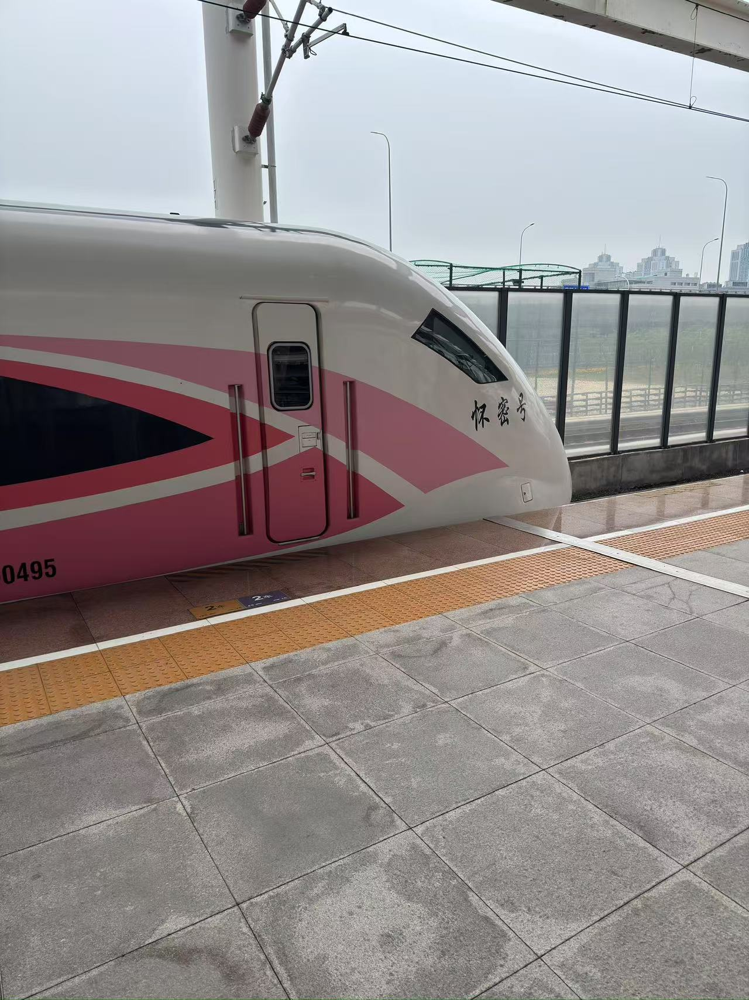
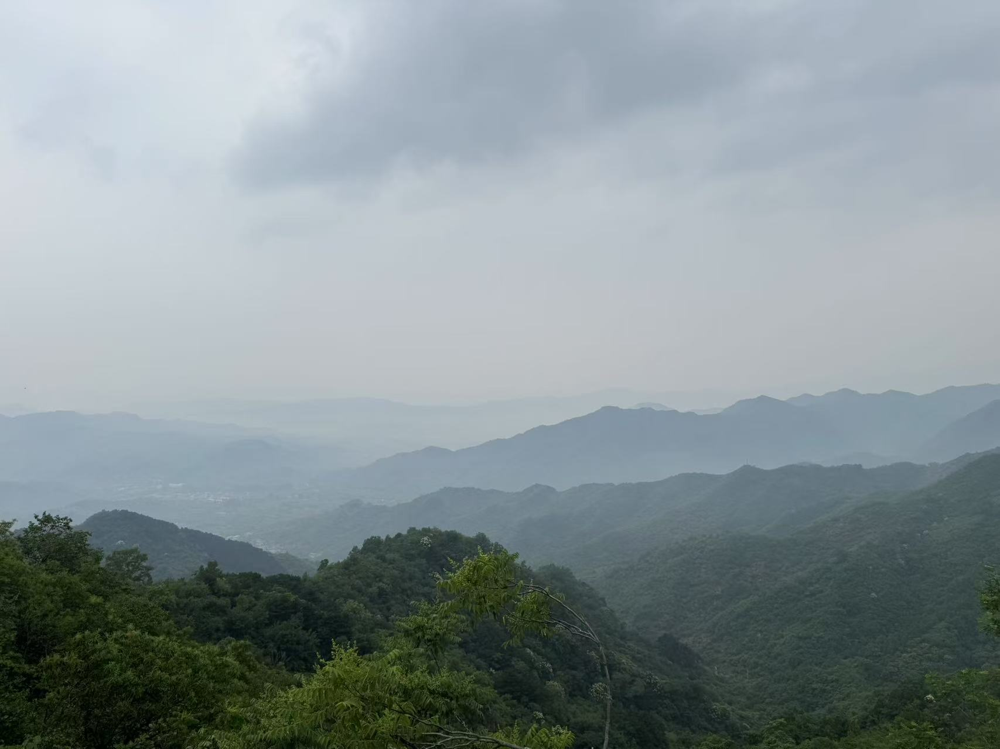
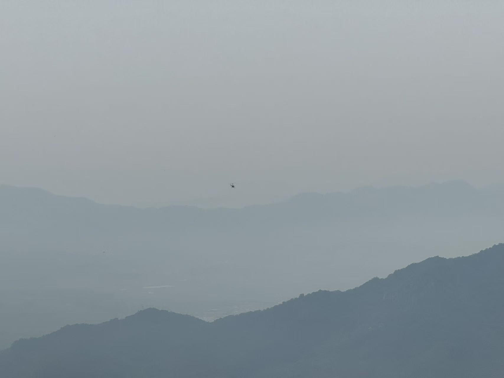
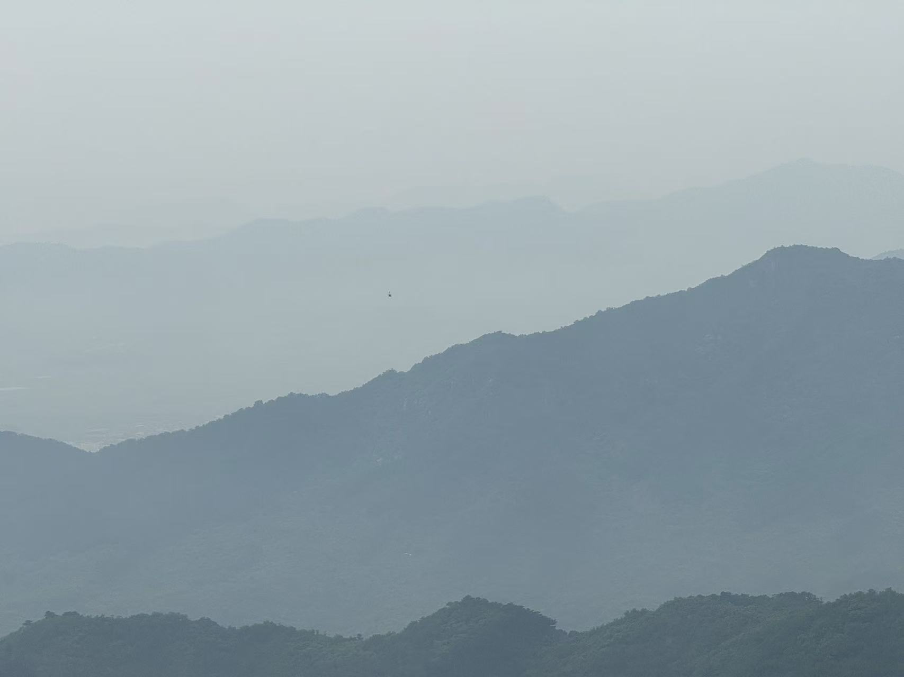
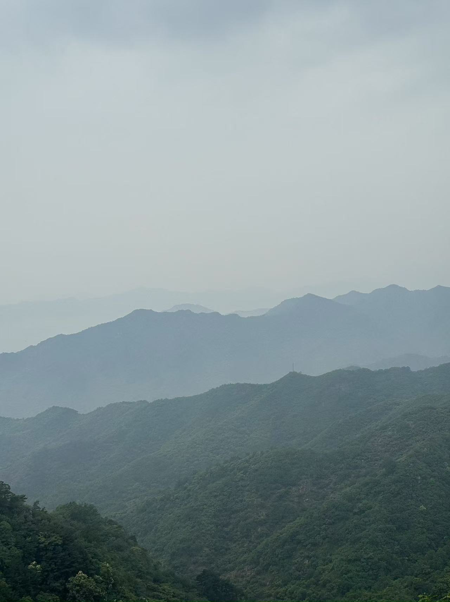
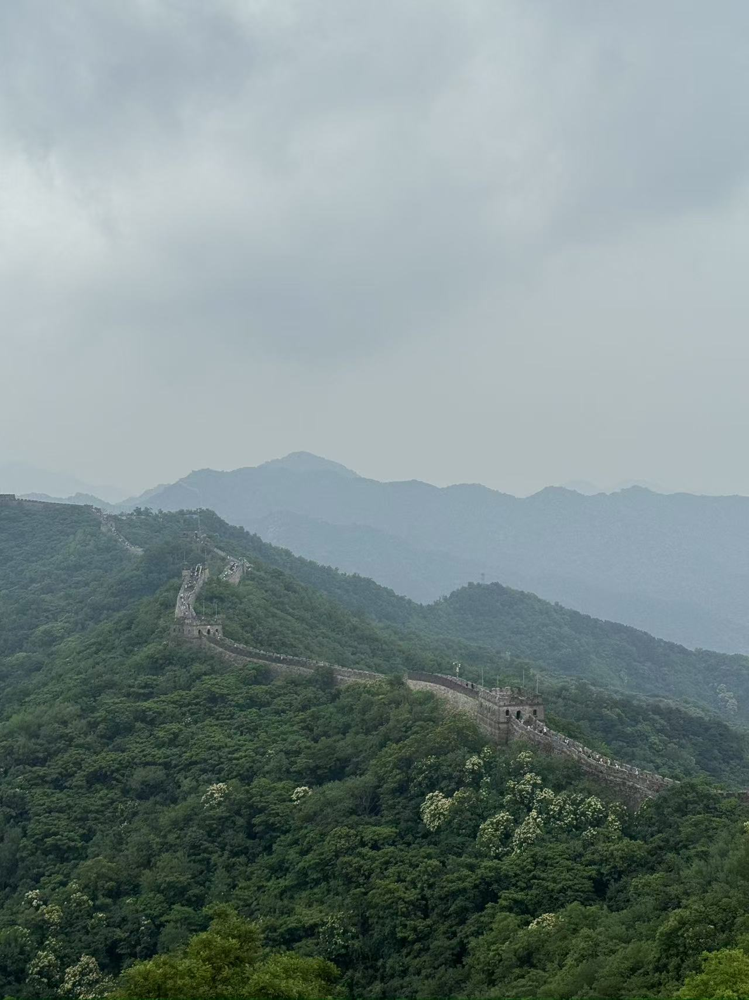
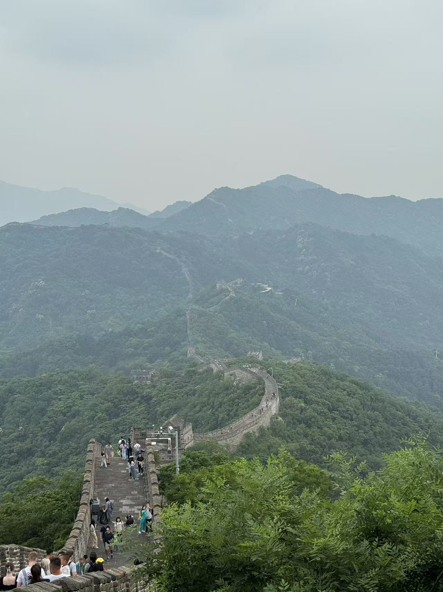
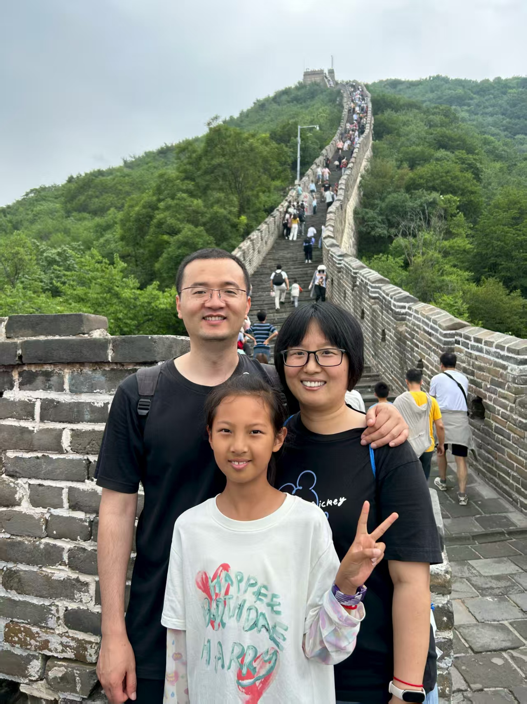
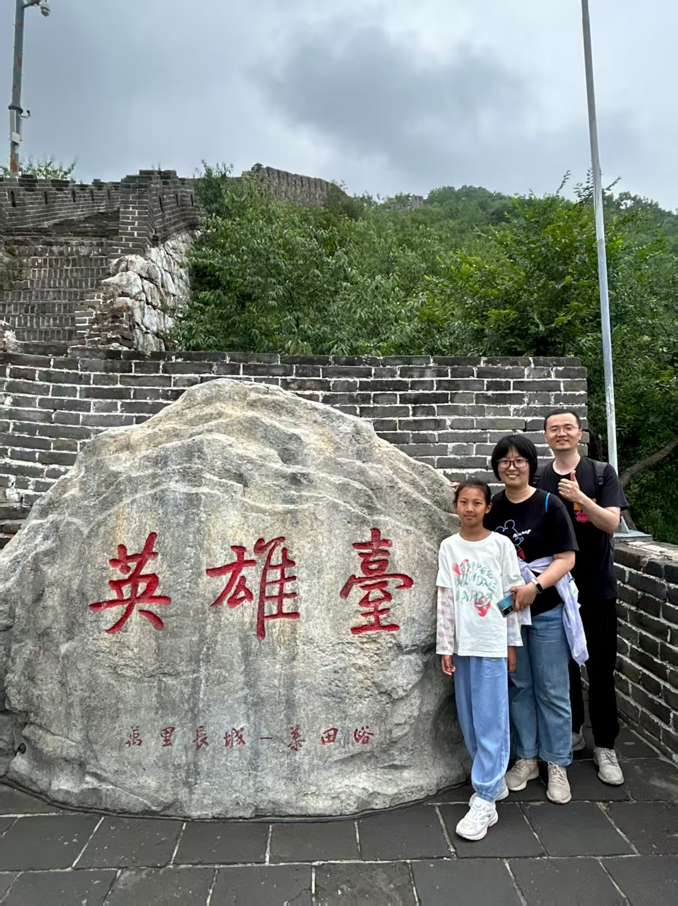
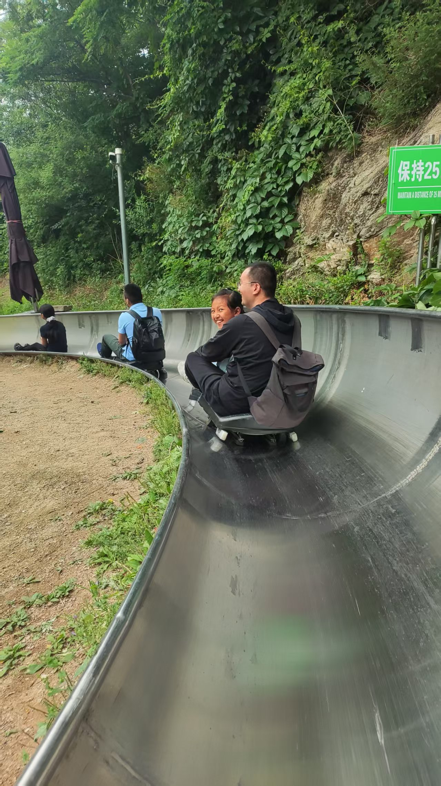

六一儿童节，娃和好朋友约好一起爬长城。

去年我们[去过慕田峪长城](https://liudon.com/posts/climbing-mutianyu-great-wall-on-october-1st/)，人不多、好爬不累，两家商量后决定还是去慕田峪。

早上打车到清河站，还是粉色的小火车。

这次人多没占到位置，俩小朋友只能席地而坐了。

到了之后，直奔摆渡车，缆车上山。

今天有雾，雾中的长城也是另一番景色。

媳妇第一次爬慕田峪，一起登顶。

排队1个多小时，终于坐上了小朋友心心念的滑道，确实很好玩。

下山打车往车站赶，结果碰到堵车，没赶上火车。

折腾半天总算改签上7点的车，在车站点了个KFC，边吃边等车，晚上9点总算到家了。

儿童节快乐～ 