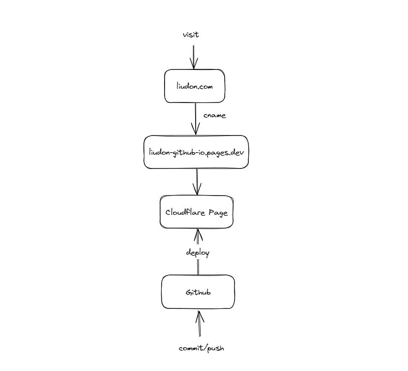
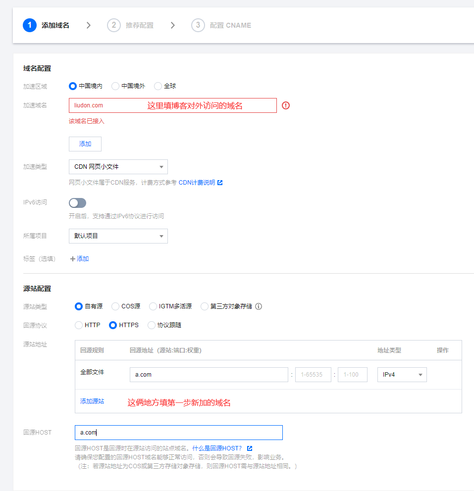

#### 背景



这是当前的博客架构，文件保存在`Github`仓库，通过`Cloudflare Page`提供访问。


众所周知，在国内，`Cloudflare`的CDN属于反向加速，平均耗时在1.5s左右。

今天，我们就来讲一下，如何实现国内海外双线路博客访问。

#### 大体思路

```
海外继续走Cloudflare Page，国内再套一层CDN回源Cloudflare Page。

Cloudflare Page已经提供了一个cname域名A，形如xxx.pages.dev。

国内CDN添加域名后，也会提供一个cname域名B。

使用国内dns解析服务，配置cname双线路解析。
```

#### 具体操作

1. `Cloudflare Page`添加新域名解析

    这个域名是为了给国内CDN回源使用，与博客当前域名不同即可。

    

2. 配置国内CDN

    我用的腾讯云，其他服务商也是可以的。

    

    ```
    加速域名：填写博客对外访问的域名
    回源地址和Host：填写第一步新加的域名
    ```

    添加成功后，会有一个cname地址，这里是国内线路解析要用到的。

3. DNS解析调整

    `Cloudflare`不支持双线路配置，国内服务商支持，我这里用的是腾讯云。

    首先将域名的NS解析改为国内服务商的NS地址，修改后2周左右会收到`Cloudflare`的邮件，不需要理会。

    ```
    liudon.com 的名称服务器不再指向 Cloudflare。它们现在指向：

    sandals.dnspod.net
    heron.dnspod.net
    [not set]
    [not set]
    [not set]

    此更改意味着 liudon.com 不再使用 Cloudflare，因此不会再享受我们的安全和性能服务带来的优势。您的 DNS 记录将在 7 天内从我们的系统中彻底删除。
    ```

    然后添加解析，默认走国内CDN，境外走`Cloudflare Page`。

    

#### 额外的问题

为了加速`Google Analytics`，使用`Cloudflare Worker`进行了反代，具体见[加速Google Analytics](https://liudon.com/posts/optimize-google-analytics/)。

更改NS后，导致海外访问无法触发`Cloudflare Worker`了，导致没有博客统计数据了。

经过一番搜索后，发现`Cloudflare Page`有类似的`Function`功能，只需要在网站根目录下新建`functions`目录，添加对应文件即可。

这里以`Hugo`静态博客举例说明：

在根目录的`static`目录下，新建`functions`目录，新建`analytics`目录，添加`post.js`文件。

这个`analytics/post.js`是为了对应原有`Worker`的访问地址`analytics/post`，可自行修改。

`post.js`文件代码如下：

```
export async function onRequest(context) {
    try {
        return await postHandler(context);
    } catch(e) {
        return new Response(`${e.message}\n${e.stack}`, { status: 500 }); 
    }
}

async function postHandler(context) {
    const GA_DOMAIN = 'google-analytics.com';
    const GA_COLLECT_PATH = 'g\/collect';
    const COLLECT_PATH = 'analytics/post';
    const DOMAIN = '这里填你博客的域名';

    const url = context.request.url;
    const cf_ip = context.request.headers.get('CF-Connecting-IP');
    const cf_country = context.request.cf.country;
    const ga_url = url.replace(`${DOMAIN}/${COLLECT_PATH}`, `${GA_DOMAIN}/${GA_COLLECT_PATH}`)
    const newReq = await readRequest(context.request, ga_url);
    context.waitUntil(fetch(newReq));

    return new Response(null, {
        status: 204,
        statusText: 'No Content',
      });
}

async function readRequest(request, url) {
    const { _, headers } = request;
    const nq = {
      method: request.method,
      headers: {
        Origin: headers.get('origin'),
        'Cache-Control': 'max-age=0',
        'User-Agent': headers.get('user-agent'),
        Accept: headers.get('accept'),
        'Accept-Language': headers.get('accept-language'),
        'Content-Type': headers.get('content-type') || 'text/plain',
        Referer: headers.get('referer'),
      },
      body: request.body,
    };
    return new Request(url, nq);
}
```

#### 优化效果


有了国内CDN的加持，平均耗时优化到1s左右了。