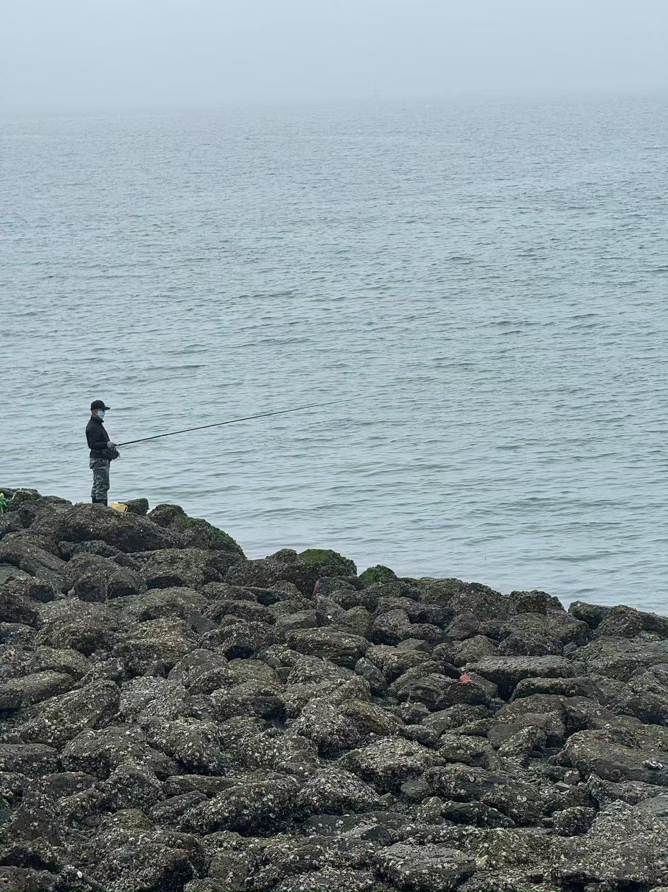

6月底，趁着娃刚考完试，学校也没课了，请假带娃去大连玩了一趟。

这次是跟娃好朋友一起出行，人两口子以前做旅行社的，直接搞了一个行程表，我们就跟报了个旅行团一样。

### 第一天

下午14:13到达大连北站，当地租车然后直奔酒店。

办理入住，放下行李简单休息后，开车去赶海。

一片砾石滩，找了本地人，提供装备带着进去赶海。

雨鞋就是薄薄一层，需要先走过一片海滩，特别地硌脚，路上还有特别多绿苔，非常地滑。

翻石头抓螃蟹，玩的不亦乐乎。

晚上小酌一下。

### 第二天

酒店就在海边，早起出来海边溜达一圈，大早起就有大爷在海里游泳了。

早上酒店吃完早餐，出发动物园。

今天大雾，白茫茫一片，缆车什么都看不到。

银沙滩喂海鸥，一根香肠直接给我叼走了。

中午火锅，环境很棒，吃的很开心。

大连自然博物馆，溜达一圈。

星海广场打卡，难得碰到了一会晴天。

晚上小吃街，吃到饱。

### 第三天

今天有雨不出门，安排在酒店水上乐园活动。

水上漂流，呛了几口水，总算学会漂了，真挺好玩。

造浪池，全都玩嗨了，就往浪大的地方去。

### 第四天

早上起来去喂梅花鹿。

大连美术馆，偶遇大雨，躲在馆里避雨。

今天是妈妈们逛街日，各种商业街打卡。

晚上吃的回勺面，超级好吃，强烈推荐。

运气好，因为今天下雨没有卖完，被我们赶上了。

### 第五天

夏家河赶海，挖蛏子。

金石滩喂海鸥、挖沙子，天居然还放晴了。

雾终于散了，原来海对面这么多机器呢。

### 第六天

收拾行李，退房，坐火车回京。

愉快的假期一晃就过去了，期待下次的出行。