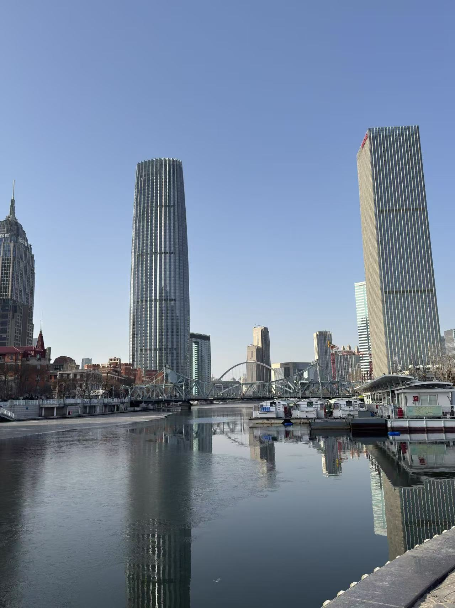
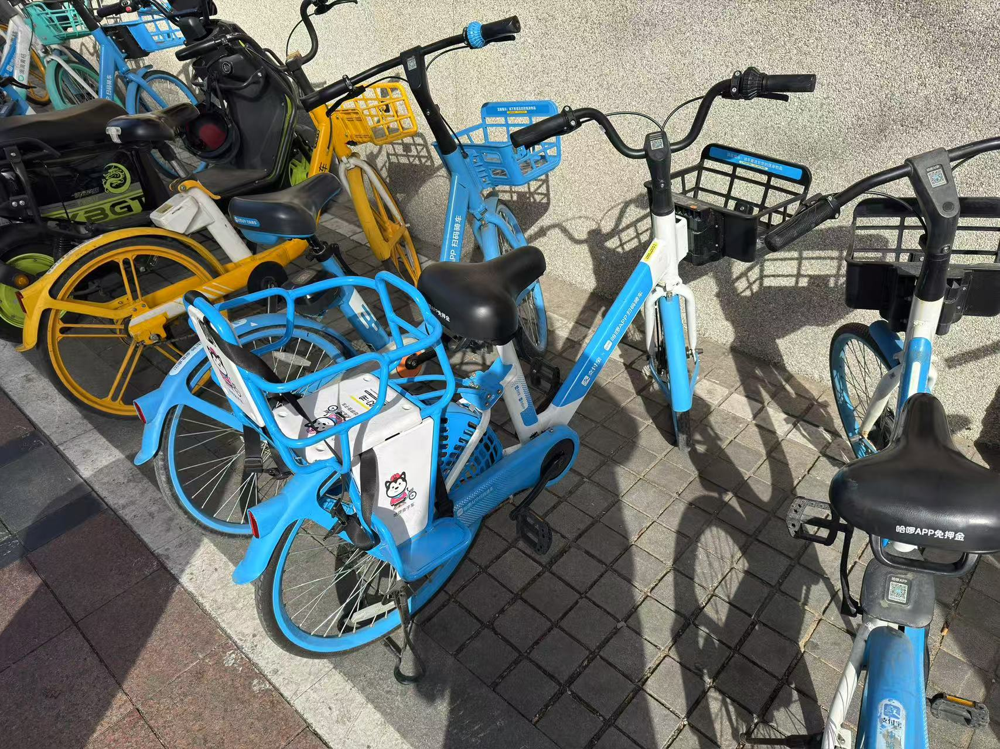
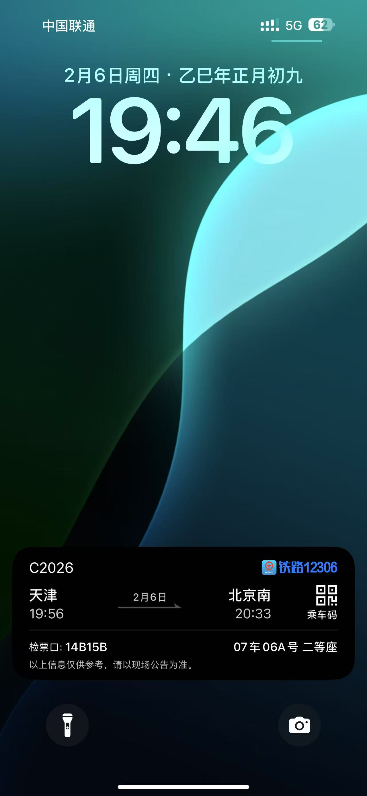

娃看完中华寻宝记，一直想去天津转转。

大年初九，返京第二天，带娃错峰去一趟天津。

7点出门，直奔北京南站，一路不敢耽搁，在发车前10分钟赶上了车。

以前一直听我爸说老家的河最终流到了海河，在路上看地图，发现确实最终汇入了海河。

世纪钟，本以为整点会报时来着，等了半天结果不是。

上午在意式风情区转了转，结果就是一些卖吃的、纪念品的地方，网红书店打卡。

路上遇到的小蓝车，居然是带后座的，可惜娃太大坐不下了。

桂发祥总店里的大麻花。

耳朵眼炸糕，来一个就行，多了吃不下。

中午简单吃个饭，转站五大道，先去听个相声。

路过瓷房子，外面简单看一眼就好。

名流茶馆，特别小的一个门脸。

上一次现场听相声，还是在北京，那会岳云鹏还没火。

2个小时，物超所值，这次天津行最值的一个地方了。

听完出来，外面已经变天，风巨大，特别的冷。

简单转了转，直奔古文化街，看摩天轮。

晚上吃过饭，外面实在是太冷了，风超级大。

摩天轮没有开，远远的打个卡。

返程，又是开车前10分钟上车。

