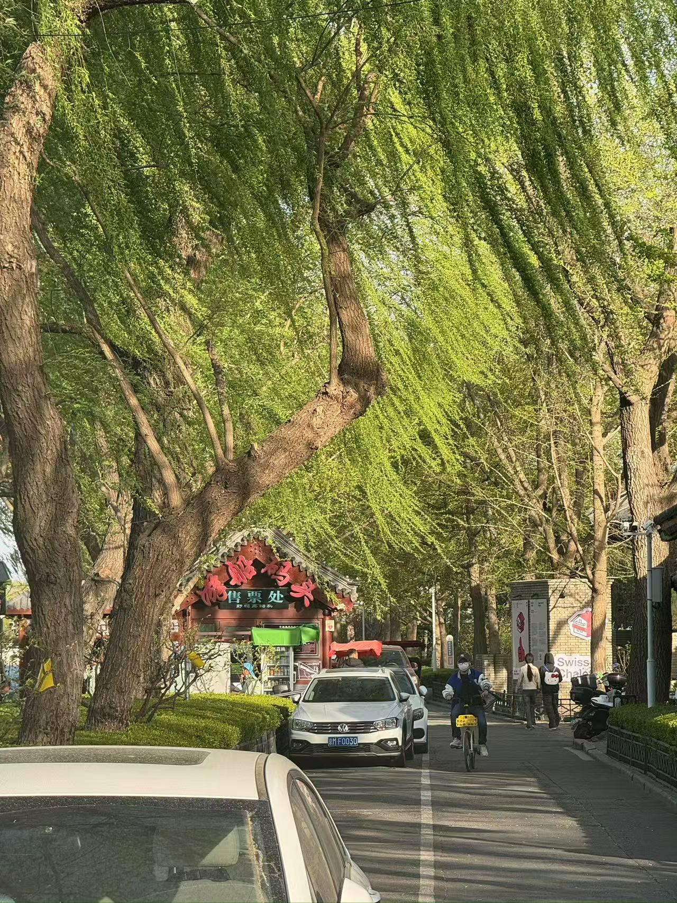

自从买了登山杖，娃一直说想去爬山。

前段时间天气一直不好，山上也还是光秃秃的，就一直没去。

趁着清明假期，带娃爬山去。

去年假期去过一次香山，路上超堵，这次还是选择了离家不远的百望山：好爬不累。

有了登山杖，这次我们没有走以往的大路，直奔山中的小路。

一路台阶，走走停停，不到半个小时就登顶了。

快到山顶的时候起风了，在山上稍作休息便下山了。

下山直奔新街口，到老西安饭庄，来个羊肉泡馍。

可能是自己掰的馍不够小，感觉没有那么入味，并没有很惊艳。

吃完饭时间还早，好不容易进一趟城，上后海转转。

沿着湖边，慢悠悠地闲逛。

到了银锭桥，人头攒动。

顺着人流，进入烟袋斜街，两边各种文创小店，买了些小吃稍微休息。

出烟袋斜街，来鼓楼打个卡。

继续向前溜达，进入南锣鼓巷。

上一次来南锣鼓巷，应该还是刚来北京不久和同事一起来的。

依旧是人挤人，扎进胡同里碰到个大爷，提醒不要买东西，这里东西特别贵，匆匆逛完就回家了。

一天下来10公里，倒也没有想象的那么累。