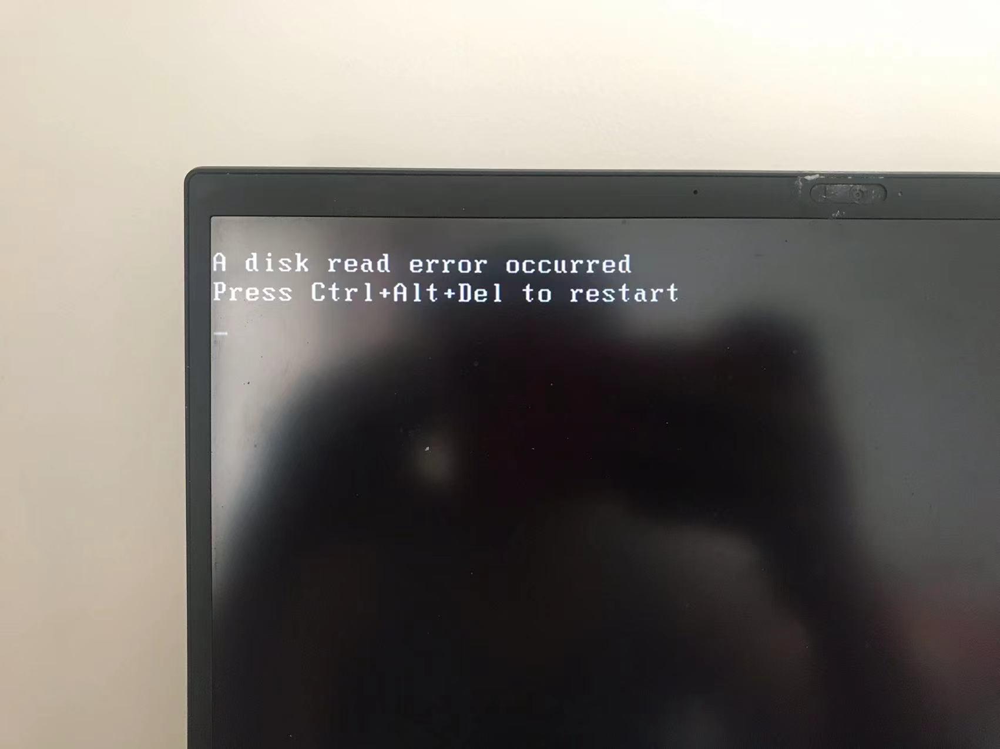
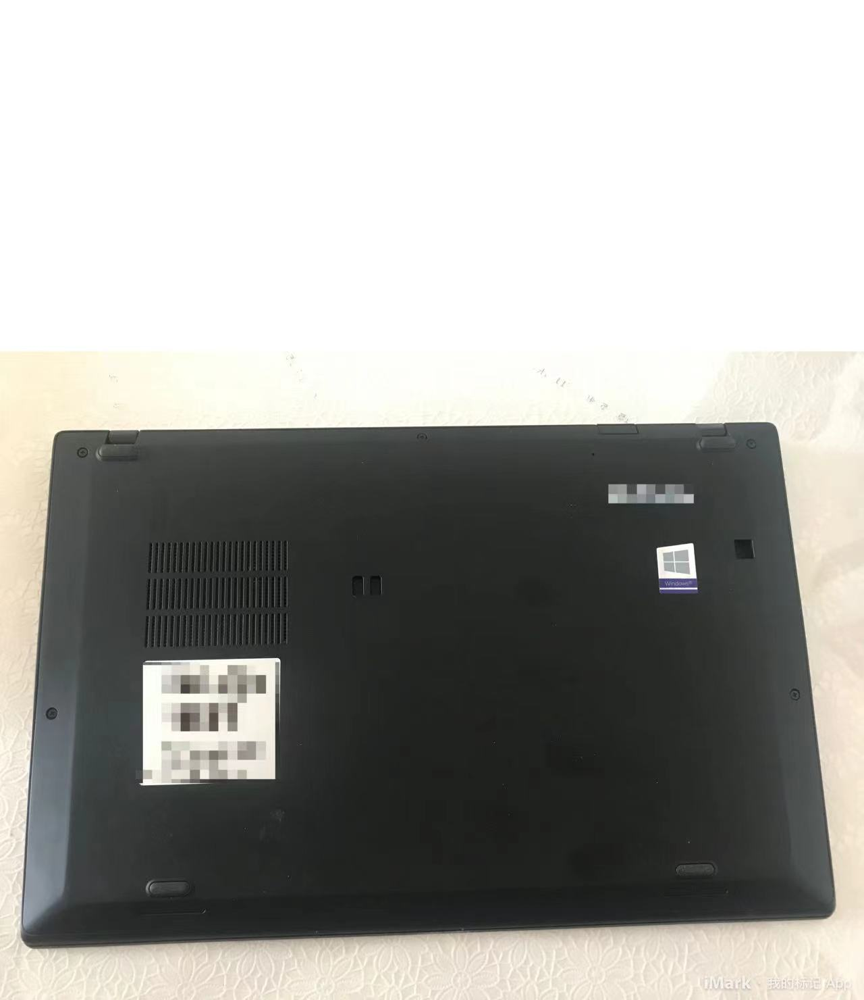
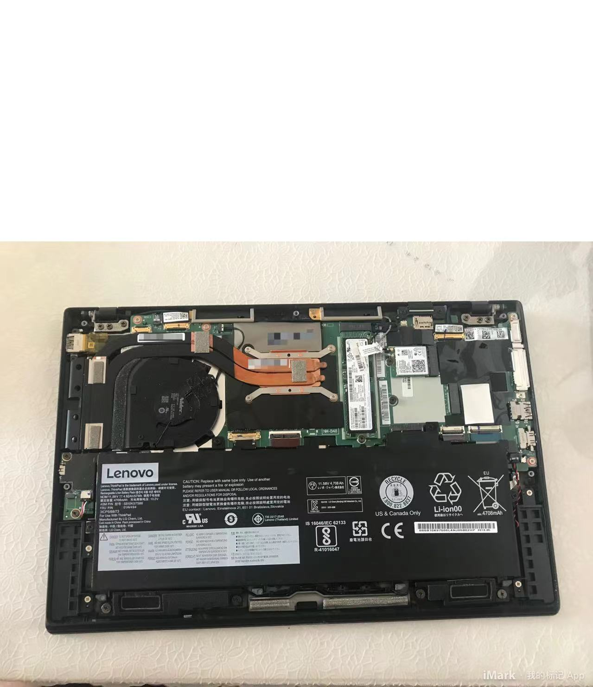
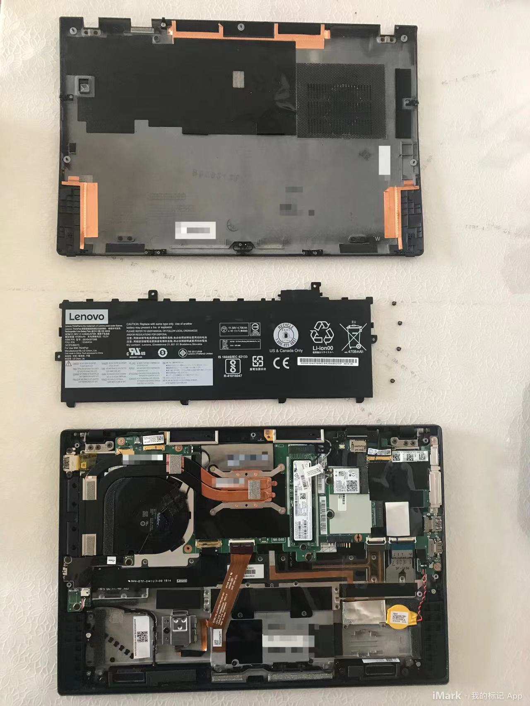
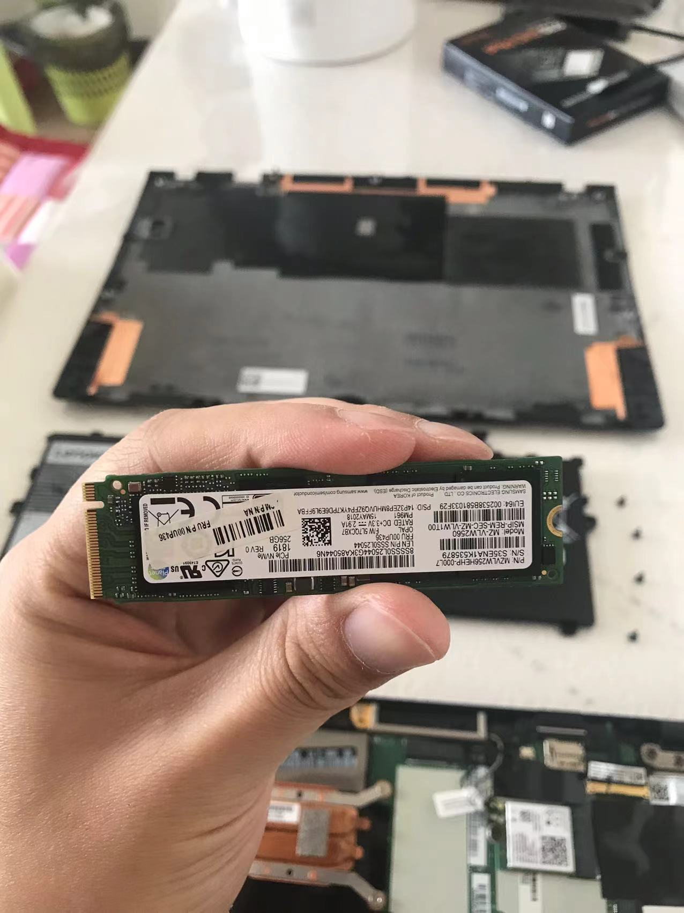
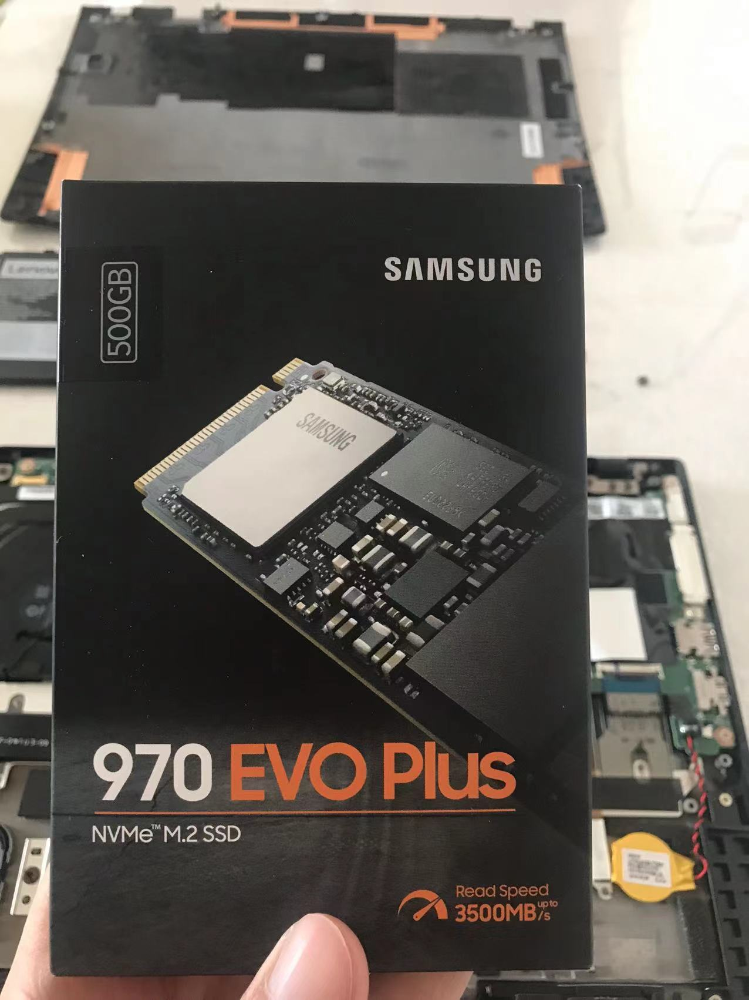
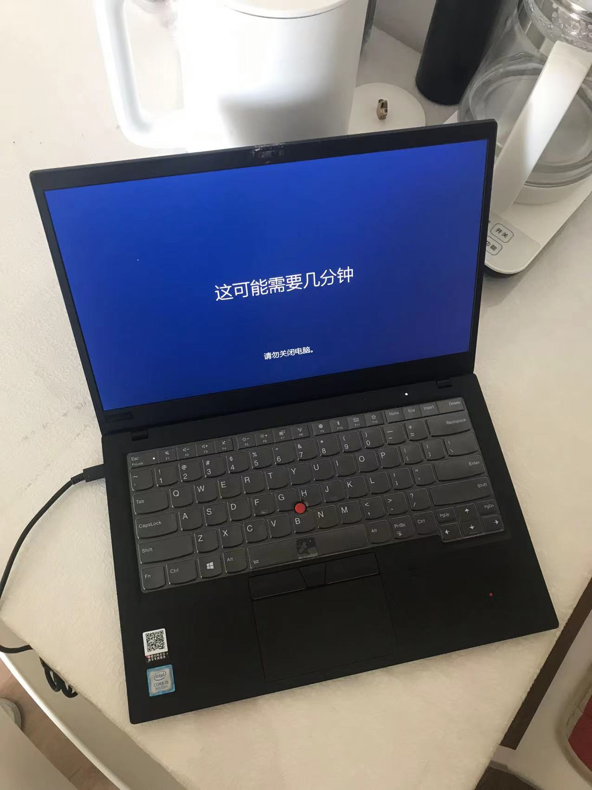

电脑突然没法用了，提示"A disk read error occurred"的错误。

多次重启也不行，感觉是硬盘挂了。

机器去年过保了，之前有过在售后维护的经历，费用不低，这次决定自己动手。

一共就5个螺丝，打开后盖。

可以看到电池旁边的螺丝，拧下取出电池。

拧开硬盘上的固定螺丝，取出硬盘。

印象里硬盘还是那种又大又厚的样子，没想到现在都这么小一块了。

我在京东买的[三星970 EVO Plus](https://u.jd.com/Zdch2qO)这款，顺利换上。

重装系统，搞定，省了一笔，好开心。

