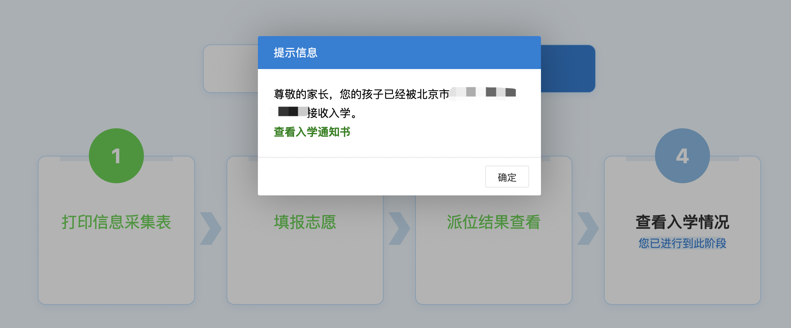

> 18年的热点新闻，纳税千万孩子无法在北京上学。

一直听说外地人在北京上学难，今年娃到了上小学的年纪，也算真实的体验了一把上学的难。

提前在网上搜了一番资料，都是一些机构整理的信息。

没有找到具体分享的记录，自己整理了下，希望能帮助到其他人。

### 1. 信息采集

5月5日，采集系统开放。

当天下午录入相关信息，提交网上审核。

### 2. 网上审核

信息提交后，就开始了漫长的审核时间。

```
5月06日 户口信息审核通过
5月14日 居住证审核通过
5月16日 居住证明审核通过
5月19日 工作证明审核通过
```


### 3. 线下审核

网上审核通过后，打印入学申请表，预约线下审核时间。


这里还有一个插曲，本来以为线下审核是在社区居委会。

周六的时候，在小学入学群里聊天，有人说是在学区审核。

后来交流一番后，发现是自己理解错了。

这里是要先去社区审核盖章，然后再到学区交资料走线下审核。

```
5月22日 社区居委会审核盖章
5月25日 到街道递交审核材料
```


* 如果你是外地集体户口，需要准备集体户口首页（复印件需要加盖公章）。
* 工作证明还需要提供满足时间要求的社保缴费记录。


### 4. 审核通过

5月27日，审核通过后，打印信息采集表。


### 5. 学校登记

6月1日对口学校发布入学登记通知书。

按通知书准备资料，到登记时间去学校交资料。

今年遇到疫情，改为线上邮件发送资料登记了。

### 6. 填报志愿

6月23日，海淀教育发文[1911后填报志愿通知](https://mp.weixin.qq.com/s/UFoFysrhG2HkzREBpDVkuQ)。


第一志愿锁定，其他志愿自己选择填报。

6月25日锁定，不允许再修改。

> 网上消息，第一志愿锁定，说明有1911后名额，有机会选中。
> 
> 租房的不需要填报志愿，等待派位。

### 7. 查看结果


6月29日15点，系统开放结果查询。

第一志愿录取，一直担心的调剂没有发生。

7月10日，收到教委短信，系统查询录取通知书。





历时1个多月的幼升小总算落地了。