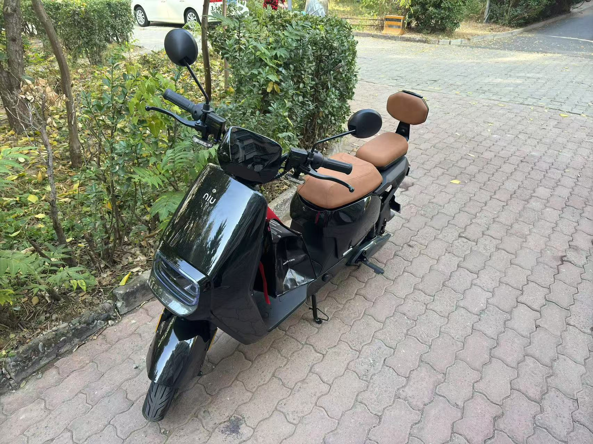
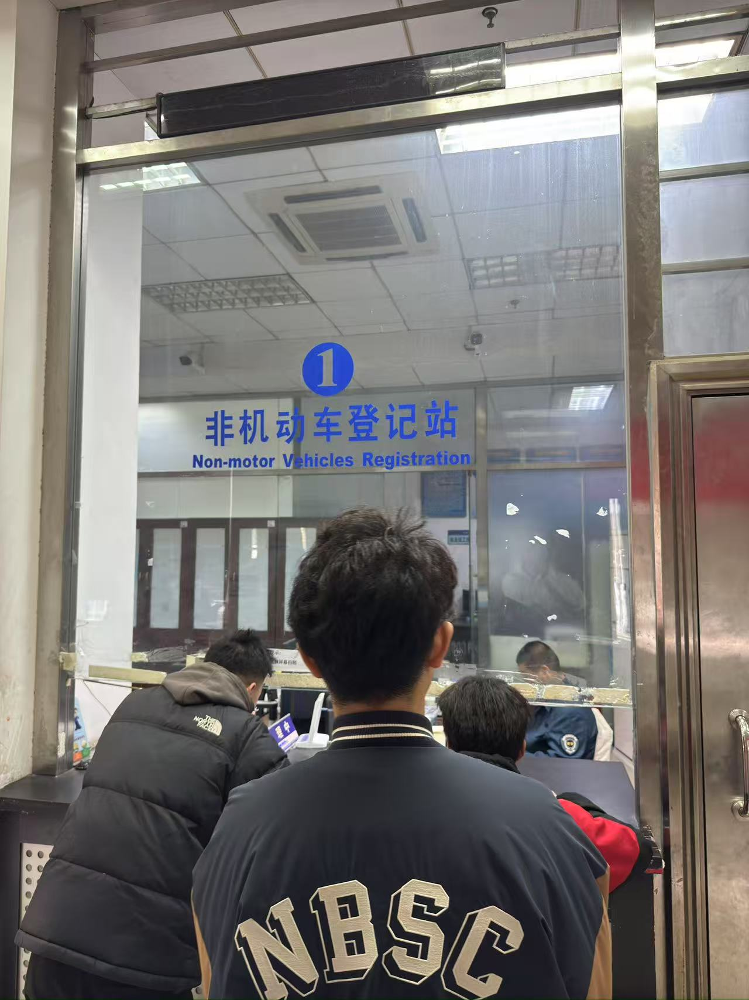
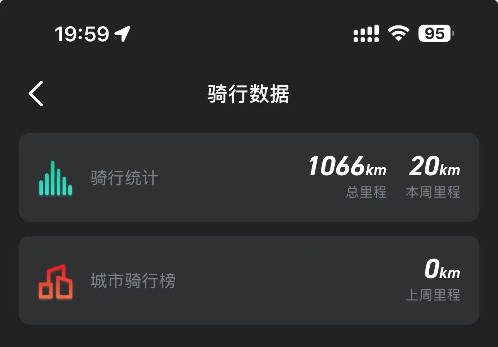

去年10月底，考虑到老的绿源电动车已经骑了5年，电池越来越不行，马上要冬天了，考虑换个新电动车。

到各个品牌店里转了一圈，发现都没有车子，说是新规的缘故，要到11月份才能有新车。

同事给推荐的小牛F400T，11月之后到店里看了，新规不让卖了，考虑一番选择了G400T。

双11活动，京东下单3699元，店里直接提货。

第二天直奔车管所，注销老车子，上牌新车子。

再发京通上申请以旧补贴，500元到手，整个下来3000出头。

跟5年前的车子比，真是天翻地覆的变化，手机解锁、蓝牙/NFC解锁，实时定位。

续航也比之前多了很多，冬天最冷的时候三天一充，平时基本一周一充。

到现在马上5个月，已经骑行了1000公里。

